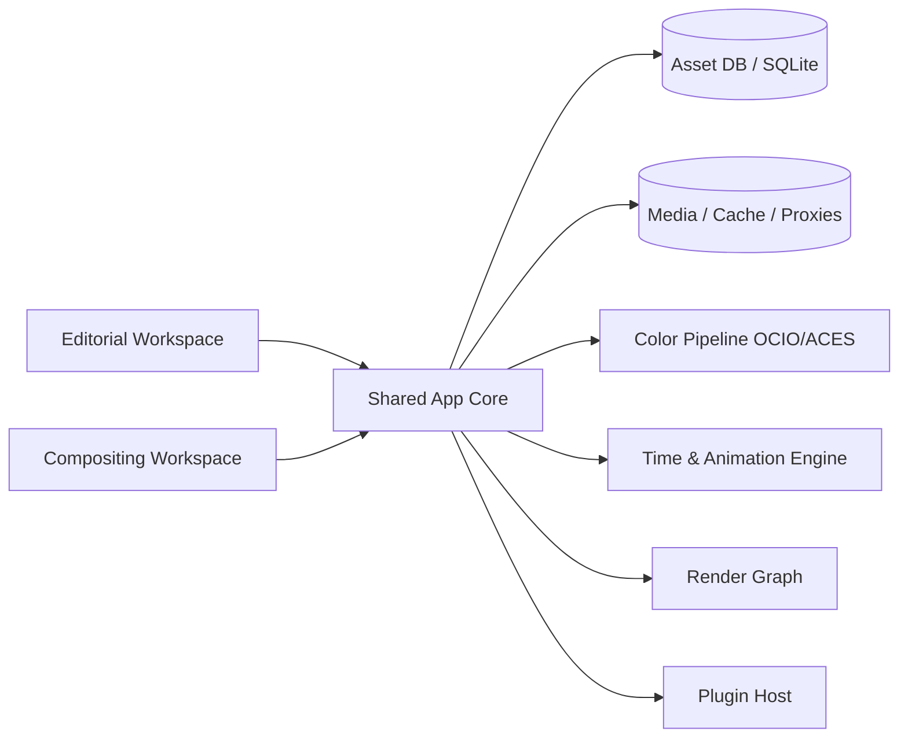
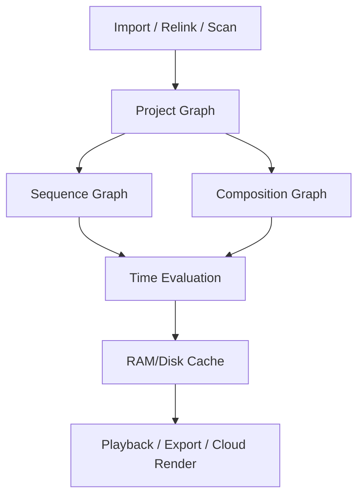
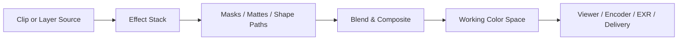
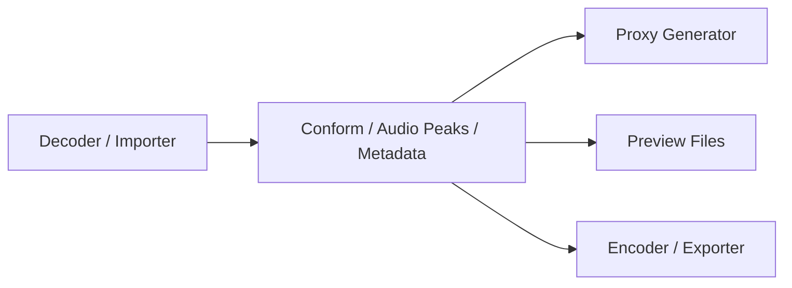
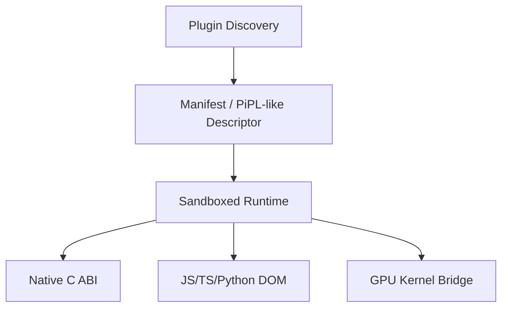
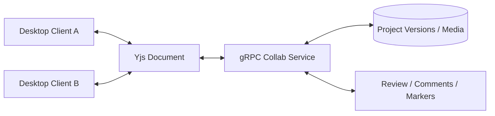

# blueprint.md

## Ringkasan eksekutif

Adobe After Effects dan Adobe Premiere Pro berbagi fondasi pascaproduksi yang saling terhubung, tetapi model produk intinya berbeda secara mendasar. After Effects berpusat pada **composition-layer-property graph** untuk compositing, motion graphics, animasi, tracking, keying, 3D, expressions, dan authoring Motion Graphics templates; Premiere berpusat pada **project-sequence-track-clip graph** untuk editorial NLE, playback timeline real-time, mixing audio, captioning/transcription, color finishing, proxy workflow, dan kolaborasi editorial. Dokumentasi resmi Adobe sendiri memperlihatkan garis batas itu dengan sangat jelas: AE mendokumentasikan composition, layer, Graph Editor, expressions, keying, 3D, tracks/mattes, dan ratusan kategori efek; sedangkan Premiere mendokumentasikan sequence, fixed effects, clip/track effects, Audio Track Mixer, captions/Speech-to-Text, Text-Based Editing, Sequence Index, proxy workflow, serta Team Projects/Productions. citeturn22search19turn22search12turn23search5turn22search6turn28view1turn19search3turn21search1turn21search9turn19search0turn16view7turn16view4

Implikasi arsitekturalnya penting: **jangan** mencoba menulis satu “alat video umum” yang kebetulan punya timeline dan efek. Untuk mencapai parity nyata, Anda butuh **satu core media/render yang sama** tetapi **dua surface produk** di atasnya:  
**editorial workspace** ala Premiere dan **compositing workspace** ala After Effects. Keduanya harus berbagi asset database, time model, color pipeline, encoder/decoder, plugin host, dan render farm, tetapi berbeda pada UI, graph semantics, dan tools prioritas. Ini jauh lebih realistis daripada meniru file native `.aep` atau `.prproj` secara biner; jalur yang lebih aman dan lebih interoperabel adalah memakai format internal Anda sendiri lalu menjembatani AAF, FCP XML, EDL, OMF, OTIO, dan ekspor video/audio/image sequence. Adobe sendiri mendokumentasikan interchange AAF/XML/EDL/OMF/FCP XML, Dynamic Link, serta impor/ekspor antarapp; OTIO secara eksplisit dirancang sebagai API/format interchange editorial, bukan container media. citeturn16view2turn16view3turn16view5turn37search1turn37search5turn37search17turn8search0turn8search4

Blueprint ini merekomendasikan strategi implementasi berikut:  
**fase pertama** membangun media core, aset, timeline NLE, playback, audio, color, export, interchange, dan proxy;  
**fase kedua** menambah composition engine, masks/mattes, blend/composite, keyframe/expression engine, shape/text/3D/camera/light, tracking, dan MOGRT authoring;  
**fase ketiga** menambah plugin SDK lengkap, scripting/automation, kolaborasi cloud/offline, render farm, review/versioning, dan AI-assisted tools. Pendekatan ini paling dekat dengan realitas teknis Adobe: Premiere menonjol pada real-time editorial dan audio-track workflows, sedangkan AE menonjol pada composition graph, tracking, matte, expressions, dan motion graphics authoring. citeturn28view1turn19search3turn20search10turn26view0turn22search5turn23search3turn35search0

Secara teknologi, pilihan yang paling aman untuk desktop cross-platform adalah **C++20 untuk core latency-kritis**, ditambah **Rust untuk parser/importer untrusted, collaboration services, dan background jobs**, dengan **Qt** untuk UI desktop, **FFmpeg** untuk codec/container, **OpenImageIO/OpenEXR** untuk image sequence/HDR, **OpenColorIO + ACES** untuk color management, **OpenTimelineIO** untuk interchange editorial, **OpenFX** sebagai standar plugin VFX opsional, **SQLite** untuk local metadata/cache DB, **gRPC** untuk service boundary, **Yjs** untuk kolaborasi CRDT, dan **Rubber Band** untuk time-stretch/pitch-shift audio. Qt memang framework cross-platform UI; JUCE kuat untuk aplikasi audio/plugin; OIIO, OpenEXR, OCIO, OTIO, dan OFX adalah toolkit/standar umum di ekosistem VFX/editorial. citeturn9search4turn9search1turn8search3turn9search18turn15search1turn15search9turn8search2turn15search0turn8search0turn8search4turn8search5turn10search0turn10search1turn10search2turn9search7

Blueprint ini sengaja menargetkan **parity fungsional** dan **interoperabilitas produksi**, bukan cloning legal atau bit-for-bit atas implementasi Adobe yang tidak terdokumentasi. Beberapa fitur AI Adobe yang benar-benar proprietari, detail internal file native, dan perilaku exact UI/preset legacy tidak dipublikasikan sepenuhnya; untuk area itu saya beri padanan teknis yang dapat dibangun ulang secara realistis. Itu juga lebih sejalan dengan batas lisensi Adobe Developer Tools yang bersifat terbatas/revocable serta pedoman penggunaan trademark Adobe yang membolehkan penyebutan nama produk tetapi membatasi penggunaan logo/tagline dan materi berhak cipta Adobe. citeturn24search2turn24search11turn24search0turn24search3turn24search22

## Ruang lingkup dan peta fitur

Matriks berikut adalah sintesis 1:1 berbasis dokumentasi resmi Adobe HelpX, Adobe SDK docs, dan panduan scripting resmi/community docsforadobe untuk area yang dipublikasikan. Untuk **efek individual yang jumlahnya ratusan**, saya memetakan **family resmi** dan mendefinisikan sistem descriptor generik agar efek dapat ditambahkan sebagai data + kernel tanpa mendesain ulang UI/engine per efek. AE memang mendokumentasikan daftar efek lengkap beserta dukungan GPU, bit depth, dan multi-frame rendering; Premiere mendokumentasikan fixed effects, standard effects, family video/audio effects, family transitions, dan reorganisasi effects library v26. citeturn16view0turn26view0turn25view3turn25view5turn27view0turn26view1turn28view0turn28view1

| Domain | Adobe After Effects | Adobe Premiere Pro | Implikasi untuk app Anda |
| --- | --- | --- | --- |
| Model inti | Composition → Layers → Properties → Keyframes/Expressions | Project → Sequences → Tracks → Clips → Effects | Butuh **dua graph** di atas core yang sama |
| Unit kerja utama | Composition | Sequence | Simpan keduanya sebagai first-class document |
| Struktur visual | Layer stack, precomp, 2D/3D layers, cameras, lights, nulls, masks, mattes | Video/audio tracks, nested sequence, fixed effects, clip/track effects | Butuh **LayerGraph** dan **TrackGraph** |
| Animasi | Keyframes, Graph Editor, expressions, puppet, shape paths | Keyframes untuk fixed/standard effects dan automation audio | Satu animation engine + mode UI berbeda |
| Compositing | Sangat kuat: alpha, masks, track mattes, blend/composite, keying | Ada masks, keying, opacity, transitions, compositing clip-based | Composite engine harus kelas film/VFX |
| Editorial NLE | Ada dasar editing, tetapi bukan fokus utama | Fokus utama: sequence editing, text-based editing, captions, proxy, audio mix | Editorial workspace harus mengutamakan real-time trimming |
| Audio | Ada efek audio dasar | Clip + track audio, Audio Track Mixer, automation, VST3 | Audio engine harus lebih dekat ke Premiere |
| Motion graphics | Authoring utama, Essential Graphics, MOGRT export | Konsumsi/penggunaan MOGRT, edit via Properties/Graphics Templates | MOGRT authoring = compositing workspace |
| Color | Color correction, HDR, OCIO/ACES | Lumetri, scopes, color management, HDR, output transforms | Shared color pipeline, beda UI panel |
| Tracking/matte | Face Tracking, Mask Tracking, 3D Camera Tracker, Roto Brush/Object Matte | Object masking, Warp Stabilizer, Auto Reframe, keying | Tracking service lintas-workspace |
| Kolaborasi | Team Projects, Frame.io | Team Projects, Productions, Frame.io | Butuh dua mode: cloud-collab dan shared-storage editorial |
| Interchange | AAF import, Premiere project import/export, XML, Dynamic Link | AAF, OMF export, EDL/XML/FCP XML, AAF import, Dynamic Link | Prioritaskan interchange, bukan native binary clone |

**Asimetri produk yang paling penting**: AE unggul pada layer-centric compositing, motion graphics, expressions, tracking/mattes, dan 3D composition; Premiere unggul pada sequence-centric editorial, clip/track audio, text/captions/transcription, proxy playback, dan collaborative project partitioning melalui Productions. Itulah sebabnya “satu timeline yang diberi efek” tidak cukup untuk menggantikan keduanya. citeturn26view0turn23search3turn22search5turn35search0turn28view1turn21search1turn21search9turn16view7turn16view4

**Daftar family resmi AE** yang wajib dipetakan ke `EffectDescriptor` internal Anda mencakup setidaknya: Audio, Blur & Sharpen, Distort, Perspective, Channel, Generate, Time, Transition, 3D Channel, Utility, Matte, Noise & Grain, Color Correction, Expression Controls, Detail-preserving Upscale, Rolling Shutter Repair, Obsolete effects, dan Cycore plugins; selain itu AE user guide menempatkan animasi, keyframe, motion tracking, keying, transparency/compositing, OCR/ACES/HDR, expressions, automation, VR/360, dan Advanced 3D Renderer sebagai area fitur resmi. citeturn26view0turn25view3turn25view5

**Daftar family resmi Premiere** yang Anda perlukan untuk parity fungsional: fixed effects Motion, Opacity, Time Remapping, Volume; video effect families Adjust, Blur & Sharpen, Color Correction, Distort, Generate, Image Control, Immersive Video, Keying, Lights & Glows, Noise & Grain, Perspective, Stylize, Time, Transform, Transition, Utility; audio effect families Amplitude and Compression, Delay and Echo, Filter and EQ, Modulation, Noise Reduction/Restoration, Reverb, Special, Stereo Imagery; serta video transitions families Animation, Dissolve, Grunge & Distort, Immersive Video, Lights & Blurs, plus legacy/obsolete compatibility buckets. Premiere juga membedakan fixed vs standard effects, clip-based vs track-based effects, serta GPU/high-bit-depth effect modes. citeturn28view1turn27view0turn26view1turn28view0

**Keputusan blueprint**:  
jadikan semua efek sebagai **data-driven descriptors** dengan field `matchName`, `displayName`, `category`, `parameterSchema`, `supportsGPU`, `supportsBitDepth`, `supportsMFR`, `supportsMaskReference`, `supportsTrackLevel`, `supportsClipLevel`, `licenseTier`, dan `renderPassType`. Ini meniru fleksibilitas yang tampak pada AE/Premiere without cloning UI Adobe secara literal, dan juga selaras dengan bagaimana Premiere dan AE mengidentifikasi effect components/plugins melalui `matchName`/localized display name dan plugin descriptors. citeturn17view3turn17view4turn36view0

## Arsitektur acuan dan model data

Arsitektur berikut didesain agar satu core dapat melayani **mode editorial** dan **mode compositing**. Pendekatan ini kompatibel dengan sifat interchange OTIO/AAF/XML, plugin host ala AE/Premiere, color pipeline OCIO/ACES, serta playback/render GPU modern. OTIO didefinisikan sebagai interchange format/API untuk editorial cut information; OCIO adalah solusi color management untuk motion picture; OpenEXR ditujukan untuk HDR scene-linear multi-part/multi-channel; dan FFmpeg menyediakan codec/container foundation yang luas. citeturn8search4turn8search2turn15search1turn8search3

| Layer | Rekomendasi | Trade-off |
| --- | --- | --- |
| UI desktop | Qt | Paling matang untuk desktop cross-platform; lisensi perlu dipilih hati-hati |
| Core media/time/render | C++20 | ABI-friendly untuk plugin native dan GPU backend |
| Parser/importer/collab services | Rust | Lebih aman untuk komponen untrusted; tambah kompleksitas FFI |
| Codec/container | FFmpeg + native hardware APIs | Cakupan luas; lisensi codec perlu dikelola |
| Image/VFX I/O | OpenImageIO + OpenEXR | Kuat untuk image sequence/HDR/VFX |
| Color | OpenColorIO + ACES | Pipeline warna modern dan interoperable |
| Editorial interchange | OpenTimelineIO | Sangat cocok sebagai canonical interchange API |
| Plugin VFX | OpenFX + custom native ABI | OFX mempercepat ekosistem; custom ABI tetap dibutuhkan |
| Audio DSP/time stretch | Rubber Band + VST3 bridge | Kualitas stretching baik; plugin audio butuh scanning/sandbox |
| Local store | SQLite | Serverless, cross-platform, cocok untuk metadata/cache |
| Service RPC | gRPC | Typed APIs dan service boundary rapi |
| Realtime collaboration | Yjs | CRDT offline-first, butuh desain doc model yang disiplin |













**Time model** internal sebaiknya memakai **integer tick time** dan **rational frame rate**, bukan floating seconds mentah. Ini mencegah drift pada EDL/XML/AAF, audio sync, dan expression evaluation. Premiere scripting guide secara eksplisit menyatakan objek waktu dihitung dalam ticks, dengan `254016000000 ticks per second`; OTIO juga didesain untuk memanipulasi data editorial secara presisi. Gunakan ticks sebagai canonical storage, lalu turunkan tampilan ke SMPTE timecode, frames, atau seconds di UI. citeturn17view0turn8search4

**Model dokumen internal** yang saya rekomendasikan:

```json
{
  "project": {
    "id": "proj_01",
    "name": "My Film",
    "version": 128,
    "colorManagement": {
      "engine": "ocio",
      "config": "aces_2.0",
      "workingSpace": "ACEScct",
      "viewerTransform": "Rec.709"
    },
    "documents": [
      {"type": "sequence", "id": "seq_main"},
      {"type": "composition", "id": "comp_title"}
    ],
    "assets": ["asset_camA_001", "asset_logo_png"],
    "libraries": ["mogrt_lib_branding"]
  }
}
```

```json
{
  "asset": {
    "id": "asset_camA_001",
    "uri": "file:///show/day01/camA_001.mov",
    "mediaType": "video",
    "container": "mov",
    "videoCodec": "prores_422_hq",
    "audioCodec": "pcm_s24le",
    "timebase": {"num": 1, "den": 25},
    "durationTicks": "6350400000000",
    "proxies": [
      {"id": "proxy_001", "uri": "file:///proxies/camA_001_proxy.mov"}
    ],
    "metadata": {
      "reel": "A001",
      "colorSpace": "logC4",
      "audioChannels": 4
    }
  }
}
```

```json
{
  "sequence": {
    "id": "seq_main",
    "name": "Main Edit",
    "zeroPointTicks": "0",
    "frameRate": {"num": 25, "den": 1},
    "videoTracks": [
      {"id": "v1", "items": ["clip_001", "nest_010"]},
      {"id": "v2", "items": ["title_001"]}
    ],
    "audioTracks": [
      {"id": "a1", "items": ["clip_001_a"]},
      {"id": "a2", "items": ["music_001"]}
    ],
    "markers": [],
    "sequenceSettings": {
      "width": 3840,
      "height": 2160,
      "pixelAspect": "1:1",
      "previewCodec": "prores_proxy"
    }
  }
}
```

```json
{
  "composition": {
    "id": "comp_title",
    "name": "Title Build",
    "durationTicks": "762048000000",
    "layers": [
      {"id": "lyr_bg", "type": "solid"},
      {"id": "lyr_text", "type": "text"},
      {"id": "lyr_cam", "type": "camera"}
    ],
    "activeCamera": "lyr_cam",
    "renderer": "advanced_3d",
    "motionBlur": true
  }
}
```

```json
{
  "effectDescriptor": {
    "matchName": "com.myapp.color.lumetri_like",
    "displayName": "Primary Grade",
    "category": "Color Correction",
    "scope": ["clip", "layer", "track"],
    "supportsGPU": true,
    "supportsBitDepth": [8, 16, 32],
    "supportsMasks": true,
    "params": [
      {"id": "exposure", "type": "float", "default": 0.0},
      {"id": "contrast", "type": "float", "default": 1.0},
      {"id": "temp", "type": "float", "default": 0.0}
    ]
  }
}
```

```json
{
  "collabOp": {
    "docId": "seq_main",
    "actor": "user_123",
    "clock": 9021,
    "op": "trimClip",
    "payload": {
      "clipId": "clip_001",
      "newInTicks": "381024000000"
    }
  }
}
```

**Baseline format/codec coverage** yang realistis untuk meniru workflow Adobe-class: QuickTime/MOV, MP4/M4V, AVI, MXF, AVCHD, MPEG-2/4, H.264, image formats seperti PNG/JPEG/TIFF/TGA/DPX, PSD/AI untuk grafik, EXR untuk HDR/VFX, beserta AAF/OMF/XML/EDL/FCP XML untuk interchange. Adobe mendokumentasikan pemisahan container vs codec dengan jelas di Media Encoder docs, dan dukungan format import/export lintas AE/Premiere memang tersebar antara aplikasi dan Media Encoder. citeturn16view2turn16view3turn7search2turn7search5turn15search1

## Spesifikasi implementasi per domain fitur

Tabel berikut adalah **spesifikasi implementasi per family fitur**. Nama fitur disusun agar benar-benar bisa diturunkan menjadi backlog engineering. Kolom **Usaha/Waktu** adalah estimasi saya untuk tim berpengalaman desktop media software; itu bukan fakta dari Adobe.

| Fitur | Padanan AE | Padanan Premiere | Tujuan & UI | Data inti | Algoritma/pipeline | Format/codec terkait | Batas performa | Edge cases & test cases | Usaha |
| --- | --- | --- | --- | --- | --- | --- | --- | --- | --- |
| Workspace & paneling | Workspaces/panels/viewers | Workspaces, Properties, Graphics Templates, Scopes | Dockable panels, saved workspaces, keyboardable commands | `WorkspaceLayout`, `PanelState` | Event bus UI + persistent layout store | N/A | Switch workspace <100 ms | HiDPI, multi-monitor, lost panel recovery, localization | Medium, 4–8 minggu |
| Project & asset management | Project panel, footage items, import prefs/proxies | Project panel, bins, templates, relink, Productions | Ingest, bins/folders, labels, metadata columns, relink, templates | `Project`, `Asset`, `Bin`, `MediaRef`, `ProxyRef` | Hashing, path abstraction, relink heuristics, background conform/peaks | MOV/MP4/MXF/PSD/AI/EXR/XML etc. | Import should not block UI; metadata scan async | Offline media, duplicate filenames, moved drives, missing fonts, sidecar metadata | High, 8–16 minggu |
| Sequence/timeline engine | Basic timeline in comp time panel | Full NLE sequence/tracks/clips/nesting | Ripple/roll/slip/slide/insert/overwrite/lift/extract, snapping, markers, sequence index | `Sequence`, `Track`, `TrackItem`, `Transition`, `Marker` | Interval tree, overlap resolver, snap index, trim solver | AAF/XML/EDL/OTIO/FCP XML | 60 fps UI scrubbing for common edits | Gaps, linked A/V detach, differing timebases, nested sequences, zero-point offset | High, 12–24 minggu |
| Composition/layer engine | Comps, precomps, layers, switches, 2D/3D | Nested sequences, clip stacking, graphics layers | Layer stack, parenting, shy/solo/lock, collapse transforms-like semantics | `Composition`, `Layer`, `TransformStack`, `ParentLink` | DAG evaluation + topological sort + render graph lowering | EXR/PSD/AI/C4D/3D assets optional | Interactive transform preview | Cycles in parenting, precomp recursion, mixed 2D/3D ordering | High, 12–24 minggu |
| Animation & curves | Keyframes, Graph Editor, speed/value graphs, expressions | Keyframed effects + automation | Timeline keyframes, tangents, curve editor, temporal/spatial interpolation | `PropertyStream`, `Keyframe`, `ExpressionBinding` | Cubic Bézier/Hermite, TCB option, expression VM | N/A | Re-evaluate changed properties only | Hold keys, roving keys, separated dimensions, huge keyframe counts | High, 10–20 minggu |
| Effects & presets system | Full effect list + animation presets | Fixed & standard effects, audio/video effects | Effects panel, search, presets, disable/reorder, favorite effects | `EffectDescriptor`, `EffectInstance`, `Preset` | Descriptor-driven parameter UI, CPU/GPU kernels, preset serialization | Built-in + plugin-defined | Stack changes applied incrementally | Missing plugin effects, localized names vs stable match names, legacy effects | High, 10–20 minggu |
| Masks, mattes & compositing | Alpha channels, masks, track mattes, blend/composite | Masks, track matte key, opacity, transitions | Pen/shape tools, matte selection, compositing modes | `MaskPath`, `MatteRef`, `BlendMode`, `CompositingOp` | Porter-Duff compositing, premultiplied alpha, mask rasterization | Alpha-capable codecs, EXR/PNG/TIFF/ProRes4444 | GPU composite at playback resolution | Premultiplied vs straight alpha, feather expansion, motion blur, inverted mattes | High, 10–18 minggu |
| Color management & grading | Color correction, HDR, OCIO/ACES | Lumetri, scopes, sequence/source color management | Curves, wheels, HDR-safe transforms, scopes, viewer LUTs | `ColorPipeline`, `Look`, `ScopeState` | Working-space transform, tone mapping, LUT processing | OCIO/ACES, EXR, HDR Rec.2020/PQ/HLG, ProRes tagged media | Real-time primary grade on proxy/full-res depending GPU | Mixed color spaces, log/raw media, SDR/HDR monitoring mismatch, export transforms | High, 8–16 minggu |
| Text, shapes & MOGRT | Text layers, shape layers, Essential Graphics authoring | Text editing, graphics templates, template customization | Character/paragraph panels, vector shapes, template controls | `TextLayer`, `ShapeLayer`, `TemplateControl` | Vector tessellation, text layout, expression-backed controls | `.mogrt`, fonts, SVG-like exports optional | Real-time editing in monitor | Missing fonts, RTL, variable fonts, responsive template bounds | High, 8–16 minggu |
| Tracking, stabilization & matte tools | Face Tracking, Mask Tracking, 3D Camera Tracker, Roto Brush/Object Matte | Object masking, Warp Stabilizer, Auto Reframe | Tracker panel, region tools, track debug overlay, matte refinement | `TrackData`, `MaskPropagation`, `Solve3D`, `SegmentationState` | Optical flow/feature tracking, camera solve, segmentation propagation, warp stabilization | Image sequences/video clips | Background analysis + cancellable jobs | Occlusion, rolling shutter, scene cuts, fast motion, wispy hair/transparency | High, 16–32 minggu |
| Audio clip/track mixing | Basic audio effects in comp | Audio Track Mixer, automation, VST3, voiceover | Clip gain, track inserts/sends, meters, pan, automation lanes | `AudioClip`, `TrackBus`, `PluginChain`, `AutomationLane` | Real-time DSP graph, offline bounce, phase-safe resampling | WAV/AIFF/PCM/AAC/OMF/AAF audio refs | Buffer underruns must be rare; deterministic offline export | Sample-rate mismatch, channel layouts, latency compensation, ducking | High, 12–24 minggu |
| Playback, caches & proxies | RAM cache, disk cache, MFR, preview from disk cache | Mercury playback, preview files, media cache, proxies | Resolution switch, drop-frame policy, cache indicators, proxy toggle | `CacheKey`, `RAMCache`, `DiskCache`, `PreviewFile`, `ProxyAttach` | Decode queue, render invalidation, cache re-use, proxy substitution | Proxy MOV/MP4/MXF; preview codecs | 1080p editorial should be real time on mid-tier HW; 4K via proxies | Cache poisoning after edits, audio/video desync, stale previews, partial invalidation | Very High, 16–32 minggu |
| Export & render queue | Render Queue, Media Encoder handoff | Export workspace, preview files, Media Encoder queue | Batch queue, presets, watch folders optional, background render | `RenderJob`, `OutputModule`, `EncoderPreset` | Deterministic offline render, tiled render, smart render, preview re-use | Video/audio/image sequence/XML/EDL/AAF/OMF | Background export should not freeze edit UI | Alpha-only export, maximum bit depth, max render quality, partial renders | High, 10–20 minggu |
| Interchange & migration | Premiere project import/export, XML, AAF import | AAF import/export, XML/FCP XML/EDL/OMF export, OTIO emerging | Import/export dialogs, translation reports, relink tools | `InterchangeDoc`, `TranslationReport`, `MappingRule` | Canonical graph ↔ OTIO/XML/AAF/EDL/OMF mappers | AAF, EDL, XML, FCP XML, OMF, OTIO | Translation report generation mandatory | Unsupported effects, merged clips, special chars, handle loss, reel/tape metadata | High, 10–24 minggu |
| Plugin host & SDK | AE effects, AEGPs, scripts | UXP, C++ plugins, importers/exporters/transmitters, VST3/control surfaces | Plugin manager, permissions, crash isolation, diagnostics | `PluginManifest`, `ABIHandle`, `SandboxPolicy` | Native ABI + WASM/IPC sandbox + UI extension host | Custom ABI, OFX, VST3 bridge | Plugin crash must not kill main session | Version skew, missing deps, GPU mismatch, localized UI strings | Very High, 16–32 minggu |
| Automation & scripting | ExtendScript + expressions + object model | ExtendScript + UXP DOM | Script console, API explorer, macro recorder optional | `DOMObject`, `Command`, `UndoTransaction` | Stable object model, action batching, undo journaling | JSON/JS/TS/Python/Lua bindings | Scripts must run async/cancellable when long | Undo safety, stale object refs, background jobs mutating open docs | High, 8–16 minggu |
| Collaboration & versioning | Team Projects, Frame.io review | Team Projects, Productions, sequence locking, comments/markers | Shared timeline, version history, activity log, review comments | `Version`, `Lock`, `CRDTOp`, `Comment`, `ReviewMarker` | CRDT for doc edits + blob versioning + locks for heavy assets | Project docs + media object store | Conflict-free text/meta edits; explicit lock for binary ops | Offline edits, relink across storage, version rollback, sequence locking semantics | Very High, 20–40 minggu |
| Security, licensing & observability | Plugin/script/media surfaces | Plugin/script/media/collab surfaces | Signing, sandboxing, telemetry, audit log, license meter | `AuditEvent`, `Entitlement`, `TrustPolicy` | Process isolation, signature verification, ACLs, secret management | N/A | No untrusted parser in UI process | Malformed media, hostile plugin, credential leak, replay attacks | High, continuous |

**Algoritma referensi** yang paling berguna untuk menutup gap antara “feature parity” dan “implementable from scratch” adalah:  
Porter–Duff untuk compositing/premultiplied alpha; Kochanek–Bartels atau cubic Bézier/Hermite untuk kurva animasi; Lucas–Kanade dan Farnebäck untuk motion estimation/tracking; content-preserving warps untuk stabilisasi; phase vocoder dan implementasi produksi seperti Rubber Band untuk time-stretch/pitch-shift; serta literatur interactive video cutout/Video SnapCut/interactive video segmentation untuk membangun fitur Roto Brush-like atau Object Matte-like. Adobe docs sendiri menjelaskan bahwa Roto Brush/Object Matte melakukan segmentasi dan propagasi berbasis AI/interaksi, dan 3D Camera Tracker maupun Warp Stabilizer melakukan background analysis. citeturn12search0turn12search3turn11search7turn11search11turn11search5turn13search0turn13search1turn13search11turn11search10turn9search7turn14search8turn14search11turn14search2turn22search11turn23search3

**Target performa yang saya sarankan** jika kebutuhan Anda masih open-ended:  
desktop editor minimum: 1080p24–30 dua stream H.264/H.265 ringan dengan beberapa efek dasar;  
desktop recommended: 4K30 dengan proxies, grade primer, dan beberapa efek GPU;  
workstation: 4K60 satu sampai dua stream dengan keying/composite moderat;  
cloud render: offline export deterministik dengan tiling, batch queue, dan reusable caches. Rekomendasi ini konsisten dengan dokumentasi Adobe tentang proxy workflows, GPU acceleration, high-bit-depth effects, RAM/disk cache, MFR, dan preview files. citeturn16view7turn31view4turn31view0turn31view1turn16view6turn33search7turn32search4

## API, SDK, dan otomatisasi

Adobe menunjukkan tiga pola ekstensi yang sebaiknya Anda tiru secara konseptual:  
**AE** memakai C++ SDK dengan effect plug-ins dan AEGPs berbasis PICA suites/hook functions;  
**Premiere** memakai campuran C++ plug-ins (importers, exporters, export controllers, transmitters, video filters, transitions, control surfaces), ExtendScript, UXP panels/commands, hybrid plugins, serta dukungan VST3 untuk audio effects. Itu berarti app Anda sebaiknya **tidak** memiliki satu-satunya plugin API; ia butuh **lapisan API yang berbeda untuk use case yang berbeda**. citeturn17view4turn17view6turn36view0turn16view8turn17view5turn6search3turn6search1

**Desain API yang direkomendasikan**

```http
POST /v1/projects
GET  /v1/projects/{projectId}
PATCH /v1/projects/{projectId}

POST /v1/projects/{projectId}/assets:import
POST /v1/projects/{projectId}/assets/{assetId}:attachProxy
POST /v1/projects/{projectId}/assets/{assetId}:relink

POST /v1/projects/{projectId}/sequences
GET  /v1/sequences/{sequenceId}
POST /v1/sequences/{sequenceId}:trim
POST /v1/sequences/{sequenceId}:insert
POST /v1/sequences/{sequenceId}:nest
POST /v1/sequences/{sequenceId}:exportInterchange

POST /v1/projects/{projectId}/compositions
GET  /v1/compositions/{compositionId}
POST /v1/compositions/{compositionId}:precompose
POST /v1/compositions/{compositionId}:renderPreview

POST /v1/renderJobs
GET  /v1/renderJobs/{jobId}
POST /v1/renderJobs/{jobId}:cancel

POST /v1/plugins:scan
GET  /v1/plugins
POST /v1/plugins/{pluginId}:enable
POST /v1/plugins/{pluginId}:disable

POST /v1/collab/rooms
POST /v1/collab/rooms/{roomId}:join
WS   /v1/collab/rooms/{roomId}/events
```

**Schema API inti**

```json
{
  "TrimRequest": {
    "sequenceId": "seq_main",
    "itemId": "clip_001",
    "mode": "ripple",
    "side": "tail",
    "newTimeTicks": "381024000000"
  }
}
```

```json
{
  "RenderJob": {
    "id": "job_1001",
    "source": {"type": "sequence", "id": "seq_main"},
    "range": {"inTicks": "0", "outTicks": "7620480000000"},
    "output": {
      "container": "mov",
      "videoCodec": "prores_422_hq",
      "audioCodec": "pcm_s24le",
      "path": "s3://renders/main_v12.mov"
    },
    "options": {
      "usePreviewFiles": true,
      "maximumBitDepth": true,
      "maximumRenderQuality": true,
      "includeAlpha": false
    }
  }
}
```

```json
{
  "InterchangeExportRequest": {
    "sequenceId": "seq_main",
    "format": "otio",
    "includeHandlesFrames": 12,
    "flattenUnsupportedEffects": true,
    "emitTranslationReport": true
  }
}
```

**SDK berlapis yang saya rekomendasikan**

| Layer SDK | Fungsi | Padanan ekosistem Adobe |
| --- | --- | --- |
| UI Extension SDK | Panel dockable, commands, properties widgets, shortcuts | Premiere UXP panels/commands |
| Script DOM SDK | Akses project/sequence/composition/effects/exports | AE/Premiere scripting guides |
| Native Media SDK | Importer, exporter, preview/transmit, metadata adapters | Premiere importers/exporters/transmitters |
| Native Effect SDK | Clip/layer/track effects CPU+GPU | AE effect plugins + Premiere video filters |
| General App SDK | Menu items, hooks, panels, render queue, keyframes, markers | AE AEGP |
| Audio Plugin Bridge | Host VST3 (+ optional AU/LV2 bridge) | Premiere VST3 support |
| Control Surface SDK | Hardware mixer/transport/Lumetri controls | Premiere control surfaces |

**Contoh ABI native effect/plugin**

```c
typedef struct MyHostSuiteV1 {
    uint32_t version;
    void* (*allocate)(size_t);
    void  (*deallocate)(void*);
    int   (*log)(int level, const char* msg);
    int   (*request_frame)(const FrameRequest*, FrameHandle*);
    int   (*publish_param_schema)(const ParamSchema*, uint32_t count);
} MyHostSuiteV1;

typedef struct MyEffectPluginV1 {
    uint32_t version;
    const char* match_name;
    const char* display_name;
    const char* category;
    int (*global_init)(const MyHostSuiteV1* host);
    int (*instance_create)(const EffectInstanceSpec*, void** instance);
    int (*render_cpu)(void* instance, const RenderSpec*, FrameHandle dst);
    int (*render_gpu)(void* instance, const GpuRenderSpec*, GpuFrameHandle dst);
    int (*set_param)(void* instance, const ParamValue*);
    int (*get_param)(void* instance, ParamValue*);
    int (*destroy)(void* instance);
} MyEffectPluginV1;
```

**Contoh script API**

```ts
const app = require("myapp");

const project = await app.projects.open("show/main.project");
const seq = project.sequences.byName("Main Edit");

await seq.trim({
  itemId: "clip_001",
  mode: "ripple",
  side: "tail",
  newTimecode: "00:01:12:10"
});

await seq.effects.add({
  itemId: "clip_001",
  matchName: "com.myapp.color.primary_grade",
  params: { exposure: 0.2, contrast: 1.05 }
});

await app.render.enqueue({
  source: seq.id,
  preset: "ProRes_422HQ_Master"
});
```

**Prinsip desain DOM**:  
gunakan object model stabil seperti `Project`, `Asset`, `Sequence`, `Track`, `TrackItem`, `Composition`, `Layer`, `Property`, `Effect`, `Marker`, `RenderJob`. Ini selaras dengan object model scripting AE dan Premiere yang memang mengekspos project/sequences/components/time/markers. Premiere UXP bahkan memperlihatkan DOM modern untuk membuka dokumen, memodifikasi, dan menjalankan menu items; object model Premiere lama menjelaskan sequence, tracks, components, custom properties, dan time ticks. citeturn16view8turn17view1turn17view3turn17view0turn6search13turn16view9

## Interoperabilitas, lisensi, keamanan, roadmap, dan keterbatasan

**Interoperabilitas yang wajib didahulukan** bukan native project clone, melainkan jalur produksi yang paling banyak dipakai. Dokumentasi Adobe menunjukkan bahwa:  
AE dapat import/export Premiere project dan XML, serta bekerja dengan Dynamic Link;  
Premiere dapat import AAF dan proyek Avid/AAF-didorong, export FCP XML, AAF, OMF, EDL, caption tracks, dan berbagai format media;  
Team Projects/Productions memisahkan problem kolaborasi cloud vs project partitioning/shared storage;  
release notes Premiere terbaru juga sudah menyebut ekspor **OTIO** selain FCP XML, yang sangat relevan sebagai jembatan modern. citeturn16view2turn16view5turn37search1turn37search5turn37search17turn37search2turn37search8turn16view4turn37search13

**Urutan prioritas migration/interchange yang saya rekomendasikan**

| Prioritas | Format / jalur | Alasan |
| --- | --- | --- |
| Sangat tinggi | OTIO internal + import/export | Canonical editorial interchange modern |
| Sangat tinggi | FCP XML import/export | Paling berguna untuk editor NLE lintas alat |
| Sangat tinggi | AAF import/export | Penting untuk workflows Avid dan finishing |
| Tinggi | EDL export/import dasar | Wajib untuk fallback offline/online conform |
| Tinggi | OMF export audio | Penting untuk handoff Pro Tools |
| Tinggi | Caption sidecar/embed/burn-in | Penting untuk localization/accessibility |
| Sedang | MOGRT consume + author | Branding/editorial handoff penting |
| Sedang | Dynamic-link-like live reference | Nilai tinggi, tetapi kompleks secara invalidation/render |
| Rendah | Native `.aep`/`.prproj` round-trip penuh | Risiko teknis/legal tinggi, dokumentasi publik terbatas |

**Catatan migration**: Adobe sendiri memperingatkan bahwa hanya sebagian efek/fitur yang transfer ke FCP XML, bahwa AAF export memiliki keterbatasan seperti merged clips yang tidak didukung, dan bahwa relinking AAF ke source footage tidak otomatis di Avid. Karena itu, app Anda harus **selalu** membuat `TranslationReport` dan menyediakan opsi `flattenUnsupportedEffects`, `bakeTransitions`, `consolidateHandles`, serta `generateOfflineReference`. citeturn37search1turn37search5turn37search8

**Catatan lisensi/IP penting**: ini **bukan nasihat hukum**, tetapi beberapa batas praktis sangat jelas dari sumber resmi Adobe dan ekosistem open source. Adobe mengizinkan penggunaan trademark untuk menyebut produk mereka dengan syarat tertentu, tetapi membatasi penggunaan logo, tagline, dan materi brand tertentu; Adobe Developer Tools diberikan dalam lisensi terbatas, non-transferable, revocable; dan dokumentasi docsforadobe sendiri menandai konten SDK sebagai copyrighted by Adobe. Artinya, bangunlah **fitur yang setara**, bukan menyalin ikon, wording, layout ikonik, preset proprietary, atau materi SDK/asset Adobe ke produk Anda. Untuk kompatibilitas, prioritaskan format terbuka dan standar industri seperti OTIO, OFX, OCIO, EXR, ACES, dan—bila relevan nanti—Alembic/USD untuk asset 3D/cache. citeturn24search0turn24search3turn24search2turn24search11turn24search23turn8search5turn8search2turn15search1turn15search0turn15search2turn15search3

**Keamanan** harus diperlakukan sebagai fitur utama, bukan add-on. AE/Premiere keduanya membuka permukaan serangan besar: media parsers, importers/exporters, codec stacks, scripts, UI extensions, native plug-ins, VSTs, dan collaboration/file sync. Karena itu, saya merekomendasikan:  
jalankan parser media dan plugin scanning di process terpisah;  
sediakan mode plugin native tersign + sandboxed mode WASM/IPC;  
jangan jalankan decoder untrusted di UI process;  
pisahkan permission model untuk file system, network, microphone, camera, dan GPU;  
audit semua mutation proyek;  
enkripsi token/credentials;  
pakai ACL dan append-only audit log di collab service;  
dan treat review comments, XML/AAF/OTIO, MOGRT, preset files, serta scripts sebagai input tak tepercaya. Ini adalah inferensi desain yang kuat dari luasnya surface extensibility Adobe dan sifat file/media workflows yang mereka dokumentasikan. citeturn17view6turn36view0turn17view5turn16view8turn24search2turn16view4

**Roadmap implementasi yang paling realistis**

| Fase | Deliverable utama | Hasil |
| --- | --- | --- |
| Fase fondasi | Asset DB, media I/O, sequence engine, playback, proxy, color pipeline dasar, export queue, OTIO/XML/EDL dasar | “Premiere-lite” yang usable |
| Fase compositing | Layer/composition engine, masks/mattes, blend/composite, keyframes/curve editor, text/shapes, effects descriptor system | “After Effects-lite” untuk grafik dan comp dasar |
| Fase finishing | Audio track mixer, VST3, scopes, HDR/OCIO/ACES penuh, preview files/smart render, translation reports | Post stack yang solid |
| Fase pro | Tracking/stabilization/object matte/3D camera solve, MOGRT authoring/consumption, plugin host penuh | Parity fungsional yang lebih dalam |
| Fase team | Collaboration server, version graph, locks, review/comment markers, cloud render | Alur kerja tim/skala produksi |

**Sumber primer prioritas** untuk melanjutkan engineering Anda setelah blueprint ini, urutkan seperti berikut:  
Adobe HelpX user guides untuk feature behavior, format support, proxy/cache/color/collab/export; Adobe AE/Premiere SDK docs untuk plugin ABI dan object model; Adobe UXP/ExtendScript docs untuk automation; ASWF/Open standards docs untuk OTIO, OCIO, OFX, EXR; lalu paper klasik untuk compositing, tracking, interpolation, stabilization, dan audio time-stretch. citeturn26view0turn28view1turn16view2turn16view3turn16view7turn31view0turn20search10turn17view6turn36view0turn16view8turn6search3turn8search4turn8search5turn8search2turn15search1turn12search0turn11search5turn11search7turn13search1turn11search10

**Keterbatasan blueprint ini**:  
beberapa perilaku proprietary Adobe—terutama AI models terbaru, format native internal `.aep`/`.prproj`, implementasi exact preset lama, dan rule translation edge-case per vendor—tidak dijelaskan sepenuhnya di dokumentasi publik, jadi saya tidak mengklaim bit-for-bit compatibility; beberapa halaman HelpX lintas bahasa/platform menunjukkan label renderer yang berbeda menurut OS/driver/API; dan daftar efek Adobe sangat besar, sehingga blueprint ini memetakannya pada level **family/descriptors + engine requirements**, bukan menuliskan satu spesifikasi terpisah untuk setiap efek legacy individual. Namun, untuk membangun aplikasi produksi nyata, pendekatan ini justru lebih kuat: ekstensibel, legal lebih aman, dan interoperabel. citeturn16view0turn27view0turn24search2turn24search0turn32search0turn17view7