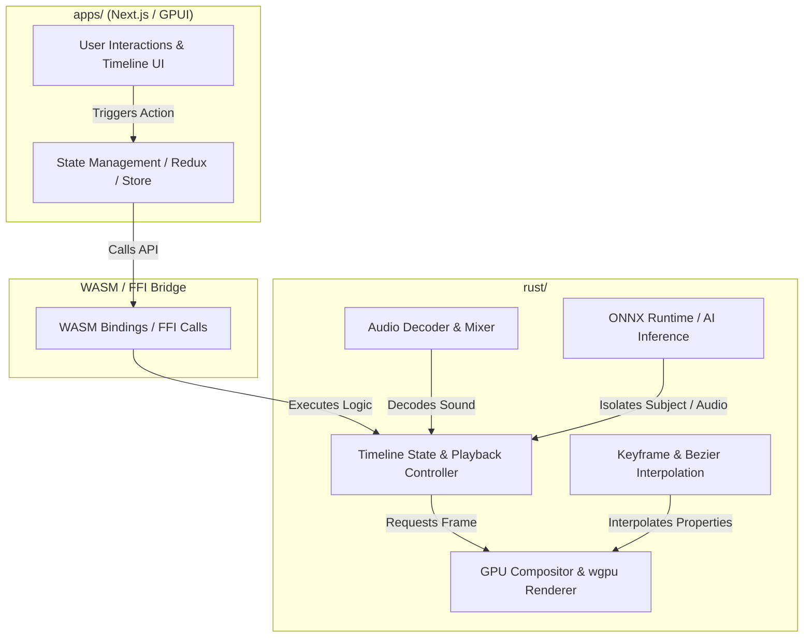
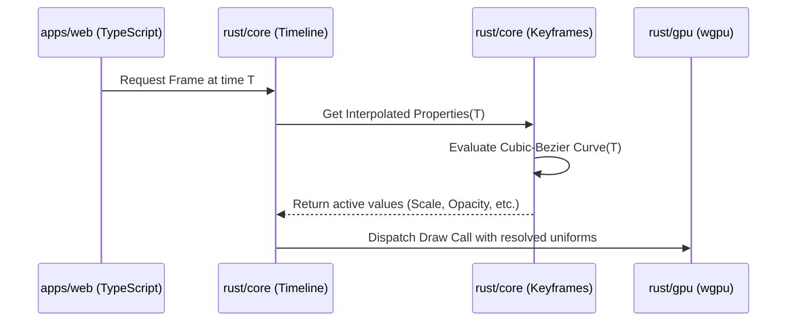
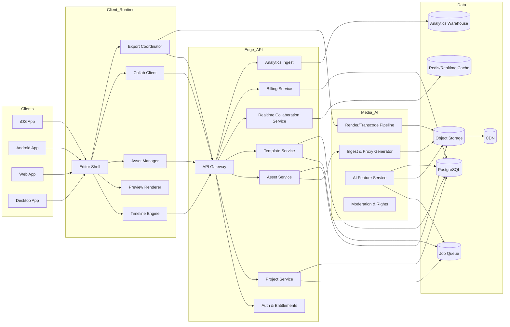
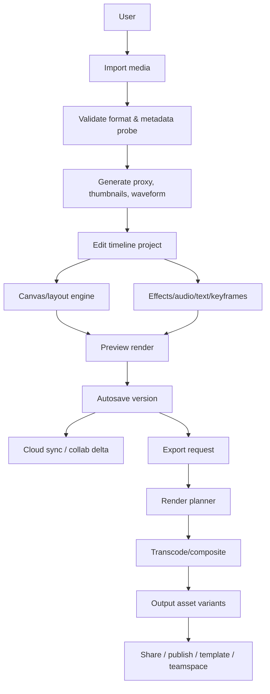
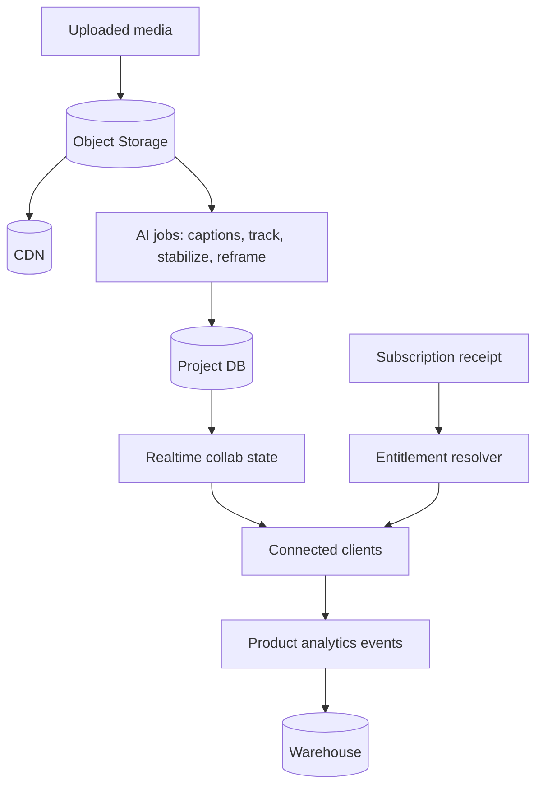
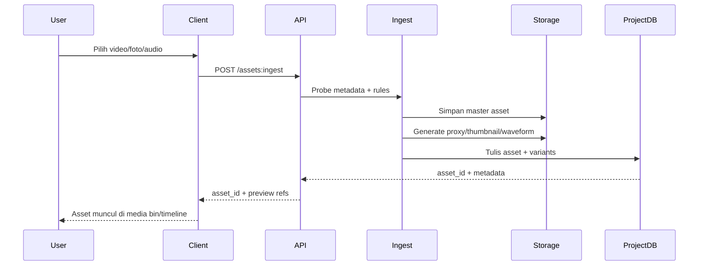
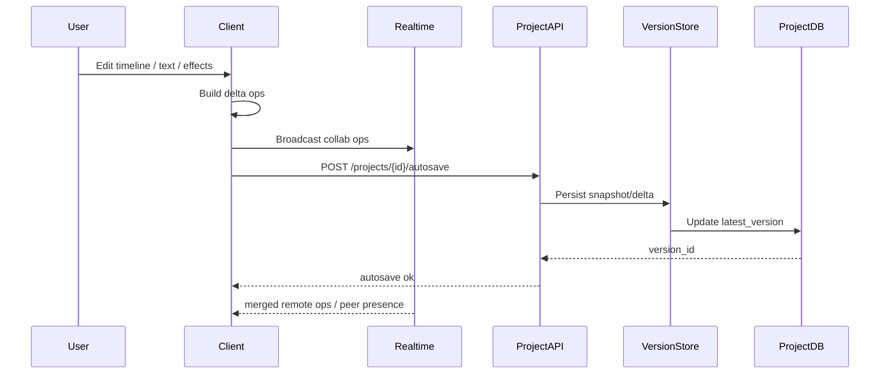
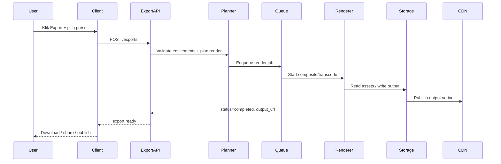

# CapCut Feature & Implementation Blueprint for OpenCut

This document serves as a comprehensive technical research and implementation blueprint for mapping CapCut's editing capabilities to the **OpenCut** architecture (Next.js web shell, GPUI desktop shell, and the shared Rust core).



---

## 1. Timeline & Basic Video Editing

The timeline is the backbone of any video editor. CapCut relies on a magnetic timeline structure that auto-snaps clips, handles track layers, and scales playback dynamic rates.

### CapCut Capabilities

*   **Magnetic & Multi-track Timeline**: Tracks automatically snap together to prevent black frames, while support for overlays (video/image layers above the main track) allows multi-cam or picture-in-picture edits.
*   **Speed Ramping & Slow-mo**: Standard speed adjustment (0.1x to 100x) paired with speed ramping curves (Presets: *Hero Time, Montage, Bullet, Jump Cut*) and custom speed graphs using Bezier curves.
*   **Split, Trim, Crop, and Slip**: Precision timeline manipulations down to individual frame boundaries.

### OpenCut Implementation Strategy

| Sub-system | Platform / Code Path | Tech Stack & Strategy |
| :--- | :--- | :--- |
| **State Management** | `rust/crates/timeline` | Move timeline representation (clips, transitions, tracks, cut points) fully into Rust to keep state platform-agnostic. Implement a transaction-based history for Undo/Redo. |
| **Speed Interpolation** | `rust/crates/gpu` | Handle speed ramping by interpolating texture frame timestamps in the rendering loop. For slow-motion, implement **optical flow frame interpolation** using a lightweight shader or model. |
| **Magnetic Physics** | `apps/web/src/stores` | Implement UI magnetic snapping in TS/Next.js (visually), but validate the resulting block alignment constraints in the Rust core timeline API. |

---

## 2. Keyframe Animation Engine

Keyframes allow users to animate parameters smoothly over time. CapCut supports keyframing almost every property (Position, Scale, Rotation, Opacity, Effects, Color).

### CapCut Capabilities

*   **Universal Property Mapping**: Keyframe placement on transform coordinates (X, Y, Z rotation, Scale), opacity sliders, and custom shader parameters.
*   **Graph Easing Curves**: Curve editing screen where users can set presets (*Ease In 1/2/3, Ease Out, Bounce*) or adjust custom cubic-bezier graphs to control acceleration between keyframes.

### OpenCut Implementation Strategy



*   **Logic Location**: `rust/crates/timeline/src/keyframes.rs`
    *   Implement keyframe track structs holding `(time_offset, value, interpolation_type, bezier_control_points)`.
*   **Mathematical Models**:
    *   **Linear**: $f(t) = t$.
    *   **Bezier**: Solve the cubic Bezier equation $B(t) = (1-t)^3 P_0 + 3(1-t)^2 t P_1 + 3(1-t) t^2 P_2 + t^3 P_3$ numerically (using Newton-Raphson iteration) to map target progress time to values.
*   **Shader Uniforms**: Send the resolved values as uniform inputs directly to the GPU vertex and fragment shader instances for drawing.

---

## 3. Audio Processing Suite

Modern short-form editors rely heavily on advanced audio tools for music sync, noise cleaning, and transcription.

### CapCut Capabilities

*   **Audio Waveform Rendering**: Fast multi-resolution waveform caching for timeline tracks.
*   **Beat Detection**: Automatic detection of music beats (transients) to place markers on the timeline.
*   **Voice Isolation & Noise Reduction**: Deep learning models that separate human speech from wind, background noise, or background music.
*   **Extracted Audio & Sound Effects**: Directly extracting audio files from loaded MP4 files.

### OpenCut Implementation Strategy

*   **Waveform Calculation**:
    *   Calculate RMS/Peak amplitude envelopes on the decoder level in `rust/crates/audio`.
    *   Return down-sampled arrays of waveform peaks to the UI for high-performance canvas rendering.
*   **Noise Reduction & Isolation**:
    *   Use a lightweight neural network (e.g., **RNNoise** or **CleanUNet**) compiled into WebAssembly or run locally via **ONNX Runtime (ort)** in the Rust core.
*   **Beat Detection**:
    *   Implement an **Onset Detection Function (ODF)** in Rust, utilizing a Short-Time Fourier Transform (STFT) to identify spectral flux/energy changes.

---

## 4. Text & Captions Engine

A core driver of CapCut's popularity is its rich caption generator, which eliminates the need to manually write subtitles.

### CapCut Capabilities

*   **Auto Captions**: Transcription of speech using highly optimized speech-to-text models.
*   **Text-to-Speech (TTS)**: Conversion of written text into multiple AI-generated voice characters (e.g., *Scream, Trickster, Kawaii*).
*   **Dynamic Text Templates**: 3D Text rendering, glowing text outlines, custom bubbles, and animation presets (e.g., *Fade In, Typewriter, Spring*).

### OpenCut Implementation Strategy

*   **Auto Captions (STT)**:
    *   Integrate **Whisper.cpp** (via WASM or static C/C++ bindings in Rust) to perform local, high-speed on-device speech-to-text.
*   **Text Rendering**:
    *   Use Rust crates such as `wgpu-text` or `glyphon` to render text directly in the GPU compositor pipeline, avoiding browser overhead.
    *   Support styling structures (outline thickness, shadow blur, text bubble shapes) via specialized fragment shaders.

---

## 5. GPU Effects & Transitions

CapCut contains thousands of transitions, filters, and overlays. All render-heavy effects run directly on the GPU.

### CapCut Capabilities

*   **Multi-pass Video Effects**: Complex styles such as *Bloom, Lens Blur, Glitch, Prism, Hallucination, Comic*.
*   **Body & Face Effects**: Real-time tracking of human limbs or faces to apply overlay masks (e.g., *Glow outline, angel wings, face distortion*).
*   **Transitions**: Smooth frame blending, directional pans, page curls, and zoom cuts.

### OpenCut Implementation Strategy

*   **Shader Architecture**:
    *   Implement as multi-pass WGSL shaders within `rust/crates/gpu`.
    *   For multi-pass shaders, orchestration is managed in TypeScript using helper functions such as `resolveEffectPasses` (which reads parameter configs and runs the corresponding GPU passes dynamically).
*   **Facial / Body Mapping**:
    *   Integrate **MediaPipe** (via WebGL/WASM bindings) to extract face mesh and body keypoints.
    *   Pass the coordinate keypoints as a uniform buffer to the GPU compositing stage to align overlay textures or masks on the body.

---

## 6. Color Grading & Adjustments

Professional creators use color grading parameters to correct footage lighting and color space.

### CapCut Capabilities

*   **Manual Adjustment Panel**: Highlights, shadows, contrast, brightness, temperature, hue, saturation.
*   **HSL & Color Wheels**: Individual control over hue, saturation, and luminance of specific color channels.
*   **LUTs (Look-Up Tables)**: Supporting `.cube` format file imports.
*   **AI Color Correction**: Auto-balance exposure.

### OpenCut Implementation Strategy

```text
Input Frame
    │
    ▼
Contrast/Brightness Shaders (Mathematical offset)
    │
    ▼
HSL Shader (RGB ──> HSV transformation, individual channel shift, ──> RGB)
    │
    ▼
3D LUT Texture Sample (1D coordinates mapping to a 3D RGB Color Cube)
    │
    ▼
Output Frame
```

*   **3D LUT Implementation**:
    *   Parse the `.cube` file in Rust.
    *   Load the data into a **3D Texture** (`wgpu::Texture` with dimension `TextureDimension::D3`).
    *   In the WGSL fragment shader, convert input RGB values to coordinate indexes and sample from the 3D texture using tri-linear filtering for high-speed color transformation.

---

## 7. AI-Powered Smart Tools

These tools separate CapCut from legacy editors, automating tasks that used to require manual rotoscoping.

### CapCut Capabilities

*   **Smart Cutout / Chroma Key**: Removing a background (with or without green screen) dynamically.
*   **Auto Reframe**: Tracking the primary subject (e.g., a dancer) and auto-cropping/translating the frame to convert horizontal videos (16:9) to vertical format (9:16).
*   **Motion Tracking**: Tracking an object (e.g., a face, a moving car) and attaching text or stickers to its position coordinates.

### OpenCut Implementation Strategy

*   **Smart Cutout**:
    *   Implement a background matting network like **U-2-Net** or **MODNet** inside the Rust core, running model inference on frames via **ONNX Runtime (ort)** or WebGPU shaders.
*   **Chroma Key**:
    *   Provide a shader-based solution that computes the Euclidean distance between a user-selected key color and the input texel in the YUV/YCbCr color space (which yields far superior results than raw RGB distance).
*   **Motion Tracking**:
    *   Implement standard **KCF (Kernelized Correlation Filter)** or **MOSSE** tracking algorithms in Rust, feeding bounding box updates back to timeline overlay coordinates.

# CAPCUT — ULTIMATE COMPLETE FEATURE BLUEPRINT

# 1:1 EXHAUSTIVE FEATURE CATALOG
>
> Version: 2.0 — Ultra-Detailed Edition
> Last Updated: June 2025
> Platform Coverage: iOS · Android · Windows · macOS · Web

---

## TABLE OF CONTENTS

1. [Overview & Identity](#1-overview--identity)
2. [Platform & Ecosystem](#2-platform--ecosystem)
3. [User Interface & Workspace](#3-user-interface--workspace)
4. [Project Management](#4-project-management)
5. [Built-in Camera & Recording](#5-built-in-camera--recording)
6. [Timeline & Editing Core](#6-timeline--editing-core)
7. [Video Editing — Basic Operations](#7-video-editing--basic-operations)
8. [Video Editing — Adjustments & Corrections](#8-video-editing--adjustments--corrections)
9. [Speed Controls & Time Manipulation](#9-speed-controls--time-manipulation)
10. [Keyframe Animation System](#10-keyframe-animation-system)
11. [Chroma Key & Background Removal](#11-chroma-key--background-removal)
12. [Masking System](#12-masking-system)
13. [Blend Modes](#13-blend-modes)
14. [Picture-in-Picture & Overlay](#14-picture-in-picture--overlay)
15. [Filters Library](#15-filters-library)
16. [Video Effects Library](#16-video-effects-library)
17. [Transitions Library](#17-transitions-library)
18. [Stickers & Elements](#18-stickers--elements)
19. [Text & Titles System](#19-text--titles-system)
20. [Audio — Import & Sources](#20-audio--import--sources)
21. [Audio — Editing Tools](#21-audio--editing-tools)
22. [Audio — Effects & Processing](#22-audio--effects--processing)
23. [Audio — Voice Effects & Changers](#23-audio--voice-effects--changers)
24. [Audio — Beat Sync & Music Features](#24-audio--beat-sync--music-features)
25. [Speech-to-Text & Auto Captions](#25-speech-to-text--auto-captions)
26. [Text-to-Speech (TTS)](#26-text-to-speech-tts)
27. [AI Features — Complete Catalog](#27-ai-features--complete-catalog)
28. [AI — Image & Photo Tools](#28-ai--image--photo-tools)
29. [AI — Video Generation & Editing](#29-ai--video-generation--editing)
30. [AI — Script & Content Generation](#30-ai--script--content-generation)
31. [AI — Avatar & Character](#31-ai--avatar--character)
32. [AI — Translation & Localization](#32-ai--translation--localization)
33. [AI — Commerce & Business](#33-ai--commerce--business)
34. [Motion Tracking](#34-motion-tracking)
35. [Auto Reframe](#35-auto-reframe)
36. [Video Stabilization](#36-video-stabilization)
37. [Color Grading — Complete System](#37-color-grading--complete-system)
38. [Templates System](#38-templates-system)
39. [Quick Tools](#39-quick-tools)
40. [Teleprompter](#40-teleprompter)
41. [Stock Library & Assets](#41-stock-library--assets)
42. [Media Import & Format Support](#42-media-import--format-support)
43. [Media Management & Organization](#43-media-management--organization)
44. [Export & Output](#44-export--output)
45. [Sharing & Publishing](#45-sharing--publishing)
46. [Cloud & Sync](#46-cloud--sync)
47. [Collaboration & Team Features](#47-collaboration--team-features)
48. [Brand Kit](#48-brand-kit)
49. [Social Media Integration](#49-social-media-integration)
50. [Batch Creation & Automation](#50-batch-creation--automation)
51. [CapCut Pro / Subscription](#51-capcut-pro--subscription)
52. [Platform-Specific Features](#52-platform-specific-features)
53. [Accessibility](#53-accessibility)
54. [Settings & Preferences](#54-settings--preferences)
55. [Performance & Technical](#55-performance--technical)
56. [Monetization Model](#56-monetization-model)
57. [Full Comparison Matrix](#57-full-comparison-matrix)
58. [Keyboard Shortcuts](#58-keyboard-shortcuts)
59. [System Requirements](#59-system-requirements)

---

## 1. OVERVIEW & IDENTITY

### 1.1 General Information

- **App Name**: CapCut — Video Editor
- **Former Name**: Viamaker (2019–2020)
- **Developer**: ByteDance Ltd.
- **Sub-Developer**: Shenzhen Lianmeng Technology Co., Ltd.
- **Country of Origin**: China (global product)
- **Launch Year**: 2020 (rebranded from Viamaker)
- **Total Downloads**: 1 Billion+ (Google Play alone)
- **Rating**: 4.4–4.7 stars (varies by platform)
- **Category**: Video Players & Editors / Photo & Video
- **Content Rating**: 12+ (iOS) / Everyone (Android)
- **Website**: capcut.com

### 1.2 Core Philosophy

- Free-first model with professional-grade capabilities
- AI-powered tools to simplify complex editing
- Deep integration with TikTok ecosystem
- Cross-platform availability (mobile → desktop → web)
- Template-driven workflow for quick content creation

### 1.3 Target Users

- Social media content creators (TikTok, Instagram, YouTube)
- Small business owners & marketers
- Casual/enthusiast video editors
- Educators & students
- E-commerce sellers
- Professional editors seeking lightweight tools

---

## 2. PLATFORM & ECOSYSTEM

### 2.1 Mobile App — iOS

- **Minimum OS**: iOS 12.0+
- **Devices**: iPhone 6s+, iPad Air 2+, iPod Touch 7th gen
- **App Store Category**: Photo & Video
- **Size**: ~300MB–500MB (varies with updates)
- **iPad Optimized**: Yes (separate iPad layout)
- **Apple Watch**: Not supported
- **iMessage App**: Not available

### 2.2 Mobile App — Android

- **Minimum OS**: Android 5.0+ (Lollipop)
- **Architecture**: ARM64 recommended (ARMv7 supported)
- **Google Play**: Available
- **APK**: Available for sideloading
- **App Size**: ~200MB–400MB (varies with updates)
- **Tablet Optimized**: Partial (responsive layout)

### 2.3 Desktop App — Windows

- **Minimum OS**: Windows 10 (64-bit)
- **Installation**: Standalone installer (.exe)
- **Microsoft Store**: Available
- **Size**: ~500MB–1GB+
- **Auto-Update**: Built-in update mechanism
- **Portable Version**: Not available

### 2.4 Desktop App — macOS

- **Minimum OS**: macOS 10.14+ (Mojave)
- **Apple Silicon**: Native M1/M2/M3/M4 support
- **Mac App Store**: Available + standalone installer
- **Size**: ~500MB–1GB+
- **Auto-Update**: Built-in update mechanism

### 2.5 Web Editor

- **URL**: capcut.com/editor (browser-based)
- **Browsers**: Chrome 80+, Firefox 75+, Safari 14+, Edge 80+
- **Requirement**: JavaScript enabled, stable internet
- **Feature Parity**: ~60-70% of mobile/desktop features
- **Cloud Rendering**: Server-side export
- **PWA Support**: Can be installed as progressive web app

### 2.6 Browser Extension

- **Chrome Extension**: Available
- **Features**: Screen recording, web video capture, quick trim
- **Integration**: Direct import to CapCut editor

### 2.7 Cross-Platform Ecosystem

- **Unified Account**: ByteDance account, Google, Facebook, Apple, TikTok login
- **Project Sync**: Cloud-synced projects across all devices
- **Start Mobile → Continue Desktop**: Seamless handoff
- **Asset Sync**: Custom assets available on all platforms
- **Settings Sync**: Preferences synced across devices

---

## 3. USER INTERFACE & WORKSPACE

### 3.1 Home Screen (Mobile)

- **New Project Button**: Prominent "+" create button
- **Project Grid/List**: View all saved projects
- **Recent Projects**: Quick-access row of recent projects
- **Template Tab**: Browse trending/curated templates
- **Quick Tools Tab**: One-tap utility tools
- **Search Bar**: Global search (templates, effects, tools)
- **Notification Bell**: Updates, tips, promotions
- **Profile/Account**: Account settings and subscription
- **For You Feed**: Personalized template recommendations
- **Trending Section**: Currently popular templates
- **Category Chips**: Filter by category (Business, Vlog, etc.)

### 3.2 Editor Layout — Mobile

- **Top Section**: Preview window (real-time playback)
- **Bottom Section**: Timeline editor
- **Floating Toolbar**: Context-sensitive tool bar
- **Property Panel**: Slide-up sheet for selected element
- **Undo/Redo Buttons**: Top bar undo/redo
- **Settings Gear**: Project settings
- **Export Button**: Top-right export action
- **Aspect Ratio Toggle**: Quick aspect ratio switcher
- **Preview Play Button**: Large centered play/pause
- **Fullscreen Preview**: Tap preview to enter fullscreen
- **Two-Handed Editing**: Optimized for landscape orientation
- **Gesture Controls**:
  - Pinch to zoom timeline
  - Long press to drag clips
  - Swipe to scrub
  - Double-tap to edit selected element
  - Two-finger rotate for elements

### 3.3 Editor Layout — Desktop

- **Menu Bar**: File, Edit, View, Tools, Help
- **Top Toolbar**: Quick action buttons
- **Preview Monitor**: Resizable, center-left default
- **Source Monitor**: Preview raw clips before editing
- **Timeline Panel**: Bottom, multi-track horizontal
- **Media Bin**: Left panel, imported assets
- **Effects Panel**: Left panel tab, browse effects
- **Properties Inspector**: Right panel, selected element properties
- **Audio Meters**: Right side, real-time levels
- **Effect Controls**: Right panel tab, effect parameters
- **History Panel**: Edit history browser
- **Markers Panel**: Chapter/marker management
- **Resizable Panels**: All panels drag-to-resize
- **Panel Rearrange**: Customize workspace layout
- **Workspace Presets**: Save/load custom workspaces
- **Dual Monitor**: Support for multi-display setup
- **Dark Theme**: Default dark UI
- **Light Theme**: Optional light UI

### 3.4 Project Settings (Configurable)

- **Resolution Presets**: 360p, 480p, 720p, 1080p, 1440p (2K), 2160p (4K)
- **Custom Resolution**: User-defined width × height
- **Frame Rate**: 24fps, 25fps, 30fps, 50fps, 60fps
- **Aspect Ratio**: 16:9, 9:16, 1:1, 4:5, 5:4, 3:4, 4:3, 21:9, 2.35:1, 2.39:1, custom
- **Background Color**: Hex color picker for project background
- **Default Transition Duration**: 0.1s – 5.0s
- **Default Photo Duration**: 2s – 10s (for photo slideshows)
- **Audio Sample Rate**: 44.1kHz, 48kHz
- **Auto-Save Interval**: Configurable (30s, 1min, 5min, etc.)

---

## 4. PROJECT MANAGEMENT

### 4.1 Project Operations

- **Create New Project**: Blank or from template
- **Duplicate Project**: Full project copy
- **Rename Project**: Custom project names
- **Delete Project**: Delete with confirmation
- **Project Sort**: By name, date modified, date created, size
- **Project Search**: Find projects by name
- **Project Info**: View resolution, duration, size, creation date

### 4.2 Save & Recovery

- **Auto-Save**: Periodic automatic saving (background)
- **Manual Save**: Explicit save action
- **Project Recovery**: Recover from crash/force-close
- **Version History**: Browse previous project versions (cloud)
- **Undo History**: Multi-level undo (50–100+ steps)
- **Redo**: Forward through undo history

### 4.3 Project Import/Export

- **Export Project File**: Save project as .ccproject (CapCut native)
- **Import Project File**: Open .ccproject files
- **Project Archiving**: Archive old projects to free space
- **Project Transfer**: Transfer project between devices via cloud

---

## 5. BUILT-IN CAMERA & RECORDING

### 5.1 Camera Modes

- **Video Recording**: Standard video capture
- **Photo Capture**: Take photos within app
- **Hands-Free Mode**: Timer-based recording without holding
- **Countdown Timer**: 3s, 5s, 10s countdown before recording
- **Tap to Record**: Hold-to-record or tap-to-start/stop
- **Speed Recording**: Record at 0.3x, 0.5x, 1x, 2x, 3x speed
- **Flip Camera**: Front/rear camera switch (live)
- **Touch to Focus**: Tap to set focus point
- **Touch to Expose**: Tap to set exposure
- **Grid Overlay**: Rule of thirds / grid lines for framing
- **Flash Control**: On/Off/Auto for rear camera
- **Stabilization**: Real-time video stabilization during recording
- **Resolution Selection**: Choose recording resolution (720p, 1080p, 4K)

### 5.2 AR Camera Effects (Real-Time)

- **Face Filters**: AR face effects (beauty, funny, artistic)
- **Face Tracking**: Real-time face detection and tracking
- **Background Effects**: Real-time background blur/change during recording
- **Body Effects**: Full-body AR effects
- **Hand Gesture Effects**: Effects triggered by hand movements
- **3D Object Placement**: Place 3D objects in camera view
- **Color Filters**: Real-time color filter preview
- **Beauty Mode**: Skin smoothing, face reshaping, eye enlargement

### 5.3 Beauty/Retouch Camera Tools

- **Skin Smoothing**: Adjustable smoothing level
- **Face Slimming**: Narrow face shape
- **Eye Enlargement**: Bigger eyes effect
- **Nose Reshaping**: Nose size adjustment
- **Lip Color**: Virtual lip color
- **Foundation**: Virtual makeup foundation
- **Blush**: Virtual blush application
- **Brow Shape**: Eyebrow reshaping
- **Teeth Whitening**: Whiten teeth in real-time
- **Dark Circle Removal**: Remove under-eye circles
- **Auto-Beauty**: One-tap beauty enhancement

### 5.4 Teleprompter Mode (In-App Recording)

- **Script Display**: Show scrolling text during recording
- **Scroll Speed**: Adjustable text scroll speed
- **Font Size**: Adjustable text size for readability
- **Text Opacity**: Adjust transparency of teleprompter text
- **Mirror Mode**: Mirror text for beam-splitter teleprompters
- **Import Script**: Paste or type script text
- **AI Script Generation**: Generate script directly in teleprompter

### 5.5 Voiceover Recording

- **Direct Voiceover**: Record narration over timeline
- **Monitoring**: Listen to existing audio while recording
- **Countdown**: Pre-recording countdown
- **Microphone Selection**: Choose input device (desktop)
- **Input Level**: Visual input level meter
- **Re-Record**: Easily re-do voiceover takes

### 5.6 Screen Recording (Desktop/Extension)

- **Full Screen Capture**: Record entire screen
- **Window Capture**: Record specific application window
- **Region Capture**: Record selected screen area
- **Webcam Overlay**: Optional webcam overlay on screen recording
- **System Audio**: Capture system audio
- **Microphone**: Simultaneous mic recording
- **Recording Controls**: Start, pause, stop
- **Annotation Tools**: Drawing tools during screen recording

---

## 6. TIMELINE & EDITING CORE

### 6.1 Timeline Architecture

- **Video Tracks**: Up to 6+ video layers (desktop), 3–4 (mobile)
- **Audio Tracks**: 4+ dedicated audio tracks
- **Text Track**: Dedicated text/title layer
- **Sticker/Element Track**: Overlay elements layer
- **Effect Track**: Global effect layer
- **Adjustment Track**: Global adjustment layer
- **Track Height**: Adjustable track height
- **Track Expansion**: Expand/collapse individual tracks
- **Track Locking**: Lock tracks to prevent edits
- **Track Muting**: Mute/unmute individual tracks
- **Track Visibility**: Show/hide tracks
- **Track Naming**: Custom track names
- **Track Reordering**: Drag to reorder tracks

### 6.2 Clip Operations

- **Split/Cut (Blade)**: Cut clip at playhead position
- **Multi-Split**: Split all tracks at playhead simultaneously
- **Trim (Start)**: Trim clip from beginning
- **Trim (End)**: Trim clip from end
- **Trim (Slip)**: Change in/out points without moving clip
- **Trim (Roll)**: Adjust edit point between two adjacent clips
- **Ripple Trim**: Trim and close resulting gap
- **Ripple Delete**: Delete clip and close gap
- **Lift**: Delete clip leaving gap
- **Extract**: Remove clip and close gap (all tracks)
- **Insert Edit**: Insert clip at playhead, pushing existing content
- **Overwrite Edit**: Place clip at playhead, replacing existing
- **Replace Clip**: Swap media while keeping all edits/effects
- **Copy Clip**: Copy to clipboard
- **Cut Clip**: Cut to clipboard
- **Paste Clip**: Paste from clipboard at playhead
- **Paste Insert**: Paste and insert (ripple)
- **Paste Attributes**: Copy effects/properties from one clip to another
- **Duplicate Clip**: Clone clip adjacent or elsewhere
- **Select All**: Select all clips on all tracks
- **Select Track**: Select all clips on one track
- **Deselect**: Clear selection
- **Group Clips**: Link multiple clips for group operations
- **Ungroup**: Remove clip grouping
- **Link/Unlink**: Link/unlink video and audio of same clip
- **Freeze Frame**: Insert still frame at any point
- **Add Edit**: Add cut point without using blade tool
- **Match Frame**: Find source frame in preview
- **Sub-Clip**: Create sub-segment from longer clip

### 6.3 Clip Properties

- **Duration**: Display and adjust clip duration
- **Start/End Timecode**: Precise in/out points
- **Position**: X/Y coordinates
- **Scale/Size**: Resize percentage
- **Rotation**: Rotation angle (0°–360°)
- **Opacity**: 0%–100%
- **Anchor Point**: Transform origin point
- **Speed**: Playback speed multiplier
- **Volume**: Audio level per clip
- **Audio Pan**: Left/Right stereo panning
- **Blend Mode**: Compositing mode
- **Composite Order**: Layer stacking order

### 6.4 Timeline Navigation

- **Playhead Scrubbing**: Drag playhead for frame-by-frame
- **Zoom In/Out**: Magnify timeline (pinch/scroll/keyboard)
- **Zoom to Fit**: Fit entire project in view
- **Zoom to Selection**: Zoom to selected clip(s)
- **Scroll**: Horizontal/vertical scrolling
- **Snapping**: Toggle magnetic snap (clips snap to edges, playhead, markers)
- **Playhead Centering**: Keep playhead centered while scrubbing
- **Go to Start**: Jump to project beginning
- **Go to End**: Jump to project end
- **Go to In Point**: Jump to marker in
- **Go to Out Point**: Jump to marker out
- **Next Edit Point**: Jump to next cut/clip edge
- **Previous Edit Point**: Jump to previous cut/clip edge
- **J-K-L Playback**: Reverse-pause-forward speed control (desktop)
- **Frame Step Forward**: Move one frame forward
- **Frame Step Backward**: Move one frame backward
- **5-Second Jump**: Jump forward/back 5 seconds
- **Loop Playback**: Loop selected region or entire timeline
- **In/Out Points**: Set in and out points for region operations

### 6.5 Markers

- **Add Marker**: Place marker at playhead
- **Marker Colors**: Color-coded markers
- **Marker Labels**: Named/annotated markers
- **Edit Markers**: Modify marker position and properties
- **Delete Markers**: Remove individual or all markers
- **Jump to Marker**: Navigate between markers
- **Beat Markers**: Auto-generated markers from beat detection
- **Chapter Markers**: Define chapters for export

### 6.6 Smart Editing Operations

- **Smart Split**: AI-powered automatic splitting
- **Smart Trim**: AI suggests trim points (remove silence)
- **Scene Detection**: Auto-detect scene changes and split
- **Gap Removal**: Remove all gaps between clips
- **Close Gap**: Close gap at specific point
- **Align Clips**: Snap clips to align on timeline

---

## 7. VIDEO EDITING — BASIC OPERATIONS

### 7.1 Transform

- **Position X/Y**: Move element horizontally/vertically
- **Scale**: Resize (uniform and non-uniform)
- **Rotation**: Rotate 0°–360° (free rotation)
- **Flip Horizontal**: Mirror left-right
- **Flip Vertical**: Mirror top-bottom
- **Anchor Point**: Set transform origin
- **Skew**: Perspective distortion
- **Corner Pin**: Four-corner transform (perspective)
- **Reset Transform**: Return to default values

### 7.2 Crop

- **Free Crop**: Drag to crop any area
- **Preset Ratios**: 16:9, 9:16, 1:1, 4:5, 3:4, 4:3, 21:9
- **Custom Ratio**: User-defined crop ratio
- **Pixel-Accue**: Set exact pixel dimensions
- **Crop Feathering**: Soften crop edges
- **Crop Invert**: Invert crop (keep outside instead)
- **Animated Crop**: Keyframe crop position/size over time

### 7.3 Video Adjustments (Detailed)

- **Brightness**: -100 to +100
- **Contrast**: -100 to +100
- **Saturation**: -100 to +100
- **Exposure**: -100 to +100
- **Highlights**: -100 to +100
- **Shadows**: -100 to +100
- **Whites**: -100 to +100
- **Blacks**: -100 to +100
- **Temperature**: -100 to +100
- **Tint**: -100 to +100
- **Hue**: -180° to +180°
- **Vibrance**: -100 to +100
- **Sharpen**: 0 to 100
- **Clarity**: -100 to +100
- **Vignette**: -100 to +100
- **Fade**: 0 to 100
- **Grain**: 0 to 100
- **Dehaze**: -100 to +100
- **Glow**: 0 to 100

### 7.4 Clip Speed

- **Normal Speed**: 0.1x to 100x (covered in detail in Section 9)

### 7.5 Reverse

- **Reverse Video**: Play video backwards
- **Reverse Audio**: Reverse audio independently
- **Combined Reverse**: Reverse audio + video together

### 7.6 Duplicate & Freeze

- **Duplicate Frame**: Repeat current frame
- **Freeze Frame**: Insert still image from video
- **Freeze Duration**: Set freeze frame length
- **Freeze with Transition**: Smooth transition into/out of freeze

### 7.7 Stabilization

- **Video Stabilization**: Reduce camera shake
- **Stabilization Levels**:
  - Minimal (slight stabilization)
  - Recommended (balanced)
  - Most (maximum stabilization, potential crop)
- **Cropping from Stabilization**: Show crop amount indicator
- **Preview**: Real-time stabilization preview

### 7.8 Denoise

- **Video Noise Reduction**: Reduce visual noise/grain
- **Level Control**: Adjustable noise reduction strength

### 7.9 Enhance

- **AI Video Enhance**: Upscale and improve video quality
- **Super Resolution**: AI upscaling (e.g., 720p → 1080p → 4K)
- **Face Enhancement**: AI face detail recovery
- **Detail Recovery**: Restore lost details in low-quality footage
- **Color Enhancement**: AI-powered color improvement

---

## 8. VIDEO EDITING — ADJUSTMENTS & CORRECTIONS

### 8.1 White Balance

- **Temperature Slider**: Cool ↔ Warm (Kelvin equivalent)
- **Tint Slider**: Green ↔ Magenta
- **Auto White Balance**: AI-powered auto correction
- **Preset White Balance**: Daylight, Cloudy, Tungsten, Fluorescent, Shade

### 8.2 Tone Curve (RGB Curves)

- **Master Curve**: Overall luminance curve
- **Red Channel**: Individual red curve
- **Green Channel**: Individual green curve
- **Blue Channel**: Individual blue curve
- **Point Curve**: Add/move control points
- **Reset Curve**: Return to linear

### 8.3 HSL (Hue/Saturation/Luminance)

- **Per-Color Control**: Red, Orange, Yellow, Green, Aqua, Blue, Purple, Magenta
- **Hue Shift**: Shift specific colors
- **Saturation**: Adjust saturation per color
- **Luminance**: Adjust brightness per color

### 8.4 Color Wheels (Desktop)

- **Lift**: Adjust shadows color
- **Gamma**: Adjust midtones color
- **Gain**: Adjust highlights color
- **Offset**: Overall color shift

### 8.5 Split Toning

- **Highlight Color**: Apply color to highlights
- **Shadow Color**: Apply color to shadows
- **Balance**: Weight between highlights and shadows
- **Saturation**: Intensity of split toning

### 8.6 LUT Support

- **Built-in LUTs**: Cinematic LUTs included
- **Import .cube LUTs**: Import custom LUT files (Pro)
- **LUT Intensity**: Adjustable LUT strength (0–100%)
- **LUT + Manual Adjustments**: Stack LUT with manual grading

### 8.7 Auto Correction

- **Auto Color**: AI auto color correction
- **Auto Contrast**: Automatic contrast adjustment
- **Auto White Balance**: One-tap white balance fix
- **Auto Exposure**: Normalize exposure levels

---

## 9. SPEED CONTROLS & TIME MANIPULATION

### 9.1 Basic Speed

- **Speed Range**: 0.1x to 100x
- **Common Presets**: 0.1x, 0.2x, 0.3x, 0.4x, 0.5x, 0.75x, 1x, 1.25x, 1.5x, 2x, 3x, 4x, 5x, 8x, 10x, 20x, 50x, 100x
- **Custom Speed**: Manual entry for exact speed
- **Reverse**: -1x playback (video backwards)
- **Maintain Audio Pitch**: Option to keep audio pitch when changing speed
- **Mute on Speed Change**: Option to mute audio during speed changes

### 9.2 Speed Ramping / Curve

- **Speed Curve Editor**: Graphical editor for variable speed
- **Speed Keyframes**: Place speed change points
- **Preset Speed Curves**:
  - Montage: Slow → Fast → Slow
  - Hero: Fast → Slow (emphasis moment)
  - Bullet Time: Fast → Slow → Fast
  - Smooth: Gradual acceleration/deceleration
  - Jump Cut: Instant speed jumps
  - Custom: User-drawn curve
- **Velocity Graph**: Visual display of speed over time
- **Ease In**: Gradual speed increase from slow
- **Ease Out**: Gradual speed decrease to slow
- **Bezier Handles**: Fine-tune speed transitions
- **Preview**: Real-time preview of speed changes

### 9.3 Slow Motion

- **Standard Slow-Mo**: Reduce speed (0.5x, 0.25x, etc.)
- **Optical Flow (AI Frame Interpolation)**: AI generates intermediate frames for ultra-smooth slow motion
- **Frame Blending**: Blend adjacent frames for smoother slow-mo
- **Twixtor-Style**: Advanced time remapping (AI-enhanced)
- **Freeze + Slo-Mo**: Combine freeze frames with slow motion segments

### 9.4 Time Remapping

- **Free-Form Time Mapping**: Non-linear time manipulation
- **Time Reverse Segments**: Reverse portions within a clip
- **Hold Frames**: Pause at specific frames
- **Ramp Into Slow-Mo**: Smoothly transition from normal to slow
- **Ramp Out of Slow-Mo**: Smoothly return to normal speed

### 9.5 Hyperlapse / Timelapse

- **Timelapse Creation**: Speed up long footage (10x–100x)
- **Hyperlapse**: Stabilized timelapse (with stabilization)
- **Frame Sampling**: Choose frame sampling method for extreme speeds

---

## 10. KEYFRAME ANIMATION SYSTEM

### 10.1 Keyframe-Supported Properties

- **Transform Properties**:
  - Position (X, Y)
  - Scale (width, height, uniform)
  - Rotation (0°–360°+)
  - Anchor Point
  - Opacity (0%–100%)
  - Skew
- **Video Properties**:
  - All color adjustments (brightness, contrast, etc.)
  - Filter intensity
  - Effect parameters
  - Blur amount
  - Sharpen amount
  - Vignette
  - Grain
  - Crop (position, size)
  - Border/outline properties
- **Audio Properties**:
  - Volume
  - Audio pan (left/right)
  - Audio effect parameters
  - EQ bands
- **Text Properties**:
  - Font size
  - Text color
  - Stroke width
  - Shadow parameters
  - Background parameters
  - Character/line spacing
- **Mask Properties**:
  - Mask path (shape)
  - Mask feather
  - Mask expansion
  - Mask opacity
  - Mask rotation
- **Speed**: Speed value at keyframe points (speed ramping)

### 10.2 Keyframe Controls

- **Add Keyframe**: Place keyframe at playhead for selected property
- **Auto-Keyframe**: Automatically create keyframes when property changes
- **Delete Keyframe**: Remove selected keyframe
- **Delete All Keyframes**: Remove all keyframes for property
- **Move Keyframe**: Reposition keyframe in time
- **Copy Keyframe**: Copy keyframe to clipboard
- **Paste Keyframe**: Paste keyframe at playhead
- **Paste Multiple Keyframes**: Paste animation to different clip
- **Select Multiple Keyframes**: Shift-click for batch selection

### 10.3 Interpolation Types

- **Linear**: Constant-rate change between keyframes
- **Ease In**: Gradually accelerate from keyframe
- **Ease Out**: Gradually decelerate into keyframe
- **Ease In & Out**: Smooth acceleration and deceleration
- **Bezier**: Custom curve with handles
- **Hold**: Instant change (no interpolation)
- **Auto-Bezier**: Automatic smooth curve
- **Continuous Bezier**: Smooth through keyframe with linked handles

### 10.4 Curve Editor (Desktop)

- **Value Graph**: View and edit value over time
- **Speed Graph**: View and edit rate of change
- **Bezier Handles**: Drag handles for fine curve control
- **Zoom**: Zoom in/out on curve view
- **Per-Channel Curves**: Edit X and Y independently

### 10.5 Pre-Built Animations

- **Pan & Zoom (Ken Burns)**:
  - Zoom In (center)
  - Zoom Out (center)
  - Pan Left → Right
  - Pan Right → Left
  - Pan Up → Down
  - Pan Down → Up
  - Custom pan/zoom
- **Entry Animations**:
  - Fade In
  - Slide In (Left, Right, Top, Bottom)
  - Pop In (scale from 0)
  - Bounce In
  - Rotate In
  - Flip In (3D)
  - Drop In
  - Zoom In
  - Wipe In
- **Exit Animations**:
  - Fade Out
  - Slide Out (all directions)
  - Pop Out
  - Shrink Out
  - Rotate Out
  - Flip Out
  - Zoom Out
  - Wipe Out
- **Emphasis Animations**:
  - Pulse
  - Bounce
  - Shake
  - Swing
  - Jello
  - Rubber Band
  - Flash
  - Glow
  - Tada
  - Heartbeat
  - Blink
  - Bob
  - Float
- **Save Custom Animation**: Save own keyframe animations as presets
- **Favorite Animations**: Pin frequently used presets

---

## 11. CHROMA KEY & BACKGROUND REMOVAL

### 11.1 Chroma Key (Green/Blue Screen)

- **Color Picker**: Select exact chroma key color
- **Auto-Detect**: AI auto-detect green/blue screen
- **Tolerance**: Adjust color matching sensitivity (0–100%)
- **Edge Feathering**: Soften edges around subject (0–100)
- **Shadow**: Restore shadow detail from removed background
- **Spill Suppression**: Remove color bleeding on edges
- **Spill Color**: Target color for spill removal
- **Edge Thin/Thick**: Refine edge thickness
- **Clip Black**: Crush blacks for cleaner matte
- **Clip White**: Crush whites for cleaner matte
- **Matte Generation**: View matte for fine-tuning
- **Foreground/Background Color Correction**: Color-match subject to new background
- **Decontamination**: Clean edges from background color contamination
- **Preview**: Real-time before/after split view

### 11.2 AI Background Removal (Portrait/Subject)

- **Automatic Detection**: AI identifies and isolates subjects
- **No Green Screen Required**: Works with any background
- **Portrait Mode**: Optimized for people (faces, hair, etc.)
- **Object Mode**: General object isolation
- **Multiple Subjects**: Detect and isolate multiple subjects
- **Edge Refinement**: Clean, natural-looking edges
- **Hair Detail**: Preserve fine hair detail
- **Temporal Consistency**: Stable mask across all frames
- **Background Replacement Options**:
  - Solid color
  - Gradient
  - Blur (portrait blur / depth-of-field)
  - Custom image
  - Custom video
  - Transparent
  - Pre-designed background templates
- **Background Blur Levels**: Adjustable blur strength
- **Depth Map**: AI-generated depth map for variable blur
- **Foreground Blur**: Blur foreground elements for cinematic DOF

---

## 12. MASKING SYSTEM

### 12.1 Mask Types

- **Linear (Gradient)**: Straight-line gradient mask
- **Rectangle**: Rectangular mask with rounded corners option
- **Circle/Ellipse**: Circular/oval mask
- **Heart**: Heart-shaped mask
- **Star**: Star-shaped mask
- **Triangle**: Triangular mask
- **Pentagon**: Pentagon-shaped mask
- **Arrow**: Arrow-shaped mask
- **Custom/Freehand**: Hand-drawn mask with pen tool
- **AI Subject Mask**: AI auto-detect and mask subjects
- **Luminance Mask**: Mask based on brightness values
- **Color Range Mask**: Mask based on color selection

### 12.2 Mask Controls

- **Invert Mask**: Swap masked/unmasked areas
- **Feather**: Soften mask edges (0–200+)
- **Expansion/Contraction**: Grow or shrink mask boundary
- **Mask Opacity**: Transparency of mask effect (0–100%)
- **Mask Rotation**: Rotate mask shape
- **Mask Position**: Move mask on canvas
- **Mask Scale**: Resize mask uniformly
- **Mask Path**: Edit individual control points (freehand)
- **Mask Shape Presets**: Quick-apply common shapes
- **Multiple Masks**: Apply multiple masks to one clip
- **Mask Blend Mode**: Combine masks (Add, Subtract, Intersect, None)
- **Mask Keyframing**: Animate all mask properties over time
- **Mask Tracking**: Auto-track mask with moving subject

---

## 13. BLEND MODES

### 13.1 Full Blend Mode List

| # | Blend Mode | Category |
| --- | --- | --- |
| 1 | Normal | Default |
| 2 | Dissolve | Default |
| 3 | Darken | Darken |
| 4 | Multiply | Darken |
| 5 | Color Burn | Darken |
| 6 | Linear Burn | Darken |
| 7 | Darker Color | Darken |
| 8 | Lighten | Lighten |
| 9 | Screen | Lighten |
| 10 | Color Dodge | Lighten |
| 11 | Linear Dodge (Add) | Lighten |
| 12 | Lighter Color | Lighten |
| 13 | Overlay | Contrast |
| 14 | Soft Light | Contrast |
| 15 | Hard Light | Contrast |
| 16 | Vivid Light | Contrast |
| 17 | Linear Light | Contrast |
| 18 | Pin Light | Contrast |
| 19 | Hard Mix | Contrast |
| 20 | Difference | Inversion |
| 21 | Exclusion | Inversion |
| 22 | Subtract | Inversion |
| 23 | Divide | Inversion |
| 24 | Hue | HSL |
| 25 | Saturation | HSL |
| 26 | Color | HSL |
| 27 | Luminosity | HSL |

### 13.2 Blend Mode Controls

- **Opacity with Blend**: Adjust blend intensity
- **Fill with Blend**: Adjust fill opacity (affects certain modes differently)
- **Knockout**: Allow layers below to show through

---

## 14. PICTURE-IN-PICTURE & OVERLAY

### 14.1 Video Overlay (PiP)

- **Layer Multiple Videos**: Stack videos on top of each other
- **Free-Form Placement**: Drag to position anywhere on canvas
- **Resize**: Corner handles to resize
- **Rotation**: Rotate overlay independently
- **Opacity**: 0–100% transparency
- **Blend Mode**: Apply blend modes to overlay
- **Auto-Mute**: Option to mute overlay audio
- **Audio Mix**: Blend overlay audio with main video
- **Flip**: Horizontal/vertical flip

### 14.2 PiP Shapes

- **Rectangle**: Default rectangular overlay
- **Rounded Rectangle**: With adjustable corner radius
- **Circle**: Circular crop overlay
- **Custom Shape**: Use mask for custom PiP shapes

### 14.3 PiP Styling

- **Border/Outline**: Add border with color and width
- **Drop Shadow**: Shadow with offset, blur, color
- **Background**: Background behind PiP (solid/gradient)
- **Corners**: Rounded corner adjustment

### 14.4 PiP Animation

- **Entry Animations**: Fade, slide, pop, bounce, rotate, zoom
- **Exit Animations**: Reverse of entry animations
- **Loop Animations**: Continuous subtle motion
- **Keyframe Animation**: Full custom PiP animation
- **Preset Motions**: Floating, shaking, orbiting, etc.

### 14.5 Image Overlay

- **Layer Images**: Place images on top of video
- **Sticker/Logo Overlay**: Permanent branding overlay
- **Watermark**: Add custom watermark
- **Photo Overlay**: Overlay photos with transparency (PNG)
- **GIF Overlay**: Overlay animated GIFs

---

## 15. FILTERS LIBRARY

### 15.1 Filter Categories (Detailed)

- **Portrait**: Skin-enhancing filters optimized for faces
- **Vintage**: Retro film looks (70s, 80s, 90s aesthetics)
- **Film**: Cinema film emulation (Kodak, Fuji-inspired)
- **Cinematic**: Movie-like color grading (teal & orange, etc.)
- **Food**: Enhance food photography colors
- **Nature**: Outdoor/landscape enhancement
- **Urban/City**: Street photography moods
- **BW (Black & White)**: Various monochrome styles
- **Warm**: Warm-toned filters
- **Cool**: Cool/blue-toned filters
- **Moody**: Dark, dramatic aesthetics
- **Vibrant**: Saturated, colorful looks
- **Faded**: Matte, washed-out film looks
- **Spring**: Light, pastel tones
- **Summer**: Bright, warm tones
- **Autumn/Warm Autumn**: Orange, brown, warm earthy
- **Winter**: Cool, desaturated, blue-toned
- **Dream**: Soft, ethereal looks
- **Retro**: Vintage camera simulation
- **Dramatic**: High contrast, bold tones
- **Soft Light**: Gentle, flattering tones
- **HDR Effect**: Simulated HDR look
- **Polaroid**: Instant camera simulation
- **Lomo**: Lomography camera effect
- **Cross Process**: Darkroom cross-processing look
- **Noir**: Classic film noir
- **Pastel**: Soft pastel color palette
- **Neon**: Vibrant neon color effect
- **Leak**: Light leak overlay effects
- **Dust & Scratch**: Aged film imperfections
- **Cinema**: Hollywood movie color grading
- **Korea/Japanese**: East Asian aesthetic filters
- **Social Media**: Platform-optimized looks

### 15.2 Filter Controls

- **Intensity/Strength**: 0%–100% filter strength
- **Compare**: Before/after split view
- **Favorite Filters**: Star/pin filters for quick access
- **Recent Filters**: Recently used filter history
- **Filter Preview Grid**: Thumbnail grid preview of all filters
- **Filter + Manual Adjustment**: Stack filter with manual color grading
- **Filter Search**: Search filters by name

---

## 16. VIDEO EFFECTS LIBRARY

### 16.1 Effect Categories (Detailed)

#### Style Effects

- **Cartoon**: Turn video into cartoon style
- **Sketch**: Pencil sketch effect
- **Oil Painting**: Oil painting simulation
- **Watercolor**: Watercolor painting style
- **Comic Book**: Pop art / comic style
- **Mosaic**: Pixelation effect
- **Posterize**: Reduce color levels
- **Halftone**: Dot pattern print simulation
- **Emboss**: 3D embossed look
- **Edge Detection**: Outline drawing effect
- **Thermal**: Thermal camera look
- **X-Ray**: X-ray film negative
- **Pencil**: Fine pencil line drawing
- **Neon Outline**: Glowing neon edge effect

#### Glitch Effects

- **RGB Split/Chromatic Aberration**: Separate color channels
- **VHS**: VHS tape simulation (tracking lines, static)
- **Datamosh**: Data corruption effect
- **Digital Noise**: Static/snow interference
- **Scanlines**: CRT monitor lines
- **Screen Tear**: Horizontal screen tearing
- **Block Glitch**: Pixel block displacement
- **Wave Glitch**: Waveform distortion
- **Flicker**: Rapid brightness changes
- **Interference**: Signal interference pattern
- **Corruption**: Data corruption visual

#### Light Effects

- **Lens Flare**: Simulated camera lens flare
- **Bokeh**: Background blur with light orbs
- **Light Leak**: Film light leak overlay
- **Sun Rays**: Volumetric sun beam effect
- **Flash**: Bright flash transition/effect
- **Sparkle/Stars**: Twinkling light effects
- **Glow**: Soft bloom/glow effect
- **Anamorphic**: Anamorphic lens streak
- **Light Sweep**: Light sweeping across frame
- **Prism**: Prism rainbow refraction
- **Chromatic**: Colorful light dispersion
- **Flare Collection**: Various lens flare styles

#### Blur Effects

- **Gaussian Blur**: Standard blur
- **Motion Blur**: Directional blur simulating movement
- **Radial Blur**: Zoom or spin blur from center
- **Tilt-Shift**: Miniature model effect
- **Gaussian Blur (Face)**: Blur faces for privacy
- **Pixelate**: Mosaic blur
- **Depth Blur**: AI depth-based blur (portrait mode)
- **Lens Blur**: Camera lens blur simulation
- **Zoom Blur**: Blur radiating from center
- **Surface Blur**: Skin-smoothing selective blur

#### Distortion Effects

- **Fisheye**: Wide-angle fisheye lens
- **Swirl**: Rotational swirl distortion
- **Wave**: Sine wave displacement
- **Bulge/Pinch**: Spherize distortion
- **Mirror**: Kaleidoscope/mirror effect
- **Ripple**: Water ripple effect
- **Stretch**: Directional stretch
- **Barrel/Pincushion**: Lens distortion
- **Twist**: Spiral twist effect
- **Dizzy**: Rotating dizzy effect
- **Earthquake/Shake**: Camera shake simulation
- **Jello**: Wobbly jello effect

#### Particle Effects

- **Snow**: Falling snow particles
- **Rain**: Rain drops
- **Fire/Flames**: Fire particles
- **Sparkles**: Glitter/sparkle particles
- **Confetti**: Confetti falling
- **Bubbles**: Rising bubbles
- **Falling Leaves**: Leaf particles
- **Dust Particles**: Floating dust motes
- **Ash/Embers**: Floating ash
- **Stars**: Star particles
- **Hearts**: Heart particles
- **Petals**: Flower petals
- **Fireworks**: Firework explosions
- **Lightning**: Lightning bolts
- **Clouds/Fog**: Atmospheric fog

#### Retro/Vintage Effects

- **Old Film**: Silent era film look
- **Film Grain**: Analog film grain overlay
- **Film Scratch**: Film scratch lines
- **Vignette**: Classic dark-edge vignette
- **Color Fade**: Vintage color fading
- **VHS Tracking**: VHS tracking line artifacts
- **CRT Effect**: CRT monitor simulation
- **Super 8**: Super 8mm film look
- **16mm**: 16mm film look
- **Sepia**: Brown-toned vintage
- **Polaroid**: Instant photo look
- **Daguerreotype**: Historical photograph style

#### Color Effects

- **Color Pop**: Isolate one color, rest B&W
- **Selective Color**: Choose which colors to keep/change
- **Color Gradient**: Apply gradient color overlay
- **Duotone**: Two-color effect
- **Tritone**: Three-color effect
- **Channel Shift**: Shift color channels
- **Invert**: Invert all colors
- **Solarize**: Sabattier effect
- **Color Wash**: Color overlay tinting
- **False Color**: False color mapping

#### Artistic Effects

- **Impressionist**: Impressionist painting
- **Pointillism**: Dot-based art style
- **Stained Glass**: Stained glass pattern
- **Mosaic**: Tile mosaic effect
- **Collage**: Multi-image collage
- **Double Exposure**: Blended multiple exposure
- **Glitch Art**: Artistic glitch combinations
- **ASCII Art**: Text-based art effect

#### Motion Effects

- **Speed Lines**: Motion speed lines overlay
- **Motion Trail**: Ghosting/trail effect
- **Spin**: Continuous rotation
- **Bounce**: Bouncing motion
- **Float**: Gentle floating motion
- **Pulse**: Rhythmic pulsing
- **Vibrate**: Vibration/shake
- **Swing**: Pendulum swing
- **Breath**: Gentle scale breathing

#### Cinematic Effects

- **Anamorphic Widescreen**: Black bars (21:9, 2.35:1, 2.39:1)
- **Film Look**: Film camera emulation
- **Letterbox**: Add letterbox bars
- **Opening Credits**: Movie-style opening
- **End Credits**: Movie-style credits scroll
- **Scene Transition**: Cinematic scene changes
- **Director's Cut**: Cinematic compilation effects

### 16.2 Effect Controls

- **Effect Stacking**: Apply multiple effects simultaneously
- **Effect Order**: Reorder effect application
- **Effect Intensity**: 0–100% strength per effect
- **Effect Parameters**: Fine-tune individual effect settings
- **Remove Effect**: Delete without affecting clip
- **Toggle On/Off**: Enable/disable without removing
- **Copy Effect**: Copy effect to other clips
- **Effect Presets**: Save custom effect configurations

---

## 17. TRANSITIONS LIBRARY

### 17.1 Transition Categories (Detailed)

#### Basic Transitions

- **Cross Dissolve / Cross Fade**: Gradual blend between clips
- **Fade to Black**: Fade out → Fade in (through black)
- **Fade to White**: Fade out → Fade in (through white)
- **Dip to Black**: Brief fade to black
- **Dip to White**: Brief fade to white
- **Cut**: Hard cut (no transition)
- **Additive Dissolve**: Brightness-based dissolve

#### Wipe Transitions

- **Wipe Left**: New clip wipes from right to left
- **Wipe Right**: New clip wipes from left to right
- **Wipe Up**: Bottom to top wipe
- **Wipe Down**: Top to bottom wipe
- **Diagonal Wipe**: Angled wipe
- **Clock Wipe**: Clock-hand rotation wipe
- **Barn Door (Horizontal)**: Split horizontal
- **Barn Door (Vertical)**: Split vertical
- **Iris**: Circle opening/closing
- **Box**: Rectangle expanding/contracting
- **Checkerboard**: Checker pattern wipe
- **Venetian Blinds**: Horizontal blind strips
- **Vertical Blinds**: Vertical blind strips
- **Zig-Zag**: Zigzag wipe pattern
- **Gradient Wipe**: Soft gradient-based wipe

#### Slide Transitions

- **Slide Left**: Push clip from right
- **Slide Right**: Push clip from left
- **Slide Up**: Push clip from bottom
- **Slide Down**: Push clip from top
- **Slide Over**: New clip slides over (covering)
- **Push**: Clips push each other
- **Cover**: New clip covers old
- **Uncover**: Old clip reveals new

#### 3D Transitions

- **Cube Rotate**: 3D cube rotation
- **Page Turn / Page Flip**: Book page turn effect
- **Zoom Through**: 3D zoom into scene
- **Door Open**: 3D door opening
- **Flip Horizontal**: Card flip (horizontal axis)
- **Flip Vertical**: Card flip (vertical axis)
- **Spin**: 3D spin transition
- **Perspective**: 3D perspective shift
- **Tumble**: 3D tumble rotation
- **Fold**: Paper fold effect
- **Origami**: Multi-fold transition

#### Shape Transitions

- **Circle Open/Close**: Circle reveal/conceal
- **Diamond**: Diamond shape transition
- **Heart**: Heart shape transition
- **Star**: Star shape transition
- **Triangle**: Triangle wipe
- **Hexagon**: Hexagonal transition
- **Cross/Plus**: Cross-shaped transition
- **Arrow**: Arrow-shaped wipe
- **Custom Shape**: Various geometric shapes
- **Bubble**: Bubble-shaped reveals
- **Spiral**: Spiral transition

#### Light & Flash Transitions

- **Flash White**: Bright white flash
- **Flash Black**: Quick black flash
- **Lens Flare**: Lens flare sweep
- **Light Leak**: Light leak overlay transition
- **Burst**: Light burst/explosion
- **Glow**: Glowing transition
- **Strobe**: Strobe light effect
- **Flare Sweep**: Moving lens flare
- **Sparkle**: Sparkle/flash transition
- **Rays**: Light ray transition

#### Ink & Artistic Transitions

- **Ink Drop**: Ink dropping in water
- **Ink Splash**: Ink splashing
- **Watercolor**: Watercolor wash transition
- **Paint Stroke**: Brush stroke reveal
- **Paint Splash**: Paint splash reveal
- **Pencil Sketch**: Sketch drawing transition
- **Calligraphy**: Brush calligraphy wipe
- **Splash**: Water/fluid splash
- **Smoke**: Smoke cloud transition
- **Melt**: Melting transition

#### Geometric Transitions

- **Triangle Mosaic**: Triangle tile breakup
- **Hexagon Mosaic**: Hexagonal tile breakup
- **Square Mosaic**: Square tile breakup
- **Polygon**: Random polygon breakup
- **Crystallize**: Crystal facet transition
- **Shatter**: Glass shatter effect
- **Explode**: Explosion/fragmentation
- **Fracture**: Cracking/fracture transition
- **Blocks**: Block disintegration
- **Strips**: Strip-based transition
- **Grid**: Grid pattern transition

#### VHS/Retro Transitions

- **VHS Glitch**: VHS-style glitch
- **Tracking Lines**: VHS tracking error
- **Static**: TV static transition
- **Channel Change**: TV channel switching
- **Film Strip**: Film strip transition
- **Film Scratch**: Film scratch transition
- **Old TV**: TV power off/on
- **Retro Wipe**: Retro-styled wipe

#### Blur Transitions

- **Gaussian Blur**: Blur in/out
- **Directional Blur**: Motion blur transition
- **Radial Blur**: Zoom blur in/out
- **Spin Blur**: Rotational blur
- **Tilt-Shift Blur**: Miniature blur transition

#### Distortion Transitions

- **Wave**: Wave distortion transition
- **Ripple**: Ripple distortion
- **Whip**: Fast whip pan (motion blur)
- **Zoom**: Fast zoom in/out
- **Shake**: Camera shake transition
- **Stretch**: Elastic stretch
- **Swirl**: Swirl/spiral distortion

#### Color Transitions

- **Color Wash**: Color overlay wash
- **Chromatic Aberration**: RGB split transition
- **Negative**: Film negative transition
- **Solarize**: Solarize transition
- **Tint Shift**: Color tint transition
- **Black & White to Color**: Desaturation transition

#### Overlay Transitions

- **Overlay Slide**: Overlay element slides across
- **Overlay Wipe**: Overlay element wipes
- **Clapperboard**: Movie clapperboard transition
- **Comic**: Comic book panel transition
- **Social Media**: App icon / UI transition

#### AI-Powered Transitions

- **AI Morph**: AI-powered face/object morphing
- **Smart Cut**: AI determines best transition point
- **Object Transition**: AI tracks objects through transition
- **Scene Match**: AI matches composition for seamless cut

### 17.2 Transition Controls

- **Duration**: 0.1s to 5.0s (customizable per transition)
- **Direction**: Reverse transition direction (where applicable)
- **Alignment**:
  - Center at Cut: Centered on edit point
  - Start at Cut: Begins at edit point
  - End at Cut: Ends at edit point
  - Custom Offset: Manual positioning
- **Default Duration**: Set project-wide default
- **Apply Default**: Apply default transition to selection
- **Apply to All Edits**: Apply same transition to all cut points
- **Remove Transition**: Delete transition without affecting clips
- **Replace Transition**: Swap one transition for another
- **Preview**: Hover/click to preview transition
- **Favorite**: Mark transitions as favorites
- **Recent**: Recently used transitions
- **Search**: Search transitions by name
- **Filter**: Filter by category
- **Custom Transition**: Upload custom transition video/asset (Pro)

---

## 18. STICKERS & ELEMENTS

### 18.1 Sticker Library

- **Total Stickers**: 10,000+ (static + animated combined)
- **Static Stickers**: Fixed image stickers
- **Animated Stickers**: Looping animation stickers
- **Lottie Stickers**: Vector-based animated stickers

### 18.2 Sticker Categories

- **Emoji**: Standard emoji set + custom emojis
- **Reactions**: Social media reaction faces
- **Arrows**: Directional arrows
- **Frames**: Decorative frames and borders
- **Doodles**: Hand-drawn style illustrations
- **Social Media Icons**: Platform logos and UI elements
- **Subscribe/Like/Follow**: Call-to-action graphics
- **Ratings/Reviews**: Stars, thumbs up, rating badges
- **Food & Drink**: Food-related illustrations
- **Animals**: Animal illustrations
- **Weather**: Weather symbols
- **Travel**: Travel-related graphics
- **Shopping**: E-commerce badges, price tags, sale stickers
- **Countdown**: Countdown number stickers
- **Speech Bubbles**: Thought bubbles, speech bubbles
- **Badges/Ribbons**: Award badges, ribbons
- **Fire/Explosions**: Action effects
- **Hearts/Love**: Love-themed elements
- **Music**: Music notes, instruments
- **Gaming**: Game-related graphics
- **Sports**: Sports-related graphics
- **Seasonal**: Holiday-themed stickers
- **Trending**: Currently popular stickers
- **Text-Based**: Text-styled stickers (OMG, LOL, etc.)
- **Lower Thirds**: Animated lower third overlays
- **Subscribe Button**: Animated subscribe CTA
- **Progress Bar**: Animated progress indicators
- **Calendar/Date**: Date overlay stickers
- **Logo Templates**: Editable logo designs

### 18.3 Sticker Controls

- **Resize**: Free-form corner-pinning
- **Rotate**: 360° rotation
- **Opacity**: 0–100% transparency
- **Duration**: Set display duration
- **Position**: Place anywhere on canvas
- **Flip**: Horizontal/vertical
- **Animation**: Entry, exit, and loop animations
- **Border**: Add border/outline
- **Shadow**: Drop shadow customization
- **Color Tint**: Change sticker color (where applicable)
- **Keyframe**: Full keyframe animation support
- **Layer Order**: Adjust stacking order
- **Search**: Keyword search across stickers
- **Favorites**: Pin favorite stickers
- **Recent**: Recently used stickers

### 18.4 Custom Elements

- **Import Image as Sticker**: Use any image (PNG with transparency)
- **Import GIF as Sticker**: Use animated GIFs
- **Create Custom Sticker**: Draw or design within app
- **Remove Background**: Auto-remove background from imported images

---

## 19. TEXT & TITLES SYSTEM

### 19.1 Text Input

- **Add Text**: Manual text entry
- **Multi-Line Text**: Paragraph support
- **Rich Text**: Mixed formatting within text box
- **Auto-Size**: Text auto-sizes to fit text box
- **Fixed Size**: Fixed text box with overflow
- **Vertical Text**: Top-to-bottom text direction
- **RTL Text**: Right-to-left text support (Arabic, Hebrew)
- **Emoji in Text**: Full emoji support within text

### 19.2 Fonts

- **Built-in Fonts**: 300+ fonts available
- **Font Categories**:
  - Serif (e.g., Times, Garamond-style)
  - Sans-Serif (e.g., Helvetica-style)
  - Display/Decorative
  - Handwriting/Script
  - Monospace
  - Condensed
  - Extended
  - Stencil
  - Graffiti
  - Calligraphy
  - Pixel/Retro
  - Arabic/Hebrew
  - CJK (Chinese, Japanese, Korean)
- **Custom Font Import**: Upload .ttf, .otf, .woff files (Pro)
- **Font Preview**: Preview fonts before applying
- **Font Search**: Search fonts by name
- **Font Favorites**: Pin frequently used fonts
- **Recent Fonts**: Recently used font history
- **Bold**: Text bold weight
- **Italic**: Text italic style
- **Underline**: Underline text
- **Strikethrough**: Line through text
- **All Caps**: Force uppercase
- **Small Caps**: Small capital letters

### 19.3 Text Styling

- **Font Size**: 6pt to 500pt+ (scalable)
- **Text Color**: Full color picker + hex input + presets
- **Gradient Fill**: Multi-stop gradient text color
- **Text Alignment**: Left, Center, Right, Justify
- **Line Height/Spacing**: 0.5x to 3.0x line height
- **Letter Spacing**: -100 to +100 character spacing
- **Paragraph Spacing**: Space between text blocks
- **Text Opacity**: 0%–100% transparency
- **Stroke/Outline**: Color, width (1px–20px+), position (inside/outside/center)
- **Multiple Stroke**: Multiple outline layers
- **Shadow**: X-offset, Y-offset, blur, color, opacity
- **Multiple Shadows**: Stackable shadow effects
- **Background/Bubble**: Text background rectangle/bubble with color, opacity, corner radius
- **Highlight**: Text highlight color behind text
- **Inner Shadow**: Inward shadow on text
- **Inner Glow**: Glowing inner edge
- **Outer Glow**: Glowing outer edge
- **Bevel & Emboss**: 3D text effect
- **Reflection**: Text reflection/mirror
- **3D Rotation**: X, Y, Z axis rotation for 3D text
- **3D Depth**: Extrusion depth and color
- **Curve/Arch Text**: Bend text along arc
- **Circle Text**: Text along circular path
- **Wave Text**: Wavy text path
- **Perspective Text**: Vanishing point text
- **Text Transform**: Scale X, Scale Y independently

### 19.4 Text Animation (Auto Text)

- **Total Pre-Made Animations**: 500+ styles
- **Entry Animations** (play once when appearing):
  - Typewriter (character by character)
  - Word by Word reveal
  - Line by Line reveal
  - Fade In
  - Slide In (all directions)
  - Pop/Bounce In
  - Scale Up
  - Rotate In
  - Flip In (3D)
  - Blur In
  - Spiral In
  - Elastic In
  - Drop/Bounce
  - Stagger (sequential character animation)
  - Glitch In
  - Neon Glow In
  - Handwritten (appears as if being written)
  - Brush Stroke In
  - Dissolve In
  - Expand In
  - Letter Flip
  - Character Dance
  - Stamp/Press In
  - Wipe In
  - Masked Reveal
- **Exit Animations** (play when disappearing):
  - All entry animations (reversed)
  - Dissolve Out
  - Shrink/Fade Out
  - Fly Out
  - Explode Out
  - Crush Out
  - Melt Out
- **Loop/Emphasis Animations** (continuous):
  - Bounce
  - Pulse/Glow
  - Shake
  - Jitter
  - Float
  - Swing
  - Blink
  - Wave (per character)
  - Rainbow (color cycling)
  - Gradient Shift
  - Neon Pulse
  - Shadow Pulse
  - Rotate Wobble
  - Scale Breathing
  - Color Cycle
  - Shadow Float
  - Bob
  - Jello
  - Tada
  - Heartbeat
  - Rubber Band
  - Vibrate

### 19.5 Text Templates

- **Pre-Designed Text Styles**: 200+ complete text designs
- **Categories**:
  - Trending
  - Minimal
  - Bold/Impact
  - Retro/Vintage
  - Handwritten
  - Neon
  - 3D
  - Elegant
  - Playful
  - Cinematic
  - Social Media
  - Title Cards
  - Lower Thirds
  - End Credits
  - Call-to-Action
  - Quotes
  - Statistics/Numbers
  - List/Countdown
- **Customizable**: Modify colors, fonts, timing of templates

### 19.6 Subtitle/Caption System

- **Auto Caption Generation**: AI speech-to-text (see Section 25)
- **Manual Caption Entry**: Type subtitles manually
- **Import .srt**: Import standard subtitle files
- **Import .ass/.ssa**: Import advanced subtitle files
- **Export .srt**: Export subtitle file
- **Caption Styles**: Pre-styled subtitle templates
  - Default white on black
  - Yellow text
  - Karaoke style (word highlight)
  - TikTok-style bold captions
  - Custom styled captions
- **Word Highlight**: Current spoken word highlighted in different color
- **Caption Positioning**: Drag to reposition on canvas
- **Caption Timing**: Adjust timing of individual captions
- **Batch Edit**: Edit all captions in list view
- **Split Caption**: Split at cursor point
- **Merge Caption**: Combine two caption segments
- **Multi-Language**: Generate captions in 10+ languages
- **Speaker Labels**: Identify different speakers
- **Punctuation**: AI-added punctuation
- **Caption Font**: Customize subtitle font
- **Caption Background**: Add background bar/box behind subtitles
- **Caption Outline**: Add text outline for readability
- **Caption Shadow**: Add shadow for legibility

---

## 20. AUDIO — IMPORT & SOURCES

### 20.1 Audio Import Methods

- **Device Music Library**: Import from phone/computer music
- **Files App**: Import from file manager
- **Extract from Video**: Pull audio from video clip
- **Voiceover Recording**: Record directly in-app
- **CapCut Music Library**: Built-in licensed music catalog
- **Sound Effects Library**: Built-in SFX catalog
- **TikTok Favorites**: Import saved TikTok sounds
- **Cloud Storage**: Import from Google Drive, Dropbox, etc.
- **URL Import**: Import audio from web URL
- **Clipboard**: Paste audio from clipboard

### 20.2 Supported Audio Formats

| Format | Import | Notes |
| --- | --- | --- |
| MP3 | ✅ | Most common |
| WAV | ✅ | Uncompressed |
| AAC | ✅ | Standard |
| M4A | ✅ | Apple standard |
| FLAC | ✅ | Lossless |
| OGG | ✅ | Open source |
| WMA | ✅ | Windows Media |
| AMR | ✅ | Voice recording |
| AIFF | ✅ | Apple uncompressed |
| OPUS | ✅ | Modern codec |

### 20.3 Music Library

- **Total Tracks**: Thousands of licensed tracks
- **Genres**:
  - Pop
  - Electronic / EDM
  - Hip-Hop / Rap
  - R&B / Soul
  - Rock
  - Acoustic / Folk
  - Jazz
  - Classical
  - Country
  - Reggae
  - Latin
  - K-Pop
  - Lo-Fi
  - Ambient
  - Cinematic / Score
  - Corporate / Business
  - Children's
  - Holiday / Seasonal
  - World Music
  - Podcast / Spoken Word
- **Mood Categories**:
  - Happy / Uplifting
  - Sad / Emotional
  - Energetic / Exciting
  - Calm / Relaxing
  - Dramatic / Epic
  - Romantic / Love
  - Dark / Mysterious
  - Funny / Quirky
  - Inspirational / Motivational
  - Chill / Laid-back
  - Aggressive / Intense
  - Dreamy / Ethereal
- **Duration Filters**: Short (<30s), Medium (30s–2min), Long (2min+)
- **BPM Filters**: Filter by tempo
- **Vocal/Instrumental**: Filter vocal vs. instrumental tracks
- **Featured/Curated**: Editor-picked playlists
- **Trending**: Currently popular tracks
- **New Releases**: Recently added music
- **Favorites**: Save favorite tracks
- **Recently Used**: Quick access to recently used music
- **Search**: Keyword search across music library
- **Preview**: Preview tracks before adding
- **License Info**: View licensing details for each track
- **Commercial Use**: Some tracks licensed for commercial use

### 20.4 Sound Effects Library

- **Categories**:
  - UI / Interface (clicks, pops, whooshes)
  - Transitions (swooshes, swishes)
  - Nature (birds, water, wind, thunder)
  - Ambient (room tone, city, café)
  - Foley (footsteps, doors, objects)
  - Comedy (cartoon sounds, fails, boinks)
  - Horror (creepy, suspense, jumpscares)
  - Sci-Fi (laser, robot, spaceship)
  - Musical (instruments, stingers, jingles)
  - Notification (dings, alerts, bells)
  - Impact (crashes, hits, booms)
  - Whoosh / Swoosh
  - Pop / Bubble
  - Glitch / Digital
  - Camera (shutter, flash)
  - Typing / Keyboard
  - Applause / Crowd
  - Animal sounds
  - Vehicle sounds
  - Sports sounds
- **Total SFX**: 10,000+ sound effects
- **Preview**: Tap to preview
- **Search**: Keyword search
- **Favorites**: Pin favorite SFX
- **Free to Use**: Royalty-free in CapCut projects

---

## 21. AUDIO — EDITING TOOLS

### 21.1 Basic Audio Operations

- **Trim Audio**: Drag edges to trim
- **Split Audio**: Cut at playhead
- **Delete Audio**: Remove audio clip
- **Duplicate Audio**: Clone audio clip
- **Copy/Paste Audio**: Clipboard operations
- **Reorder**: Drag audio clips on timeline
- **Fade In**: 0.1s to 10s fade in
- **Fade Out**: 0.1s to 10s fade out
- **Volume**: Per-clip volume (0% to 200%+)
- **Volume Keyframes**: Animate volume changes over time
- **Audio Speed**: Change speed independently from video
  - 0.25x to 4x
  - Maintain pitch option
  - Tempo change without pitch shift
- **Audio Reverse**: Reverse audio playback
- **Audio Detach**: Separate audio from video clip
- **Audio Replace**: Replace audio while keeping video
- **Mute Clip**: Silence audio clip without removing
- **Unmute**: Restore muted audio
- **Audio Lock**: Lock audio to prevent edits
- **Link/Unlink Audio-Video**: Sync or desync audio and video

### 21.2 Audio Pan (Stereo)

- **Left/Right Pan**: -100 (full left) to +100 (full right)
- **Center**: Default center position
- **Pan Keyframes**: Animate panning over time

### 21.3 Audio Equalizer (EQ)

- **Preset EQs**:
  - Default/Flat
  - Acoustic
  - Bass Booster
  - Bass Reducer
  - Classical
  - Dance
  - Deep
  - Electronic
  - Hip-Hop
  - Jazz
  - Latin
  - Loudness
  - Lounge
  - Piano
  - Pop
  - R&B
  - Rock
  - Spoken Word (Podcast)
  - Treble Booster
  - Treble Reducer
  - Vocal Booster
- **Custom EQ**: Manual frequency band adjustment
  - 32Hz, 64Hz, 125Hz, 250Hz, 500Hz, 1kHz, 2kHz, 4kHz, 8kHz, 16kHz
  - Each band: -12dB to +12dB
- **Visual EQ Curve**: See EQ shape on graph
- **Q Factor**: Bandwidth control per frequency

### 21.4 Audio Effects (Processing)

- **Compressor**: Dynamic range compression
  - Threshold, Ratio, Attack, Release, Gain
- **Limiter**: Prevent audio from exceeding threshold
- **Noise Reduction**: AI-powered background noise removal
  - Wind noise reduction
  - Ambient noise reduction
  - Hum removal (50Hz/60Hz)
  - Click/pop removal
  - Adjustable strength
- **De-Esser**: Reduce sibilance (harsh 's' sounds)
- **De-Reverb**: Reduce room reverb/echo
- **Gate**: Noise gate (silence below threshold)
- **Normalization**: Auto-normalize audio levels
  - Target loudness: -14 LUFS, -16 LUFS, -23 LUFS (selectable)
- **Auto Loudness**: Match loudness across clips
- **Bass Boost**: Enhance low frequencies
- **Treble Boost**: Enhance high frequencies
- **Loudness Enhancement**: AI loudness improvement
- **Audio Enhancement**: AI overall audio quality improvement

### 21.5 Audio Ducking

- **Auto Ducking**: Automatically lower background music when voiceover is detected
- **Ducking Level**: How much to lower (e.g., -12dB, -18dB, -24dB)
- **Attack Time**: How quickly to duck
- **Release Time**: How quickly to restore
- **Threshold**: Sensitivity of voice detection

### 21.6 Audio Separation (AI)

- **Vocal Isolation**: Separate vocals from music
- **Vocal Remover**: Remove vocals (create karaoke)
- **Instrumental Extraction**: Extract instrumentals only
- **Drum Separation**: Isolate drum track
- **Bass Separation**: Isolate bass track
- **Other Instruments**: Separate other instrument groups
- **Quality Modes**: Standard vs. High Quality processing

### 21.7 Audio Meters

- **Real-Time Levels**: Visual audio level display during playback
- **Peak Meter**: Peak level indicator
- **VU Meter**: Average level indicator
- **Clipping Indicator**: Red indicator when audio clips
- **Stereo Meters**: Left/Right channel meters
- **dB Scale**: Decibel scale display

---

## 22. AUDIO — EFFECTS & PROCESSING

### 22.1 Reverb Effects

- **Room**: Small room reverb
- **Hall**: Concert hall reverb
- **Plate**: Plate reverb
- **Cathedral**: Large space reverb
- **Chamber**: Medium room
- **Spring**: Spring reverb
- **Ambience**: Subtle space
- **Custom Reverb**: Adjustable decay, size, damping

### 22.2 Delay Effects

- **Echo**: Single/multiple echo
- **Delay**: Adjustable time delay
- **Ping Pong**: Stereo ping-pong delay
- **Slapback**: Short delay
- **Multi-Tap**: Multiple delay taps

### 22.3 Modulation Effects

- **Chorus**: Thickening effect
- **Flanger**: Sweeping comb filter
- **Phaser**: Phase shifting
- **Tremolo**: Amplitude modulation
- **Vibrato**: Pitch modulation
- **Rotary**: Leslie speaker simulation

### 22.4 Distortion Effects

- **Overdrive**: Mild distortion
- **Distortion**: Heavy distortion
- **Fuzz**: Extreme distortion
- **Bit Crusher**: Lo-fi digital distortion
- **Saturation**: Harmonic saturation
- **Telephone**: Bandpass filtered (phone call sound)
- **Radio**: AM radio quality
- **Megaphone**: Megaphone/PA speaker sound
- **Underwater**: Underwater muffled effect
- **Cave**: Cave echo/reverb effect
- **Bathroom**: Bathroom acoustics
- **Garage**: Garage acoustics

---

## 23. AUDIO — VOICE EFFECTS & CHANGERS

### 23.1 Voice Changer Effects

- **Chipmunk**: Very high pitch
- **High Pitch**: Moderately high
- **Deep Voice**: Very low pitch
- **Low Pitch**: Moderately low
- **Robot**: Robotic voice
- **Electronic/Synth**: Electronic processing
- **Echo**: Voice with echo
- **Reverb**: Voice with reverb
- **Megaphone**: Megaphone/PA quality
- **Radio**: Radio/telephone quality
- **Underwater**: Muffled underwater effect
- **Cave**: Large cave echo
- **Alien**: Alien/otherworldly voice
- **Monster**: Deep monster voice
- **Child**: Higher-pitched child-like
- **Old Man**: Lower, rougher tone
- **Female ↔ Male**: Pitch shift for gender change
- **Narrator**: Deep, rich narrator voice
- **Whisper**: Soft, breathy effect
- **Shout**: Amplified, compressed
- **Vibrato**: Wobbling pitch effect
- **Helium**: Helium-like high pitch
- **Drunk**: Slurred, wobbling effect
- **Ghost**: Ethereal, echoing whisper
- **Demon**: Deep, distorted, scary
- **Darth Vader**: Breathing + deep voice
- **Auto-Tune**: Pitch correction / T-Pain effect
- **Sing**: Musical note quantization
- **Chorus**: Multi-voice effect
- **Twin**: Duplicate voice (slight offset)
- **Walkie Talkie**: Walkie-talkie quality
- **Gramophone**: Old gramophone/phonograph
- **Intercom**: Building intercom quality

### 23.2 Voice Changer Controls

- **Pitch Shift**: Manual pitch adjustment (-12 to +12 semitones)
- **Formant Shift**: Change vocal formant (character)
- **Mix**: Blend original with effect (dry/wet)
- **Speed**: Change speaking rate

---

## 24. AUDIO — BEAT SYNC & MUSIC FEATURES

### 24.1 Beat Detection

- **AI Beat Detection**: Automatically detect beats in music
- **Beat Markers**: Visual markers placed on timeline at beat points
- **Downbeat Detection**: Identify strong beats (bar markers)
- **Tempo Detection**: Identify BPM (beats per minute)
- **Beat Confidence**: Display detection confidence level

### 24.2 Auto Beat Sync

- **One-Tap Sync**: Automatically align video cuts to beats
- **Smart Sync**: AI determines which beats to cut on
- **Sync Preview**: Preview before applying
- **Adjustable Cut Density**: Control how often cuts happen (every beat, every 2 beats, etc.)
- **Transition Integration**: Auto-apply transitions at beat points
- **Effect Sync**: Sync visual effects to beats

### 24.3 Manual Beat Markers

- **Tap to Mark**: Tap along to place beat markers manually
- **Add Marker**: Place individual markers
- **Delete Marker**: Remove markers
- **Move Marker**: Adjust marker timing
- **Snap to Marker**: Clips snap to beat markers
- **Clear All Markers**: Remove all manual markers

### 24.4 Music Editing

- **Music Trim**: Trim music start/end
- **Music Split**: Split music at any point
- **Music Fade**: Fade in/out
- **Music Volume**: Adjust music volume
- **Music Speed**: Change music tempo
- **Music Loop**: Loop music to fill duration
- **Music Replace**: Replace music track while keeping edits

---

## 25. SPEECH-TO-TEXT & AUTO CAPTIONS

### 25.1 Core Functionality

- **Automatic Transcription**: AI converts spoken words to text
- **Video-to-Text**: Generate captions from video audio
- **Audio-to-Text**: Generate text from audio files
- **Batch Recognition**: Process entire video duration
- **Real-Time Recognition**: Live captioning during playback

### 25.2 Language Support

- **Languages**:
  - English (US, UK, AU)
  - Chinese (Simplified, Traditional)
  - Spanish
  - Portuguese (Brazil, Portugal)
  - French
  - German
  - Italian
  - Japanese
  - Korean
  - Indonesian
  - Malay
  - Thai
  - Vietnamese
  - Turkish
  - Arabic
  - Hindi
  - Dutch
  - Polish
  - Russian
  - And more (10–20+ languages)

### 25.3 Caption Features

- **Auto Punctuation**: AI adds periods, commas, question marks
- **Speaker Diarization**: Identify and label different speakers
- **Speaker Labels**: "Speaker 1", "Speaker 2", etc.
- **Confidence Scoring**: Highlight low-confidence words
- **Word Timing**: Precise per-word timing data
- **Editable Transcript**: Full text editor for corrections
- **Batch Edit View**: Edit all captions in list form
- **Split Caption**: Break captions at any point
- **Merge Caption**: Combine caption segments
- **Timing Adjustment**: Adjust start/end of each caption
- **Bulk Timing Shift**: Shift all captions forward/backward

### 25.4 Caption Styles

- **Pre-Made Styles**: 20+ subtitle style templates
- **Font Customization**: Font, size, color, weight
- **Background**: Background box/bar behind text
- **Outline**: Text stroke/outline
- **Shadow**: Text shadow
- **Position**: Top, center, bottom, custom
- **Animation**: Word-by-word highlight, karaoke effect
- **Word Emphasis**: Bold/highlight the currently spoken word
- **Bilingual Subtitles**: Show two languages simultaneously

### 25.5 Caption Export

- **Export as SRT**: Standard subtitle format
- **Export as TXT**: Plain text transcript
- **Hardcode Subtitles**: Burn subtitles into video
- **Soft Subtitles**: Keep as separate track

---

## 26. TEXT-TO-SPEECH (TTS)

### 26.1 Voice Options

- **Total AI Voices**: 100+ voices
- **Voice Categories**:
  - Male voices
  - Female voices
  - Child voices
  - Elderly voices
  - Narrator voices
  - News anchor voices
  - Casual/conversational voices
  - Dramatic/theatrical voices
  - Whisper voices
  - Robot/mechanical voices
  - Cartoon voices
- **Voice Previews**: Listen to voice samples before applying

### 26.2 TTS Languages

- **Multi-Language**: 20+ languages and accents
- **Regional Accents**: US English, British English, Australian English, etc.
- **Dialects**: Various regional dialects

### 26.3 TTS Controls

- **Speed**: 0.5x to 2.0x speech rate
- **Pitch**: Higher/lower pitch adjustment
- **Volume**: Output volume control
- **Emotion/Style**: Some voices support different emotions
  - Normal
  - Happy
  - Sad
  - Angry
  - Excited
  - Calm
  - Serious
  - Friendly
  - Urgent
- **Pauses**: Insert pauses at specific points
- **Emphasis**: Emphasize specific words
- **Pronunciation**: Edit pronunciation of specific words
- **SSML Support**: Speech Synthesis Markup Language for advanced control

### 26.4 TTS Integration

- **Text-to-Speech from Text Layer**: Bind TTS to text element
- **Sync TTS with Captions**: Auto-generate captions from TTS text
- **TTS in Teleprompter**: TTS reads script
- **Batch TTS**: Generate TTS for multiple text elements
- **Re-generate**: Regenerate TTS with different voice/settings

### 26.5 Voice Cloning

- **Clone Your Voice**: Create AI model of your voice (with consent)
- **Training**: Record sample audio for voice model
- **Use Cloned Voice**: Use cloned voice for TTS
- **Voice Library**: Save multiple cloned voices
- **Privacy**: Voice data handled per privacy policy

---

## 27. AI FEATURES — COMPLETE CATALOG

### 27.1 AI Tools Overview

CapCut integrates AI across virtually every editing category. Here is a consolidated list of every AI-powered tool:

#### AI Video Tools

| Tool | Description |
| --- | --- |
| AI Background Removal | Remove video background without green screen |
| AI Video Enhancer | Upscale and improve video quality |
| AI Super Resolution | AI upscaling (SD → HD → 4K) |
| AI Video Stabilization | Intelligent camera shake reduction |
| AI Scene Detection | Auto-detect scene changes |
| AI Object Removal | Remove objects from video frames |
| AI Object Tracking | Track objects across frames |
| AI Motion Tracking | Track motion for effects/text attachment |
| AI Auto Reframe | Reframe video for different aspect ratios |
| AI Smart Cut | Auto-create highlight reels |
| AI Beat Sync | Sync edits to music beats |
| AI Smart Trim | Remove silence/dead air automatically |
| AI Highlight Detection | Find most engaging moments |
| AI Auto Zoom | Cinematic auto-zoom effects |
| AI Optical Flow | Frame interpolation for smooth slow-mo |
| AI Denoise | Reduce video noise while preserving detail |
| AI Dehaze | Remove haze/fog from footage |
| AI Interpolation | Generate intermediate frames |
| AI Speed Ramp | Intelligent speed ramping suggestions |

#### AI Audio Tools

| Tool | Description |
| --- | --- |
| AI Speech-to-Text | Auto-generate captions/subtitles |
| AI Text-to-Speech | Convert text to natural speech |
| AI Voice Cloning | Create digital copy of voice |
| AI Voice Changer | Transform voice with AI |
| AI Noise Reduction | Remove background noise |
| AI Audio Enhancement | Improve audio quality |
| AI Vocal Separation | Separate vocals from instrumentals |
| AI Audio Ducking | Auto-balance music and voice |
| AI Beat Detection | Detect music beats and tempo |
| AI Audio Normalization | Auto-level audio loudness |
| AI De-Reverb | Remove echo/reverb from recordings |
| AI Transcription | Convert any audio to text |

#### AI Image/Photo Tools

| Tool | Description |
| --- | --- |
| AI Background Removal (Image) | Remove image background |
| AI Image Generator | Text-to-image generation |
| AI Image Enhancer | Upscale and improve images |
| AI Image Expansion | Generative outpainting |
| AI Style Transfer | Apply artistic styles to images |
| AI Photo Animation | Animate still photos |
| AI Avatar Creator | Generate digital avatars |
| AI Product Photo | AI product photography |
| AI Headshot | Generate professional headshots |
| AI Face Swap | Swap faces in photos/video |
| AI Portrait | AI-generated portraits |
| AI Object Eraser (Image) | Remove objects from photos |
| AI Image Upscaler | Increase image resolution |

#### AI Content Generation

| Tool | Description |
| --- | --- |
| AI Script Writer | Generate video scripts |
| AI Video Generator (Text-to-Video) | Create video from text |
| AI Video Generator (Image-to-Video) | Animate images into video |
| AI Product URL to Video | Create product videos from URL |
| AI Long Video to Shorts | Convert long videos to short clips |
| AI Smart B-Roll | Auto-generate/suggest B-roll |
| AI Title Generator | Generate video titles |
| AI Description Generator | Generate video descriptions |
| AI Hashtag Generator | Suggest hashtags for social media |

#### AI Avatar & Character

| Tool | Description |
| --- | --- |
| AI Digital Avatar | Realistic AI presenters |
| AI Custom Avatar | Create personalized avatar |
| AI Talking Head | Generate talking-head video from text |
| AI Avatar Gestures | Facial expression and gesture control |
| AI Virtual Model | AI fashion/product models |
| AI Character Animation | Animate AI characters |

#### AI Translation & Localization

| Tool | Description |
| --- | --- |
| AI Caption Translation | Translate subtitles to other languages |
| AI Video Dubbing | AI dub video in different languages |
| AI Lip Sync | Adjust lip movement for dubbed audio |
| AI Multi-Language Export | Export with multiple subtitle tracks |

#### AI Commerce & Marketing

| Tool | Description |
| --- | --- |
| AI Product Video | Generate product showcase videos |
| AI Ad Creator | Create advertising videos |
| AI Product Photo Enhancement | Improve product images |
| AI Catalog Video | Create catalog videos from product images |
| AI Review Video | Generate review-style videos |
| AI Social Media Post | Create social media content |
| AI Batch Product Videos | Mass-produce product videos |
| AI URL to Video | Convert product page URL to video |

---

## 28. AI — IMAGE & PHOTO TOOLS (Detailed)

### 28.1 AI Image Generator

- **Text Prompt Input**: Describe image in natural language
- **Style Selection**: Photorealistic, anime, oil painting, watercolor, sketch, 3D, etc.
- **Aspect Ratio**: Square, landscape, portrait
- **Resolution**: Up to 2K-4K output
- **Negative Prompt**: Describe what to exclude
- **Seed Control**: Reproducible generation
- **Batch Generate**: Generate multiple variations
- **Use as Overlay**: Import directly into project
- **Use as Background**: Use as video background

### 28.2 AI Image Enhancer

- **Super Resolution**: 2x, 4x upscaling
- **Detail Recovery**: Restore lost details
- **Denoise**: Remove image noise
- **Sharpen**: Enhance edge clarity
- **Color Correction**: Auto color enhancement
- **Face Enhancement**: Improve facial details
- **Batch Processing**: Enhance multiple images at once

### 28.3 AI Image Expansion (Outpainting)

- **Extend Edges**: Generatively extend image boundaries
- **Custom Canvas**: Set new canvas size
- **Content-Aware Fill**: AI generates matching content
- **Directional Expansion**: Extend in specific directions

### 28.4 AI Style Transfer

- **Presets**: Van Gogh, Monet, Picasso, Anime, etc.
- **Custom Style Image**: Use any image as style reference
- **Intensity Control**: Adjust style application strength
- **Real-Time Preview**: Preview before applying

### 28.5 AI Photo Animation

- **Face Animation**: Make faces in photos smile, blink, turn head
- **Parallax Effect**: Add 2.5D parallax motion to photos
- **Panning**: Add camera movement to still photos
- **Zoom**: Add zoom effect to photos
- **Cloud/Water Movement**: Add subtle motion to scenery
- **Multiple Motion Types**: Combine different animation types

### 28.6 AI Background Tools (Image)

- **Auto Background Removal**: Instant background removal
- **Background Blur**: Portrait mode / depth-of-field
- **Background Replacement**: Replace with any image/color
- **Background Templates**: Pre-designed backgrounds
- **Solid Color Background**: Any color
- **Gradient Background**: Custom gradients
- **Transparent Background**: PNG with alpha

### 28.7 AI Object Eraser (Image)

- **Brush Tool**: Paint over objects to remove
- **Lasso Tool**: Freehand selection
- **Auto-Detection**: AI identifies removable objects
- **Content-Aware Fill**: Intelligent background reconstruction
- **Multi-Object**: Remove multiple objects

---

## 29. AI — VIDEO GENERATION & EDITING (Detailed)

### 29.1 Text-to-Video

- **Prompt Input**: Describe video in natural language
- **Duration**: Generate 3s–30s+ clips
- **Style**: Cinematic, realistic, animated, abstract, etc.
- **Aspect Ratio**: Choose output ratio
- **Resolution**: Up to 1080p
- **Motion Level**: Control amount of motion
- **Camera Movement**: Pan, zoom, static
- **Character Consistency**: Maintain character across clips
- **Scene Composition**: Control scene layout
- **Multiple Clips**: Generate multiple connected clips

### 29.2 Image-to-Video

- **Input Image**: Upload image as first frame
- **Motion Prompt**: Describe desired motion
- **Duration**: 3s–10s+ generation
- **Motion Types**: Subtle motion, camera movement, subject movement
- **Consistency**: Maintain visual consistency with source image
- **Multiple Motion Options**: Generate different motion variations

### 29.3 Script-to-Video

- **Script Input**: Paste or write full script
- **Auto-Scene Breakdown**: AI breaks script into scenes
- **Auto-B-Roll**: AI selects/generates B-roll footage
- **Auto-Voiceover**: AI generates voiceover for script
- **Auto-Background Music**: AI selects matching music
- **Auto-Text Overlays**: Key points displayed as text
- **Template Matching**: Match script to appropriate template
- **Full Automation**: One-click script to complete video

### 29.4 AI Video Extension

- **Extend Clip**: Add AI-generated content to extend a clip
- **Seamless Blending**: Smooth transition from real to AI content
- **Content Matching**: Match style, color, motion of original

### 29.5 Long Video to Shorts

- **Input Long Video**: Upload full-length video (podcast, lecture, etc.)
- **AI Highlight Detection**: Identify most engaging moments
- **Auto-Crop to Vertical**: Reframe for 9:16
- **Auto-Captions**: Generate short-form captions
- **Auto-Export**: Generate multiple short clips
- **Customizable Clip Length**: Set desired short-form duration (15s, 30s, 60s, 90s)

### 29.6 Smart B-Roll

- **Context Analysis**: AI analyzes main footage content
- **B-Roll Suggestions**: Suggest relevant supplementary footage
- **Auto-Insert**: Automatically insert B-roll at appropriate moments
- **Stock Integration**: Pull from CapCut stock library
- **AI Generation**: Generate custom B-roll via AI
- **Timing**: Smart timing of B-roll insertion

---

## 30. AI — SCRIPT & CONTENT GENERATION (Detailed)

### 30.1 AI Script Writer

- **Topic Input**: Enter video topic/theme
- **Tone Selection**: Professional, casual, humorous, dramatic, educational, motivational
- **Platform**: TikTok, Instagram Reels, YouTube Shorts, YouTube Long, LinkedIn, Twitter
- **Duration**: 15s, 30s, 60s, 3min, 5min, 10min+
- **Format**: Tutorial, review, vlog, ad, storytelling, listicle, Q&A, comparison
- **Language**: Multi-language script generation
- **Include Hooks**: AI-generated opening hooks
- **Include CTA**: Auto-generate calls-to-action
- **Outline First**: Generate outline before full script
- **Edit & Refine**: Edit generated script with AI suggestions
- **Multiple Variations**: Generate several versions to choose from

### 30.2 AI Title & Description Generator

- **Video Analysis**: Analyze video content
- **Title Suggestions**: Multiple title options
- **Description Writing**: Full description generation
- **Hashtag Generation**: Relevant hashtag suggestions
- **SEO Optimization**: Keywords for discoverability
- **Platform-Specific**: Optimized for TikTok, YouTube, Instagram

### 30.3 URL to Video (Product)

- **Product URL Input**: Paste product page URL
- **Auto-Extract**: Extract product images, description, price, features
- **Auto-Generate**: Create product showcase video
- **Template Matching**: Select appropriate template
- **Customizable**: Edit generated video
- **Batch Mode**: Create videos from multiple product URLs

---

## 31. AI — AVATAR & CHARACTER (Detailed)

### 31.1 Digital Avatars

- **Realistic AI Presenters**: Human-like AI characters
- **Male/Female Options**: Various avatar appearances
- **Ethnicity Diversity**: Multiple ethnicity options
- **Age Range**: Young, middle-aged, elderly options
- **Clothing**: Professional, casual, etc.
- **Background**: Customizable avatar backgrounds
- **Gestures**: Head nods, hand gestures, expressions
- **Lip Sync**: Accurate lip movement with script
- **Eye Contact**: Natural eye movement
- **Posture**: Standing, sitting options

### 31.2 Custom Avatar Creation

- **Photo-Based**: Create avatar from photo upload
- **Customization**: Adjust appearance details
- **Brand Avatar**: Consistent brand spokesperson
- **Save Avatar**: Reuse avatar across multiple videos

### 31.3 Avatar Script & Performance

- **Script Input**: Type script for avatar to speak
- **Voice Selection**: Choose voice for avatar
- **Language**: Multi-language avatar speech
- **Emotion**: Set emotional tone
- **Speed**: Control speech rate
- **Gestures**: Select gesture style

### 31.4 Virtual Models (Commerce)

- **AI Fashion Models**: Virtual models for clothing
- **Product Display**: Models holding/displaying products
- **Pose Selection**: Various pose options
- **Background**: Studio, outdoor, lifestyle backgrounds
- **Body Type Diversity**: Multiple body types

---

## 32. AI — TRANSLATION & LOCALIZATION (Detailed)

### 32.1 Auto Translation

- **Caption Translation**: Translate subtitles to 20+ languages
- **Batch Translation**: Translate to multiple languages at once
- **Edit Translated Text**: Manual correction of translations
- **Side-by-Side View**: Compare original and translated text

### 32.2 AI Dubbing

- **Voice Translation**: Replace original audio with translated voice
- **Language Pairs**: Support for 10+ language pairs
- **Voice Matching**: Try to match original speaker's voice characteristics
- **Emotion Preservation**: Maintain emotional tone in translation
- **Speed Matching**: Match speech timing to original
- **Multiple Speakers**: Handle multiple speakers in dubbing

### 32.3 Lip Sync Adjustment

- **AI Lip Sync**: Adjust lip movements to match dubbed audio
- **Face Detection**: Detect and modify mouth area
- **Natural Movement**: Realistic lip motion
- **Subtle Adjustment**: Doesn't look uncanny

### 32.4 Multi-Language Export

- **Multiple Subtitle Tracks**: Embed several language subtitle tracks
- **Subtitle Selection**: Viewers choose their language
- **Export Separate Files**: Export subtitle files for each language

---

## 33. AI — COMMERCE & BUSINESS (Detailed)

### 33.1 Product Video Tools

- **Product URL to Video**: Convert product page to video ad
- **Product Image to Video**: Animate product photos
- **Product Description Extraction**: Auto-extract product details
- **Feature Highlight**: Auto-highlight product features
- **Price/CTA Overlay**: Add pricing and call-to-action
- **Multiple Formats**: Generate for different platforms simultaneously
- **Template Matching**: AI selects best template for product type
- **A/B Variants**: Generate multiple versions for testing

### 33.2 AI Ad Creator

- **Campaign Input**: Set campaign goals and target audience
- **Multiple Ad Formats**: Stories, Feed posts, In-feed video
- **Ad Copy Generation**: AI writes ad copy
- **Visual Selection**: AI selects appropriate visuals
- **CTA Optimization**: Suggest effective calls-to-action
- **Platform Optimization**: Optimize for TikTok Ads, Meta Ads, Google Ads

### 33.3 AI Product Photography

- **Background Generation**: Generate studio/lifestyle backgrounds
- **Lighting Adjustment**: AI-adjusted product lighting
- **Shadow Generation**: Add realistic shadows
- **Color Correction**: Product-accurate colors
- **Multiple Angles**: Generate additional viewing angles

### 33.4 Batch Video Production

- **CSV Import**: Import product data from spreadsheet
- **Variable Fields**: Map data to template fields
- **Mass Generation**: Create 10, 100, 1000+ videos from template
- **Quality Check**: Preview batch before export
- **Batch Export**: Export all at once
- **Naming Convention**: Auto-name files based on data

---

## 34. MOTION TRACKING

### 34.1 Tracking Capabilities

- **Object Tracking**: Track any object across frames
- **Face Tracking**: Dedicated face detection and tracking
- **Person/Body Tracking**: Track human body movement
- **Point Tracking**: Track a specific point
- **Multi-Point Tracking**: Track multiple points simultaneously
- **Auto-Track**: One-click automatic tracking
- **Manual Track**: Define tracking region manually

### 34.2 Tracking Applications

- **Attach Text**: Lock text to tracked object
- **Attach Sticker**: Follow object with sticker/element
- **Attach Effect**: Effect follows tracked object
- **Blur Tracking**: Blur follows tracked face/person (privacy)
- **Mosaic Tracking**: Pixelate follows tracked subject
- **Highlight Tracking**: Circle/arrow follows subject
- **Pin Tracking**: Pin any element to moving object
- **Replacement Tracking**: Replace tracked area with other content

### 34.3 Tracking Controls

- **Tracking Speed**: Fast/Normal/Accurate modes
- **Track Forward**: Track forward from playhead
- **Track Backward**: Track backward from playhead
- **Track Both**: Track bidirectionally
- **Reset Track**: Clear tracking data
- **Manual Adjust**: Fine-tune tracked position frame-by-frame
- **Interpolate**: Fill tracking gaps automatically
- **Track Path Visualization**: See tracking path on canvas

---

## 35. AUTO REFRAME

### 35.1 Core Functionality

- **AI Subject Detection**: Identify main subject in video
- **Dynamic Reframing**: Pan/crop to follow subject
- **Multi-Subject**: Handle multiple subjects
- **Smooth Movement**: Eased camera movement
- **Subject Priority**: Choose which subject to follow

### 35.2 Output Formats

- **16:9 → 9:16**: Horizontal to vertical
- **9:16 → 16:9**: Vertical to horizontal
- **16:9 → 1:1**: Horizontal to square
- **9:16 → 1:1**: Vertical to square
- **Any ratio → Any ratio**: Custom source and target

### 35.3 Controls

- **Padding**: Set minimum padding around subject
- **Tracking Speed**: How fast camera follows subject
- **Easing**: Smooth acceleration/deceleration
- **Crop Indicator**: Preview crop area
- **Manual Adjust**: Override AI decisions at any point
- **Keyframe Override**: Manual camera moves at specific points
- **Safe Zones**: Show platform-specific safe areas

---

## 36. VIDEO STABILIZATION

### 36.1 Stabilization Levels

- **Minimal**: Slight stabilization, minimal crop
- **Recommended**: Balanced stabilization and crop
- **Maximum**: Most stabilization, significant crop
- **Custom**: User-defined stabilization strength

### 36.2 Stabilization Features

- **Real-Time Preview**: See stabilization before applying
- **Crop Indicator**: Show how much is cropped
- **Border Lock**: Option to lock to content within frame
- **Rolling Shutter Correction**: Fix rolling shutter artifacts
- **Wobble Correction**: Reduce wobble/jello effect

---

## 37. COLOR GRADING — COMPLETE SYSTEM

### 37.1 Basic Adjustments (Repeated for completeness)

- Brightness, Contrast, Saturation, Exposure, Highlights, Shadows, Whites, Blacks, Temperature, Tint, Hue, Vibrance, Sharpen, Clarity, Vignette, Fade, Grain, Dehaze, Glow

### 37.2 Advanced Color Tools

- **RGB Curves**: Master + per-channel curves
- **Color Wheels**: Lift/Gamma/Gain (desktop)
- **HSL**: Per-color Hue/Saturation/Luminance
- **Split Toning**: Highlight/Shadow color toning
- **LUT Import**: .cube file support (Pro)
- **Color Match**: AI auto-match color between clips
- **White Balance Picker**: Click neutral area for white balance
- **Scopes** (Desktop):
  - Waveform
  - RGB Parade
  - Vectorscope
  - Histogram

### 37.3 Auto Color Tools

- **Auto Color**: One-tap color correction
- **Auto White Balance**: Automatic white balance
- **Auto Exposure**: Automatic exposure normalization
- **Auto Contrast**: Automatic contrast optimization
- **Match Color**: Copy color grade from one clip to another
- **Scene-to-Scene Match**: Match color across different scenes

---

## 38. TEMPLATES SYSTEM

### 38.1 Template Library (Expanded)

- **Total Templates**: 10,000+
- **New Templates Added**: Weekly updates
- **Creator-Made Templates**: User-submitted templates
- **Official Templates**: CapCut-designed templates
- **Brand Templates**: Business-oriented templates

### 38.2 Template Categories (Full List)

- For You / Trending
- Business & Marketing
- Product Showcase
- Real Estate
- E-commerce
- Social Media Ads
- TikTok Trends
- Instagram Reels
- YouTube Shorts
- Vlog
- Travel
- Food & Cooking
- Fashion & Beauty
- Fitness & Health
- Education & Tutorial
- Music & Lyrics
- Photo Slideshow
- Before & After
- Countdown
- Top 5/10 Lists
- Quote Cards
- Birthday
- Wedding
- Holiday & Seasonal
- Sports
- Gaming
- Technology
- Memes & Comedy
- Cinematic
- Beat Sync
- Text Animation
- Photo Animation
- Text Message Story
- Split Screen
- Comparison
- Transition Show
- Outro/End Screen
- Intro/Opener
- Lower Third
- Logo Reveal
- Announcement
- Story Time
- Q&A
- Reaction
- Unboxing
- How-To
- Motivation
- Podcast Clips
- Interview
- Documentary
- Recap
- Timeline/History
- Statistics
- Tips & Hacks

### 38.3 Template Features

- **Template Preview**: Watch full template before using
- **Template Info**: Duration, aspect ratio, media required
- **Media Requirements**: Shows how many photos/videos needed
- **Replace Media**: Swap template media with own content
- **Edit Text**: Modify all text in template
- **Change Music**: Replace music track
- **Adjust Timing**: Modify clip durations
- **Change Colors**: Modify color scheme
- **Add/Remove Elements**: Customize sticker/element placement
- **Template as Base**: Start with template, continue in full editor
- **Bookmark/Favorite**: Save templates for later
- **Share Template**: Share via link or QR code
- **Template Search**: Keyword and category search
- **Filter Templates**: By duration, aspect ratio, popularity
- **Template History**: See recently used templates

---

## 39. QUICK TOOLS

### 39.1 Video Quick Tools

| Tool | Description |
| --- | --- |
| Trim | Quick trim video start/end |
| Split | Split video into parts |
| Merge | Combine multiple videos |
| Crop | Crop video frame |
| Resize | Change video dimensions |
| Compress | Reduce file size |
| Convert | Change format (MP4, MOV, etc.) |
| Speed | Adjust playback speed |
| Reverse | Play video backwards |
| Mute | Remove audio from video |
| Rotate | Rotate 90°, 180°, free |
| Flip | Horizontal/vertical mirror |
| Stabilize | Reduce camera shake |
| Enhance | AI video quality improvement |
| Background Remove | AI background removal |
| Chroma Key | Green screen removal |

### 39.2 Audio Quick Tools

| Tool | Description |
| --- | --- |
| Extract Audio | Pull audio from video |
| Mute Video | Silence video audio |
| Add Music | Add background music |
| Voiceover | Record narration |
| Audio Convert | Convert audio format |
| Noise Removal | AI noise reduction |

### 39.3 Image/Photo Quick Tools

| Tool | Description |
| --- | --- |
| Photo Slideshow | Create video from photos |
| Photo to Video | Animate single photo |
| Background Remove (Image) | Remove image background |
| Image Enhancer | AI image upscaling |
| GIF Maker | Video to GIF conversion |
| Live Photo to Video | Convert iOS Live Photo |

### 39.4 Other Quick Tools

| Tool | Description |
| --- | --- |
| Screen Recording | Record screen |
| Video Recorder | Record webcam/camera |
| Video to GIF | Convert video to animated GIF |
| Subtitle Generator | Auto-generate subtitles |
| Teleprompter | Script reading during recording |
| Video Thumbnail | Extract/create thumbnail |

---

## 40. TELEPROMPTER

### 40.1 Teleprompter Features

- **Script Input**: Type or paste script
- **Scrolling Text**: Auto-scrolling display during recording
- **Scroll Speed**: Adjustable speed (slow, medium, fast, custom)
- **Font Size**: Adjustable text size
- **Font**: Change teleprompter text font
- **Text Color**: Customize text color
- **Background Opacity**: Adjust backdrop behind text
- **Mirror Mode**: Flip text for external teleprompter hardware
- **Text Position**: Top, center, bottom of screen
- **Highlight Current Line**: Emphasize current reading line
- **Countdown**: Pre-recording countdown timer
- **Import Script**: Import from text file
- **AI Script**: Generate script with AI within teleprompter
- **Pause/Resume**: Pause scrolling during recording
- **Remote Control**: Control via second device (some platforms)

---

## 41. STOCK LIBRARY & ASSETS

### 41.1 Stock Video

- **Total Clips**: 10,000+ royalty-free clips
- **Categories**: Nature, Business, Technology, Lifestyle, Abstract, Food, Travel, People, Architecture, Sports, Animals, Weather, etc.
- **Resolution**: HD (1080p) and 4K (2160p)
- **Duration**: 3s–60s per clip
- **Search**: Keyword search
- **Tags**: Multiple tags per clip
- **Preview**: Preview before adding
- **License**: Royalty-free for CapCut projects
- **Commercial Use**: Licensed for commercial use (Pro)

### 41.2 Stock Audio

- **Music Tracks**: 10,000+ royalty-free tracks
- **Sound Effects**: 10,000+ sound effects
- **Organized by**: Genre, Mood, Duration, BPM, Vocal/Instrumental
- **Featured Playlists**: Curated collections
- **Trending Audio**: Currently popular sounds
- **TikTok Integration**: Import trending TikTok sounds
- **License**: Royalty-free in CapCut projects
- **Commercial License**: Some tracks available for commercial use

### 41.3 Stock Images

- **Total Images**: 10,000+ royalty-free photos
- **Categories**: Business, Nature, Food, People, Technology, Architecture, Travel, Animals, Objects, Textures
- **Resolution**: High-resolution images
- **Use Cases**: Overlays, backgrounds, content
- **Search**: Keyword-based search
- **License**: Royalty-free for CapCut projects

### 41.4 Design Assets

- **Graphic Elements**: Icons, shapes, illustrations
- **Frames**: Decorative borders and frames
- **Backgrounds**: Patterns, textures, gradients
- **Callouts**: Speech bubbles, arrows, badges
- **Social Media Elements**: Platform icons, UI mockups
- **Lower Thirds**: Animated name/title bars
- **End Screens**: Video outro designs
- **Intro Templates**: Video opener designs
- **Subscribe Animations**: CTA animations
- **Progress Bars**: Animated indicators
- **Logo Templates**: Customizable logo designs
- **Divider**: Screen dividers and separators

---

## 42. MEDIA IMPORT & FORMAT SUPPORT

### 42.1 Import Sources

- **Local Storage**: Device internal storage
- **SD Card**: External storage (Android)
- **Camera Roll / Gallery**: Photo/video library
- **Files App**: iOS Files / Android file manager
- **Camera Capture**: Record directly
- **Screen Recording**: Capture screen
- **Google Drive**: Cloud import
- **Dropbox**: Cloud import
- **OneDrive**: Cloud import
- **iCloud Drive**: Cloud import (iOS/macOS)
- **URL Import**: Import from web URL
- **Clipboard**: Paste from clipboard
- **Drag & Drop**: Desktop drag-and-drop
- **Share Extension**: Receive from other apps
- **AirDrop**: Receive from Apple devices
- **Nearby Share**: Receive from nearby devices (Android)
- **QR Code Scan**: Scan to import shared assets
- **TikTok Import**: Import from TikTok

### 42.2 Supported Video Formats (Import)

| Format | Codec | Import |
| --- | --- | --- |
| MP4 | H.264/AVC | ✅ |
| MP4 | H.265/HEVC | ✅ |
| MP4 | VP9 | ✅ |
| MP4 | AV1 | ✅ (some) |
| MOV | H.264 | ✅ |
| MOV | H.265 | ✅ |
| MOV | ProRes | ✅ (macOS) |
| AVI | Various | ✅ |
| MKV | Various | ✅ |
| WMV | WMV | ✅ |
| FLV | H.264 | ✅ |
| WebM | VP8/VP9 | ✅ |
| 3GP | H.264 | ✅ |
| MPEG | MPEG-2 | ✅ |
| TS/MTS | AVCHD | ✅ |
| M4V | H.264 | ✅ |
| GIF | Animated | ✅ |
| RMVB | RealMedia | Limited |

### 42.3 Supported Image Formats (Import)

| Format | Import |
| --- | --- |
| JPEG / JPG | ✅ |
| PNG | ✅ |
| BMP | ✅ |
| TIFF / TIF | ✅ |
| WebP | ✅ |
| HEIC / HEIF | ✅ |
| SVG | ✅ |
| GIF (Static) | ✅ |
| GIF (Animated) | ✅ |
| RAW (CR2, NEF, ARW, etc.) | Limited |
| PSD | Limited |
| AI | Limited |
| ICO | ✅ |

### 42.4 Supported Audio Formats (Import)

| Format | Import |
| --- | --- |
| MP3 | ✅ |
| WAV | ✅ |
| AAC | ✅ |
| M4A | ✅ |
| FLAC | ✅ |
| OGG | ✅ |
| WMA | ✅ |
| AMR | ✅ |
| AIFF | ✅ |
| OPUS | ✅ |
| AC3 | ✅ |
| DTS | Limited |
| MID/MIDI | Limited |

### 42.5 Supported Subtitle Formats

| Format | Import | Export |
| --- | --- | --- |
| SRT | ✅ | ✅ |
| ASS | ✅ | ✅ |
| SSA | ✅ | ✅ |
| TXT | ✅ | ✅ |

---

## 43. MEDIA MANAGEMENT & ORGANIZATION

### 43.1 Media Library

- **All Media View**: See all imported media
- **Video Tab**: Filter to videos only
- **Photo Tab**: Filter to photos only
- **Audio Tab**: Filter to audio files
- **Albums**: Create and manage albums/folders
- **Tags/Labels**: Tag media for categorization
- **Star/Favorite**: Mark frequently used media
- **Recent**: Recently imported media view
- **Search**: Search by filename or tags
- **Sort**: By name, date, size, type, duration
- **Thumbnail View**: Grid thumbnail display
- **List View**: Detailed list display
- **Info Panel**: View media details (resolution, duration, format, size, date)

### 43.2 Media Operations

- **Preview**: Tap to preview media before adding
- **Add to Timeline**: Add media to timeline
- **Replace**: Replace media in existing clip
- **Delete**: Remove from project/library
- **Export**: Save media to device
- **Duplicate**: Make copy of media
- **Rename**: Change media name
- **Properties**: View detailed metadata

### 43.3 Proxy Workflow

- **Auto-Proxy**: Automatically create lower-res proxies
- **Manual Proxy**: Create proxies on demand
- **Proxy Toggle**: Switch between proxy and original
- **Proxy Quality**: Choose proxy resolution
- **Full-Res Export**: Always export at original quality

---

## 44. EXPORT & OUTPUT

### 44.1 Video Export Settings

| Setting | Options |
| --- | --- |
| Resolution | 360p, 480p, 720p, 1080p, 1440p (2K), 2160p (4K) |
| Frame Rate | 24fps, 25fps, 30fps, 50fps, 60fps |
| Format | MP4 (primary), MOV, AVI |
| Codec | H.264, H.265/HEVC (Pro) |
| Bitrate | Low (5 Mbps), Medium (10 Mbps), High (20 Mbps), Custom |
| Quality | Standard, High, Best |
| HDR | HDR10 export (select devices) |
| Audio Codec | AAC |
| Audio Bitrate | 128kbps, 192kbps, 256kbps, 320kbps |
| Audio Sample Rate | 44.1kHz, 48kHz |
| Audio Channels | Mono, Stereo |
| File Size Estimate | Displayed before export |

### 44.2 Export Features

- **Background Export**: Continue using app during export
- **Export Queue**: Queue multiple exports
- **Export Progress**: Percentage + ETA
- **Export Notification**: Alert when complete
- **Cancel Export**: Stop export in progress
- **Re-Export**: Re-render with different settings
- **Preview Before Export**: Final preview
- **Watermark Toggle**: Show/hide watermark (Free vs. Pro)

### 44.3 Export Formats

| Type | Format |
| --- | --- |
| Video | MP4 (H.264) |
| Video | MP4 (H.265/HEVC) |
| Video | MOV |
| Video | AVI |
| GIF | Animated GIF |
| Audio | AAC (within video) |
| Subtitle | SRT |
| Project | .ccproject (CapCut native) |

### 44.4 Platform-Optimized Export Presets

| Platform | Resolution | Ratio | Frame Rate |
| --- | --- | --- | --- |
| TikTok | 1080×1920 | 9:16 | 30fps |
| Instagram Reels | 1080×1920 | 9:16 | 30fps |
| Instagram Feed | 1080×1080 | 1:1 | 30fps |
| YouTube | 1920×1080 | 16:9 | 30/60fps |
| YouTube Shorts | 1080×1920 | 9:16 | 30fps |
| Twitter/X | 1280×720 | 16:9 | 30fps |
| Facebook | 1080×1080 | 1:1 | 30fps |
| LinkedIn | 1080×1080 | 1:1 | 30fps |
| Pinterest | 1000×1500 | 2:3 | 30fps |
| Snapchat | 1080×1920 | 9:16 | 30fps |
| WhatsApp Status | 1080×1920 | 9:16 | 30fps |

---

## 45. SHARING & PUBLISHING

### 45.1 Direct Platform Sharing

| Platform | Capability |
| --- | --- |
| TikTok | Direct upload + caption + hashtags |
| Instagram | Feed, Reels, Stories |
| YouTube | Standard upload + Shorts |
| Facebook | Feed, Stories, Reels |
| Twitter / X | Tweet with video |
| WhatsApp | Share to contacts/status |
| Snapchat | Share to Snapchat |
| Pinterest | Create pin with video |
| LinkedIn | Share to LinkedIn |
| Email | Attach or link |
| iMessage / SMS | Send via message |
| Telegram | Share to Telegram |
| Discord | Share to Discord |

### 45.2 Local Sharing

- **Save to Camera Roll / Gallery**: Save locally
- **Save to Files**: Save to file manager
- **AirDrop**: Share to nearby Apple devices
- **Nearby Share / Quick Share**: Share to nearby devices
- **Bluetooth**: Bluetooth file transfer
- **USB/Cable**: Transfer via cable

### 45.3 Link Sharing

- **Project Link**: Shareable URL to view project
- **Template Link**: Share template via URL
- **QR Code**: Generate QR code for easy sharing
- **Embed Code**: HTML embed for websites
- **Expiring Links**: Set link expiration
- **Password Protection**: Protect shared links

---

## 46. CLOUD & SYNC

### 46.1 Cloud Storage

- **Free Tier**: 1GB–5GB (varies)
- **Pro Tier**: 100GB+
- **Team Tier**: 1TB+
- **Usage Indicator**: Show used/available storage
- **Storage Management**: Delete old projects to free space

### 46.2 Cloud Sync

- **Project Sync**: Sync projects across devices
- **Asset Sync**: Sync custom assets (fonts, effects)
- **Settings Sync**: Sync preferences
- **Auto-Sync**: Automatic background sync
- **Manual Sync**: Trigger sync on demand
- **Conflict Resolution**: Handle conflicting edits

### 46.3 Backup & Restore

- **Auto-Backup**: Periodic project backup to cloud
- **Manual Backup**: Trigger backup manually
- **Restore**: Restore from backup
- **Version History**: Browse and restore previous versions
- **Deleted Recovery**: Recover recently deleted projects

---

## 47. COLLABORATION & TEAM FEATURES

### 47.1 Team Management

- **Create Team**: Set up team workspace
- **Invite Members**: Email or link invitation
- **Roles & Permissions**:
  - Owner: Full control
  - Admin: Manage team and projects
  - Editor: Edit projects
  - Viewer: View-only access
- **Remove Members**: Revoke access
- **Team Settings**: Configure team preferences

### 47.2 Collaborative Editing

- **Shared Projects**: Multiple members access same project
- **Real-Time Sync**: Changes sync in real-time
- **Edit Indicators**: See who is editing what
- **Comments**: Add comments on timeline or specific elements
- **@Mentions**: Tag team members in comments
- **Resolved Comments**: Mark comments as resolved
- **Change History**: See who made what changes
- **Activity Feed**: Timeline of all team activity

### 47.3 Review & Approval

- **Review Mode**: View-only mode for reviewers
- **Approval Workflow**: Submit → Review → Approve/Reject
- **Feedback Tools**: Annotations and comments
- **Status Tracking**: Draft → In Review → Approved → Published
- **Notifications**: Alerts for status changes

---

## 48. BRAND KIT

### 48.1 Brand Assets

- **Brand Colors**: Save brand color palette (multiple colors)
- **Brand Fonts**: Upload and store brand fonts
- **Brand Logo**: Upload logo with transparent background
- **Logo Positioning**: Default logo placement and size
- **Brand Templates**: Create and save branded templates
- **Brand Guidelines**: Document brand usage rules
- **Watermark**: Set default watermark/bug

### 48.2 Brand Application

- **One-Click Apply**: Apply brand kit to any project
- **Brand Consistency**: Ensure consistent branding across videos
- **Team Access**: Share brand kit with all team members
- **Lock Brand Elements**: Prevent accidental brand changes
- **Brand Templates**: Pre-made templates with brand colors/logo

---

## 49. SOCIAL MEDIA INTEGRATION

### 49.1 TikTok (Deep Integration)

- **Account Linking**: Connect TikTok account
- **Direct Post**: Publish to TikTok from CapCut
- **Sound Import**: Import trending TikTok sounds
- **Trend Templates**: Templates from trending TikTok formats
- **Hashtag Suggestions**: AI-recommended hashtags for TikTok
- **Caption Suggestion**: AI-generated TikTok captions
- **Duet/React Templates**: Templates for duet-style content
- **Analytics Link**: View TikTok analytics (separate app)
- **TikTok Creator Tools**: Integration with TikTok creator features
- **Saved Sounds**: Access TikTok saved sounds library

### 49.2 Instagram

- **Direct Share**: Share to Instagram Feed, Reels, Stories, IGTV
- **Format Optimization**: Auto-optimized settings for Instagram
- **Cover Image**: Custom thumbnail for Instagram

### 49.3 YouTube

- **Direct Upload**: Upload to YouTube
- **Thumbnail Creator**: Generate custom thumbnails
- **End Screen Templates**: YouTube-style end screens
- **YouTube Shorts**: Optimized for Shorts format
- **Description/Tags**: AI-generated descriptions and tags

### 49.4 Other Platforms

- **Facebook**: Feed, Stories, Reels
- **Twitter/X**: Tweet with video
- **LinkedIn**: Professional video sharing
- **Pinterest**: Pin creation
- **Snapchat**: Direct snap sharing
- **WhatsApp**: Status and message sharing
- **Telegram**: Channel and message sharing

### 49.5 Cross-Platform Publishing

- **Multi-Select Publish**: Choose multiple platforms at once
- **Platform Adaptation**: Auto-adjust for each platform's specs
- **Scheduling**: Schedule posts for later (platform-dependent)
- **Analytics Integration**: Track performance across platforms

---

## 50. BATCH CREATION & AUTOMATION

### 50.1 Batch Video Creation

- **Template-Based Batch**: Use one template for many videos
- **CSV/Spreadsheet Import**: Import data from Excel/Sheets
- **Variable Fields**: Map data columns to template fields
  - Title text
  - Description text
  - Price text
  - Image fields
  - Video fields
  - Audio options
  - Color variables
- **Preview All**: Preview all generated videos
- **Individual Edit**: Fine-tune individual videos
- **Batch Export**: Export all at once
- **Naming Convention**: Auto-name based on data fields

### 50.2 Automation Features

- **Auto-Save**: Periodic automatic saving
- **Auto-Backup**: Cloud backup
- **Smart Defaults**: AI-suggested settings
- **Template Matching**: Auto-match content to templates
- **Auto-Caption**: Automatic subtitle generation
- **Auto-Music**: AI music selection
- **Auto-Effects**: AI effect suggestions

---

## 51. CAPCUT PRO / SUBSCRIPTION

### 51.1 CapCut Free

- Core editing features
- Basic templates
- Basic effects, filters, transitions
- Limited stock library
- 720p/1080p export
- Limited AI features
- CapCut watermark (varies)
- 1-5GB cloud storage
- Ads included
- Personal use license

### 51.2 CapCut Pro

- **Price**: ~$7.99–$9.99/month or ~$74.99/year
- **Free Trial**: 7-day free trial
- **Everything in Free, plus**:
  - All premium templates
  - All premium effects, filters, transitions
  - Full stock library (video, audio, image)
  - 4K export capability
  - H.265/HEVC encoding
  - HDR export
  - No watermark
  - 100GB+ cloud storage
  - Custom font upload
  - LUT import (.cube)
  - Advanced AI features (unlimited usage)
  - AI video generation
  - AI avatars
  - AI translation/dubbing
  - AI voice cloning
  - Priority rendering
  - No advertisements
  - Commercial use license
  - Advanced color grading (curves, wheels, HSL)
  - Advanced speed ramping
  - Batch export

### 51.3 CapCut for Teams

- **Price**: Per-seat pricing (varies)
- **Everything in Pro, plus**:
  - Team collaboration tools
  - Shared brand kit
  - Real-time collaborative editing
  - Team cloud storage (1TB+)
  - Role-based permissions
  - Review & approval workflow
  - Admin dashboard
  - Batch video creation
  - API access
  - Priority support
  - SSO (enterprise)

---

## 52. PLATFORM-SPECIFIC FEATURES

### 52.1 iOS-Specific

- iPad optimized layout
- Apple Pencil precision editing
- iOS Widgets (home screen)
- Shortcuts app integration
- Live Text extraction
- iCloud sync
- AirDrop sharing
- Handoff between devices
- Haptic Touch context menus
- ProRes video support
- Share Extension (receive from other apps)
- Spotlight search integration
- Siri Shortcuts
- Notification Center widgets

### 52.2 Android-Specific

- Material Design elements
- Home screen widgets
- Direct file system access
- SD card read/write
- Split-screen editing
- Android Share Sheet integration
- Notification controls for export
- Picture-in-Picture mode
- Android 13+ themed icon
- Scoped Storage compliance
- Samsung DeX support (some)

### 52.3 Windows-Specific

- GPU acceleration (NVIDIA NVENC, AMD VCE, Intel Quick Sync)
- Multi-monitor support
- Keyboard shortcut customization
- Windows notifications
- High DPI / 4K display scaling
- File system integration
- Drag & drop from Explorer
- Windows taskbar progress
- Jump list shortcuts
- Hardware decoding (DXVA)

### 52.4 macOS-Specific

- Apple Silicon native (M1/M2/M3/M4)
- Metal GPU acceleration
- macOS design language
- Touch Bar support (older MacBooks)
- Retina display optimization
- AirDrop sharing
- macOS Share Menu
- Spotlight integration
- Handoff support
- ProRes support
- Force Touch preview

### 52.5 Web-Specific

- No installation required
- Cloud-based rendering
- Template-first workflow
- Real-time collaboration
- Cross-platform (any OS + modern browser)
- Progressive Web App (PWA)
- Cloud storage integration
- Browser extension integration

---

## 53. ACCESSIBILITY

### 53.1 Visual

- High contrast mode
- Text size adjustment
- Color blind friendly palettes
- Screen reader support (VoiceOver, TalkBack)
- Reduced motion option
- Focus indicators

### 53.2 Auditory

- Auto captions for hearing impaired
- Visual audio meters
- Haptic feedback for audio cues
- Visual notifications

### 53.3 Motor

- Large touch targets
- Button alternatives for gestures
- Full keyboard control (desktop)
- Auto-save to prevent data loss
- Adjustable double-tap timing
- Switch Control support (iOS)

### 53.4 Cognitive

- Simple editing mode
- Template-driven workflow
- Guided tutorials
- Undo/redo safety net
- Clear labeling
- Consistent UI patterns

### 53.5 Language & Localization

- 20+ UI languages
- RTL support (Arabic, Hebrew)
- Localized content (templates, stock media)
- Regional font support
- CJK text support (Chinese, Japanese, Korean)

---

## 54. SETTINGS & PREFERENCES

### 54.1 General Settings

- **Language**: UI language selection
- **Theme**: Dark / Light mode
- **Default Aspect Ratio**: Set default for new projects
- **Default Resolution**: Set default export resolution
- **Default Frame Rate**: Set default FPS
- **Auto-Save Interval**: 30s / 1min / 5min / Off
- **Notification Preferences**: Toggle notification types
- **Download Quality**: Set quality for downloaded assets

### 54.2 Editing Settings

- **Snap to Grid**: Toggle magnetic snapping
- **Default Transition Duration**: Set default (0.1s–5.0s)
- **Default Photo Duration**: Set for slideshows (2s–10s)
- **Timeline Auto-Zoom**: Auto-zoom to fit content
- **Ripple Editing**: Enable/disable ripple behavior
- **Default Text Style**: Set default font, size, color
- **Default Fade Duration**: Set default audio fade

### 54.3 Export Settings

- **Default Export Quality**: Standard / High / Best
- **Default Format**: MP4 (primary)
- **Default Resolution**: Set preferred resolution
- **Watermark Toggle**: On/Off (Pro removes watermark)
- **Auto-Export to Gallery**: Save exports automatically
- **Export Location**: Set default save location

### 54.4 Storage & Cache

- **Cache Management**: Clear cache
- **Storage Usage**: View storage breakdown
- **Offline Assets**: Download for offline use
- **Proxy Storage**: Manage proxy file storage
- **Project Cleanup**: Remove unused project files

### 54.5 Account Settings

- **Profile**: Edit profile information
- **Subscription**: Manage CapCut Pro subscription
- **Connected Accounts**: TikTok, Google, Facebook, Apple
- **Privacy Settings**: Data and privacy controls
- **Terms of Service**: View ToS
- **Privacy Policy**: View privacy policy
- **Help Center**: Access support resources
- **Feedback**: Submit feedback/bug reports
- **About**: App version and credits
- **Log Out**: Sign out of account

---

## 55. PERFORMANCE & TECHNICAL

### 55.1 Performance Features

- **GPU Acceleration**: Hardware-accelerated encoding/decoding
- **Hardware Decoding**: H.264, H.265 hardware decode
- **Hardware Encoding**: H.264, H.265 hardware encode
- **Proxy Editing**: Low-res proxies for smooth editing
- **Background Rendering**: Pre-render in background
- **Smart Rendering**: Only re-render changed portions
- **Cache System**: Cache rendered frames for smooth preview
- **Multi-Threading**: Utilize multiple CPU cores
- **Memory Management**: Efficient RAM usage
- **Preview Quality**: Adjustable preview quality for performance

### 55.2 Technical Specifications

- **Maximum Project Duration**: No hard limit (memory-dependent)
- **Maximum Tracks**: 6+ video, 4+ audio (desktop); 3-4 video (mobile)
- **Maximum Clips per Project**: Hundreds (memory-dependent)
- **Maximum Resolution**: 4K (3840×2160)
- **Maximum Frame Rate**: 60fps
- **Maximum Image Resolution**: 8000×8000 pixels
- **Color Space**: sRGB, Rec. 709
- **Bit Depth**: 8-bit (standard), 10-bit (HDR, select)
- **Audio Sample Rate**: 44.1kHz, 48kHz
- **Audio Bit Depth**: 16-bit, 24-bit
- **Channels**: Mono, Stereo

---

## 56. MONETIZATION MODEL

### 56.1 Revenue Streams

1. **CapCut Pro Subscriptions**: Monthly/annual recurring revenue
2. **In-App Purchases**: Individual effect/pack purchases
3. **Advertising**: In-app ads for free users
4. **CapCut for Teams**: B2B subscription revenue
5. **API/Enterprise**: Enterprise licensing

### 56.2 Pricing Tiers

| Tier | Price | Key Features |
| --- | --- | --- |
| Free | $0 | Core editing, basic templates, 1080p, watermark |
| Pro Monthly | ~$7.99-$9.99/mo | All features, 4K, no watermark, 100GB cloud |
| Pro Annual | ~$74.99/yr | Same as monthly (save ~35%) |
| Teams | Per-seat | All Pro + collaboration, brand kit, API |

### 56.3 Free Trial

- **Duration**: 7 days
- **Access**: Full Pro features
- **Auto-Renewal**: Converts to paid after trial
- **Cancel Anytime**: No commitment

---

## 57. FULL COMPARISON MATRIX

### Feature × Platform Availability

| Feature | iOS | Android | Windows | macOS | Web |
| --- | --- | --- | --- | --- | --- |
| Basic Editing | ✅ | ✅ | ✅ | ✅ | ✅ |
| Multi-Track (3+) | ✅ | ✅ | ✅ (6+) | ✅ (6+) | ✅ (2-3) |
| Keyframes | ✅ | ✅ | ✅ | ✅ | Limited |
| Speed Ramping | ✅ | ✅ | ✅ | ✅ | Basic |
| Chroma Key | ✅ | ✅ | ✅ | ✅ | ❌ |
| AI Background Removal | ✅ | ✅ | ✅ | ✅ | ✅ |
| Auto Captions | ✅ | ✅ | ✅ | ✅ | ✅ |
| Text-to-Speech | ✅ | ✅ | ✅ | ✅ | ✅ |
| AI Image Generator | ✅ | ✅ | ✅ | ✅ | ✅ |
| AI Video Generator | ✅ | ✅ | Limited | Limited | ✅ |
| AI Avatars | ✅ | ✅ | Limited | Limited | ✅ |
| AI Translation | ✅ | ✅ | ✅ | ✅ | ✅ |
| AI Voice Clone | ✅ | ✅ | ❌ | ❌ | ✅ |
| Motion Tracking | ✅ | ✅ | ✅ | ✅ | ❌ |
| Auto Reframe | ✅ | ✅ | ✅ | ✅ | ✅ |
| Video Stabilization | ✅ | ✅ | ✅ | ✅ | ❌ |
| Filters (300+) | ✅ | ✅ | ✅ | ✅ | ✅ |
| Effects (500+) | ✅ | ✅ | ✅ | ✅ | Limited |
| Transitions (200+) | ✅ | ✅ | ✅ | ✅ | Limited |
| Stickers (10,000+) | ✅ | ✅ | ✅ | ✅ | ✅ |
| Custom Fonts | ✅ (Pro) | ✅ (Pro) | ✅ (Pro) | ✅ (Pro) | ❌ |
| LUT Import | ✅ (Pro) | ✅ (Pro) | ✅ (Pro) | ✅ (Pro) | ❌ |
| Curves | ✅ | ✅ | ✅ | ✅ | ❌ |
| HSL | ✅ | ✅ | ✅ | ✅ | ❌ |
| Color Wheels | ❌ | ❌ | ✅ | ✅ | ❌ |
| Scopes | ❌ | ❌ | ✅ | ✅ | ❌ |
| Masking | ✅ | ✅ | ✅ | ✅ | Limited |
| Blend Modes | ✅ | ✅ | ✅ | ✅ | Limited |
| PiP | ✅ | ✅ | ✅ | ✅ | ✅ |
| Beat Sync | ✅ | ✅ | ✅ | ✅ | ✅ |
| Audio EQ | ✅ | ✅ | ✅ | ✅ | ❌ |
| Voice Changer | ✅ | ✅ | ✅ | ✅ | ✅ |
| Noise Reduction | ✅ | ✅ | ✅ | ✅ | ✅ |
| Vocal Separation | ✅ | ✅ | ✅ | ✅ | ✅ |
| Templates | ✅ | ✅ | ✅ | ✅ | ✅ |
| Quick Tools | ✅ | ✅ | ✅ | ✅ | ✅ |
| Teleprompter | ✅ | ✅ | ❌ | ❌ | ❌ |
| Screen Recording | ❌ | ❌ | ✅ (Ext) | ✅ (Ext) | ✅ (Ext) |
| Camera (AR) | ✅ | ✅ | Limited | Limited | ❌ |
| Beauty Mode | ✅ | ✅ | ❌ | ❌ | ❌ |
| Direct TikTok Post | ✅ | ✅ | ✅ | ✅ | ✅ |
| Brand Kit | ✅ (Pro) | ✅ (Pro) | ✅ (Pro) | ✅ (Pro) | ✅ (Pro) |
| Cloud Sync | ✅ | ✅ | ✅ | ✅ | ✅ |
| Collaboration | ✅ | ✅ | ✅ | ✅ | ✅ |
| Batch Creation | ❌ | ❌ | ✅ (Teams) | ✅ (Teams) | ✅ (Teams) |
| 4K Export | ✅ (Pro) | ✅ (Pro) | ✅ (Pro) | ✅ (Pro) | ✅ (Pro) |
| H.265 Export | ✅ (Pro) | ✅ (Pro) | ✅ (Pro) | ✅ (Pro) | ❌ |
| GIF Export | ✅ | ✅ | ✅ | ✅ | ✅ |
| SRT Export | ✅ | ✅ | ✅ | ✅ | ✅ |

---

## 58. KEYBOARD SHORTCUTS (Desktop)

### 58.1 Windows Shortcuts

| Category | Action | Shortcut |
| --- | --- | --- |
| **Playback** | Play/Pause | Space |
| | Stop | . (period) |
| | Next Frame | Right Arrow |
| | Previous Frame | Left Arrow |
| | Jump 5s Forward | Shift+Right |
| | Jump 5s Backward | Shift+Left |
| | Go to Start | Home |
| | Go to End | End |
| | Loop | Ctrl+L |
| | Fullscreen Preview | Ctrl+Shift+F |
| **Editing** | Undo | Ctrl+Z |
| | Redo | Ctrl+Shift+Z |
| | Cut | Ctrl+X |
| | Copy | Ctrl+C |
| | Paste | Ctrl+V |
| | Paste Insert | Ctrl+Shift+V |
| | Delete | Delete |
| | Ripple Delete | Shift+Delete |
| | Duplicate | Ctrl+D |
| | Select All | Ctrl+A |
| | Deselect All | Ctrl+Shift+A |
| | Split | Ctrl+B |
| | Add Edit | Ctrl+K |
| | Group | Ctrl+G |
| | Ungroup | Ctrl+Shift+G |
| | Match Frame | F |
| **Navigation** | Next Edit | Page Down |
| | Previous Edit | Page Up |
| | Zoom In | Ctrl+= |
| | Zoom Out | Ctrl+- |
| | Zoom to Fit | Ctrl+0 |
| | Zoom to Selection | Ctrl+Shift+0 |
| | Scroll Left | , (comma) |
| | Scroll Right | . (period) |
| **File** | New Project | Ctrl+N |
| | Save | Ctrl+S |
| | Export | Ctrl+E |
| | Import | Ctrl+I |
| **Tools** | Blade Tool | B |
| | Selection Tool | V |
| | Trim Tool | T |
| | Razor Tool | C |
| | Slip Tool | Y |
| | Hand Tool | H |
| | Zoom Tool | Z |
| | Text Tool | T |
| | Record Voiceover | R |
| | Mute/Unmute | M |
| | Add Keyframe | Ctrl+Shift+K |
| | Mark In | I |
| | Mark Out | O |
| | Clear In | Alt+I |
| | Clear Out | Alt+O |
| | Clear In & Out | Alt+X |

### 58.2 macOS Shortcuts

Replace Ctrl with Cmd (⌘) for all shortcuts above. Additional macOS-specific:

| Action | Shortcut |
| --- | --- |
| Quick Look | Space (on selected file) |
| Finder Integration | ⌘+Space (Spotlight) |
| Close Window | ⌘+W |
| Hide App | ⌘+H |
| Minimize | ⌘+M |
| Preferences | ⌘+, (comma) |

---

## 59. SYSTEM REQUIREMENTS

### 59.1 iOS

| Requirement | Minimum | Recommended |
| --- | --- | --- |
| iOS Version | 12.0+ | 16.0+ |
| Device | iPhone 6s | iPhone 12+ |
| iPad | iPad Air 2 | iPad Pro (2020+) |
| RAM | 2GB | 4GB+ |
| Storage | 500MB app + project space | 2GB+ free |
| Processor | A9 chip | A14+ / M1+ |
| Internet | Required for cloud, AI, templates | Stable broadband |

### 59.2 Android

| Requirement | Minimum | Recommended |
| --- | --- | --- |
| Android Version | 5.0 (Lollipop) | 10.0+ |
| Architecture | ARMv7 (32-bit) | ARM64 (64-bit) |
| RAM | 2GB | 4GB+ |
| Storage | 500MB app + project space | 2GB+ free |
| Processor | Quad-core 1.5GHz | Octa-core 2.0GHz+ |
| GPU | Any | Adreno 610+ / Mali-G76+ |
| Internet | Required for cloud, AI, templates | Stable broadband |

### 59.3 Windows

| Requirement | Minimum | Recommended |
| --- | --- | --- |
| OS | Windows 10 (64-bit) | Windows 10/11 (latest) |
| Processor | Intel Core i3 / AMD Ryzen 3 | Intel Core i5/i7 / AMD Ryzen 5/7 |
| RAM | 4GB | 8GB+ (16GB for 4K) |
| GPU | Intel HD 5000 / NVIDIA GTX 600 | NVIDIA GTX 1060+ / AMD RX 580+ |
| VRAM | 1GB | 2GB+ (4GB for 4K) |
| Storage | 2GB+ (SSD recommended) | 10GB+ SSD |
| Display | 1280×720 | 1920×1080+ |
| Internet | Required for install, cloud, AI | Stable broadband |

### 59.4 macOS

| Requirement | Minimum | Recommended |
| --- | --- | --- |
| OS | macOS 10.14 (Mojave) | macOS 12+ (Monterey+) |
| Processor | Intel Core i5 | Apple M1+ (or Intel i7+) |
| RAM | 4GB | 8GB+ (16GB for 4K) |
| GPU | Intel Iris Plus | Apple M-series GPU (unified) |
| Storage | 2GB+ (SSD) | 10GB+ SSD |
| Display | 1280×720 | 1920×1080+ (Retina) |
| Internet | Required for install, cloud, AI | Stable broadband |

### 59.5 Web Browser

| Requirement | Minimum | Recommended |
| --- | --- | --- |
| Chrome | 80+ | Latest |
| Firefox | 75+ | Latest |
| Safari | 14+ | Latest |
| Edge | 80+ | Latest |
| JavaScript | Enabled | Enabled |
| Internet | Broadband (2+ Mbps) | 10+ Mbps |
| Resolution | 1280×720 | 1920×1080+ |
| Storage | N/A (cloud) | N/A |

---

## APPENDIX: QUICK STATISTICS

| Metric | Value |
| --- | --- |
| Total Downloads | 1 Billion+ |
| Countries Available | 150+ |
| UI Languages | 20+ |
| AI Voice Languages | 20+ |
| Caption Languages | 10-20+ |
| Built-in Fonts | 300+ |
| Built-in Filters | 300+ |
| Built-in Effects | 500+ |
| Built-in Transitions | 200+ |
| Built-in Stickers | 10,000+ |
| Built-in Templates | 10,000+ |
| Music Tracks | 10,000+ |
| Sound Effects | 10,000+ |
| Stock Videos | 10,000+ |
| Stock Images | 10,000+ |
| AI Tools | 50+ |
| TTS Voices | 100+ |
| Voice Changers | 30+ |
| Speed Range | 0.1x – 100x |
| Max Resolution | 4K (3840×2160) |
| Max Frame Rate | 60fps |
| Max Video Tracks | 6+ (desktop) |
| Undo Levels | 50–100+ |
| Export Formats | 4+ (MP4, MOV, AVI, GIF) |

---

> **DISCLAIMER**: This blueprint was compiled from publicly available information
> about CapCut's features as of early-to-mid 2025. Specific feature availability,
> counts, pricing, and capabilities may vary by region, platform, subscription tier,
> and are subject to change without notice. Some features may be in beta, gradually
> rolling out, or region-restricted. For the most current and accurate information,
> refer to the official CapCut website (capcut.com), app store listings, or
> in-app documentation.
>
> Feature counts (effects, transitions, templates, etc.) are approximate and
> continuously updated by ByteDance.
>
> This document is an independent research compilation and is not officially
> affiliated with, endorsed by, or connected to ByteDance Ltd. or CapCut.

# Blueprint.md

## Ringkasan eksekutif

CapCut, berdasarkan situs resmi, halaman App Store, Google Play, dan Help Center resminya, adalah editor video lintas platform yang menggabungkan editing dasar, timeline multi-track, keyframe animation, chroma key, stabilization, auto captions, text-to-speech, motion tracking, filter/effects, export 4K 60fps, cloud storage, template ecosystem, dan fitur kolaborasi/teamspace. Untuk fitur rasio **1:1**, bukti resmi menunjukkan CapCut menyediakan preset aspect ratio **1:1** di web/desktop, opsi background **warna/blur/gambar**, preview real-time, resolusi kustom, serta integrasi dengan **Auto Reframe** untuk menjaga subjek tetap berada dalam frame; namun Auto Reframe kini merupakan fitur **CapCut Pro**. Ekspor resolusi tinggi juga bersifat kondisional berdasarkan perangkat, browser, proyek, dan paket akun. citeturn12view0turn12view1turn21view1turn21view2turn34view0turn26view0

Untuk membangun aplikasi serupa dari nol, cetak biru terbaik bukan meniru UI CapCut secara literal, tetapi memisahkan sistem menjadi: **editor client shell**, **timeline/compositor engine**, **AI feature services**, **media ingest/transcoding pipeline**, **asset/template platform**, **cloud sync & collaboration**, **billing/monetization**, dan **product analytics**. Untuk kualitas engineering yang realistis di iOS, Android, dan web, saya merekomendasikan arsitektur hybrid: preview lokal/proxy-first di client, render final di server atau desktop-native accelerated path, event-sourced project model, object storage + CDN untuk media, serta CRDT/operational sync untuk collaboration. Bukti teknis resmi dari Apple, Android Media3, WebCodecs, FFmpeg, Yjs, dan OpenTimelineIO mendukung stack semacam ini. citeturn15search1turn15search2turn15search3turn15search9turn16search0turn16search1turn15search0

Secara produk, **1:1** sebaiknya diposisikan bukan sekadar “resize”, tetapi sebagai **canvas mode** dengan: safe zone, auto-layout text, crop strategy per clip, background fill strategy, subject-aware reframing, dan export preset untuk feed sosial. Informasi publik CapCut cukup kuat untuk menyimpulkan kebutuhan UX tersebut, tetapi detail internal seperti format project file, codec matrix penuh per platform, implementasi collaboration protocol, dan dashboard analytics creator publik **tidak tersedia**. Karena itu, bagian-bagian tersebut dalam blueprint ini ditandai sebagai **“tidak tersedia”** bila memang tidak dapat diverifikasi dari sumber primer publik. citeturn37view0turn37view1turn30view2turn32search0

## Analisis fitur 1:1

Secara fungsional, fitur **1:1** di CapCut adalah preset **aspect ratio square** untuk membuat video kotak, terutama relevan untuk feed sosial seperti Instagram feed. CapCut secara publik menyebut preset rasio seperti **1:1/2:1/3:4/4:3/9:16/16:9**, dan di panduan resize resmi CapCut, **1:1** disebut eksplisit sebagai format untuk Instagram feed. Help Center juga menunjukkan bahwa di desktop pengguna dapat memilih rasio proyek saat membuat project baru, termasuk **1:1**, dan di web pengguna dapat memilih rasio atau bahkan memasukkan resolusi kustom. citeturn21view1turn21view2turn37view0turn37view1

Secara UX, fitur 1:1 di CapCut terikat ke tiga area: **canvas preset**, **framing/cropping**, dan **export quality**. Bukti resmi menunjukkan adanya pilihan preset canvas saat membuat project, dropdown rasio untuk mengganti aspect ratio, preview playback real-time, alignment guides, layer ordering, serta opsi beautify background dengan **warna**, **blur**, atau **image**. Di mobile, CapCut menyarankan pinch-to-zoom untuk penempatan presisi; di web/desktop ada alignment dan ordering tools yang lebih presisi. citeturn21view1turn37view0turn29view3

Secara integrasi, 1:1 bukan fitur yang berdiri sendiri. Ia terhubung dengan **Auto Reframe**, **background fill**, **text/subtitle layout**, **template constraints**, dan **export preset**. Halaman bantuan CapCut menjelaskan bahwa Auto Reframe menyesuaikan komposisi video ke rasio baru sambil menjaga subjek tetap di frame; help page yang sama juga menunjukkan adanya parameter seperti **speed**, **subject tracking sensitivity**, dan **output ratio**, tetapi aksesnya kini berada di paywall **CapCut Pro**. citeturn34view0

Secara batasan, CapCut menyebut beberapa risiko utama yang harus kita anggap sebagai requirement untuk blueprint: mengubah aspect ratio di tengah project dapat mengganggu layout, template tertentu dapat mengunci atau mengasumsikan resolusi tertentu, preview blur tidak selalu mencerminkan kualitas final, opsi 2K/4K di web bergantung pada hardware acceleration/browser, dan long timelines 4K di web dapat diturunkan kualitas preview-nya untuk menjaga responsivitas. citeturn37view0turn37view1turn26view0turn38search9

### Ringkasan desain fitur 1:1

| Aspek | Temuan CapCut | Blueprint yang disarankan |
| --- | --- | --- |
| Definisi | Preset **1:1** tersedia sebagai aspect ratio square; digunakan untuk platform sosial seperti Instagram feed. citeturn21view1turn21view2 | Implementasikan **CanvasMode.SQUARE** sebagai first-class entity, bukan sekadar crop flag. |
| Kegunaan | Resize lintas platform, menjaga framing, mengurangi mismatch saat upload. CapCut juga menautkan resize dengan background enhancement. citeturn21view0turn21view1 | Tambahkan social presets: `instagram_feed_square`, `marketplace_square`, `ad_square`, `generic_square`. |
| UI/UX | Create project → pilih rasio; dropdown ratio; preview; background color/blur/image; alignment guides; manual placement. citeturn21view1turn37view0 | Sediakan **Canvas Inspector**, **Crop/Reframe Panel**, **Safe Zone Overlay**, **Snap Guides**, **Background Fill Panel**. |
| Opsi pengaturan | Aspect ratio preset, custom resolution, preview quality, export resolution, bitrate/quality; Auto Reframe memiliki speed/sensitivity/output ratio. citeturn34view0turn26view0turn37view1 | Simpan `canvas_ratio`, `canvas_resolution`, `framing_mode`, `bg_fill_mode`, `auto_reframe_policy`, `export_preset_id`. |
| Batasan | Mid-project ratio change berpotensi merusak layout; web 4K export bersyarat; preview bisa sengaja di-downscale. citeturn37view0turn26view0turn37view1 | Gunakan **re-layout migration** ketika ratio berubah, plus warning modal dan preview diff sebelum commit. |
| Format output | CapCut mengonfirmasi export `720p/1080p/2K/4K`, frame rate hingga 60fps, smart HDR; beberapa panduan menyebut format seperti **MP4** dan dalam konteks tertentu **MP4/MOV**. Detail codec matrix publik per platform tidak tersedia. citeturn12view0turn12view1turn26view0turn35search2 | MVP: MP4/H.264/AAC. Fase lanjut: MOV/HEVC/HDR, AV1 web export. |
| Integrasi | Terhubung dengan Auto Reframe, captions, overlays, templates, export preset. citeturn34view0turn21view5turn29view3turn29view2 | Buat pipeline berbasis **render graph**, agar canvas transform berlaku konsisten ke clip, text, captions, effects, overlays, export. |
| Informasi yang tidak tersedia | Threshold crop engine, default padding policy, internal project schema, exact device-capped export matrix. | Tandai sebagai **tidak tersedia**; tentukan sendiri lewat product policy yang eksplisit. |

### User stories utama untuk 1:1

Sebagai kreator, saya ingin mengubah video landscape menjadi **1:1** tanpa kehilangan subjek utama, agar bisa diposting ke feed sosial. Sebagai brand editor, saya ingin background di area kosong bisa diisi blur atau warna brand. Sebagai social media manager, saya ingin subtitle dan logo tetap berada di safe zone saat ratio berubah. Sebagai pengguna web, saya ingin tahu kapan preview yang blur hanyalah preview, bukan hasil ekspor final. Temuan-temuan ini konsisten dengan alur CapCut untuk resize, layout editing, export, dan auto reframe. citeturn21view1turn34view0turn37view0turn37view1

## Inventaris fitur CapCut dan matriks blueprint

Matriks di bawah memakai singkatan agar tetap ringkas: **DM** = data model utama, **API** = endpoint yang disarankan, **Algo** = pseudocode ID di bagian arsitektur, dan kolom terakhir merangkum **performance, storage, security/privacy, testing, dependencies**. Seluruh fitur yang diminta pengguna dicakup; ketika detail publik CapCut tidak tersedia, baris tersebut diberi label **tidak tersedia** untuk aspek tertentu.

### Matriks fitur editorial dan visual

| Fitur | Tujuan dan user story | UI/UX elements | DM / API / Algo | Perf, storage, security, testing, dependencies |
| --- | --- | --- | --- | --- |
| **Timeline multi-track** citeturn12view0turn12view1turn6search4 | Pengguna ingin mengatur clip primer, overlay, text, subtitle, dan audio di beberapa track agar edit kompleks tetap terstruktur. | Time ruler, playhead, track headers, mute/lock, snap, zoom, magnet, drag-reorder. | **DM:** `Project, Timeline, Track, TrackItem, SnapPoint`; **API:** `PATCH /projects/{id}/timeline`; **Algo:** A2, A3, A5. | Perf: proxy preview + virtualized timeline; Storage: project JSON/event log; Sec: project ACL; Test: 1k clip, undo/redo, ripple reorder; Deps: renderer, autosave. |
| **Trimming** citeturn12view0turn8search0turn6search2 | Pengguna ingin memotong awal/akhir clip dengan presisi. | Trim handles, timecode tooltip, preview scrub, nudge ±1 frame. | **DM:** `ClipInstance.in/out`; **API:** `PATCH /clips/{id}`; **Algo:** A2. | Perf: trim harus O(1) pada metadata; Storage: hanya edit decision; Sec: non-destructive; Test: trim audio/video sync, trim long GOP, trim linked clips; Deps: decoder index. |
| **Split** citeturn12view0turn6search2turn6search10 | Pengguna ingin membagi clip pada playhead untuk menghapus bagian tengah atau menambah transisi/effect. | Split button, context menu, shortcut, scene-split assist. | **DM:** `ClipInstance`, `ClipGroup`; **API:** `POST /clips/{id}:split`; **Algo:** A2. | Perf: copy-on-write metadata; Storage: duplicate references, not media bytes; Sec: version history; Test: split at keyframe/non-keyframe, linked audio, subtitle overlap; Deps: timeline engine. |
| **Merge / concat** citeturn12view0 | Pengguna ingin menyambung beberapa segmen jadi satu edit run. | Join selection, ripple collapse. | **DM:** `CompoundClip`; **API:** `POST /compounds`; **Algo:** A2. | Perf: lazy flatten; Storage: nested timeline; Sec: project permission; Test: nested undo, FX carry-over; Deps: timeline graph. |
| **Transitions** citeturn12view0turn29view0 | Pengguna ingin peralihan visual antar clip. | Transition browser, duration slider, preview-on-hover. | **DM:** `TransitionInstance`; **API:** `POST /transitions`; **Algo:** A3. | Perf: GPU shader preview; Storage: param blob; Sec: asset licensing; Test: asymmetric durations, alpha/blur transitions, audio crossfade sync; Deps: compositor. |
| **Effects** citeturn12view0turn12view1turn29view0 | Pengguna ingin menaikkan impact visual dengan effect trend/creative FX. | Effect browser by category, stack order, opacity/intensity controls. | **DM:** `EffectInstance`; **API:** `POST /effects`; **Algo:** A4. | Perf: render graph caching; Storage: LUT/shader refs; Sec: licensed asset controls; Test: stacking order, HDR effect chain, low-end fallback; Deps: GPU renderer, asset service. |
| **Filters** citeturn12view0turn12view1turn29view0 | Pengguna ingin preset look cepat untuk mood tertentu. | Filter gallery, intensity slider, apply-to-clip/apply-to-all. | **DM:** `FilterPreset, FilterInstance`; **API:** `POST /filters`; **Algo:** A4. | Perf: LUT cache; Storage: preset refs only; Sec: preset entitlement; Test: consistent look across codecs; Deps: color pipeline. |
| **Color grading / color correction** citeturn4search11turn4search21turn29view0 | Pengguna ingin memperbaiki exposure/white balance lalu memberi style kreatif. | Curves/sliders/scopes-lite; AI auto color; before-after toggle. | **DM:** `ColorAdjustments, LutRef`; **API:** `POST /color-jobs`; **Algo:** A4. | Perf: GPU color pipeline; Storage: per-clip params; Sec: preserve original; Test: SDR/HDR, scene consistency, LUT import; Deps: renderer. |
| **Keyframing** citeturn12view0turn28view0turn28view1turn28view2 | Pengguna ingin menganimasikan posisi, skala, rotasi, opacity, effect, bahkan audio. | Diamond keyframe icon, keyframe lane, easing, graph-lite. | **DM:** `KeyframeTrack, Keyframe`; **API:** `PUT /keyframes`; **Algo:** A5. | Perf: interpolate per-frame in preview; Storage: sparse keyframes; Sec: collaborative conflict resolution; Test: easing, Bezier timing, cross-platform parity; Deps: timeline/compositor/audio engine. |
| **Motion tracking / camera tracking** citeturn27view0turn36search0turn36search5 | Pengguna ingin teks/grafik mengikuti objek/subjek yang bergerak. | Track region overlay, subject type selector, attach-element action. | **DM:** `TrackingJob, MotionPath`; **API:** `POST /tracking-jobs`; **Algo:** A6 + A5. | Perf: async background analysis + cached motion path; Storage: keypoint/path blobs; Sec: cloud AI optional with consent; Test: occlusion, fast motion, low light, attach accuracy; Deps: AI service, compositor. |
| **Stabilization** citeturn12view0turn27view1 | Pengguna ingin mengurangi shake handheld. | Stabilize toggle, level dropdown, crop preview. | **DM:** `StabilizationJob`; **API:** `POST /stabilize-jobs`; **Algo:** A7. | Perf: background precompute; Storage: transform path; Sec: local-first where possible; Test: rolling shutter, crop aggressiveness, action cam footage; Deps: vision service, renderer. |
| **Overlays / PIP** citeturn6search17turn29view3 | Pengguna ingin menambah video, image, text, sticker, effect, transition overlay. | Add overlay, resize handles, opacity, blend mode, layer ordering. | **DM:** `OverlayInstance` = generalized `TrackItem`; **API:** reuse timeline APIs; **Algo:** A3, A4, A5. | Perf: alpha compositing; Storage: asset refs; Sec: brand asset permissions; Test: PiP transforms, safe zones, alpha edges; Deps: compositor. |
| **Text, subtitles, caption styling** citeturn12view0turn12view1turn21view5 | Pengguna ingin menambahkan text manual/import SRT dan styling subtitle. | Text inspector, caption lane, “Apply to all”, template styles. | **DM:** `TextBlock, CaptionSegment, StylePreset`; **API:** `POST /text-blocks`, `POST /captions:import`; **Algo:** A5, A9. | Perf: text layout cache; Storage: UTF-8 text + style refs; Sec: font licensing; Test: RTL/CJK, emoji, long captions, SRT invalid format; Deps: text renderer, font service. |
| **Stickers** citeturn29view0turn29view1 | Pengguna ingin menambahkan emoji/animasi/grafik atau AI-generated sticker. | Sticker browser, search, AI sticker prompt, branded sticker tab. | **DM:** `StickerAsset, StickerInstance`; **API:** `GET /stickers`, `POST /stickers:generate`; **Algo:** A4, A5. | Perf: sprite caching; Storage: vector/raster asset refs; Sec: license and moderation; Test: transparency, animation loops, asset entitlement; Deps: asset service. |
| **Templates** citeturn29view2turn38search1turn38search2turn38search8 | Pengguna ingin membuat/edit template reusable dengan placeholder media. | Template browser, placeholder mapping, “Use template”, publish flow. | **DM:** `TemplateDef, PlaceholderSlot, TemplateUsage`; **API:** `POST /templates`, `POST /templates/{id}:use`; **Algo:** A1, A5, A13. | Perf: template materialization fast path; Storage: project diff + slot definitions; Sec: protect original media, rights separation; Test: replaceable slots, cross-device sync, publish restrictions; Deps: project service, creator service. |
| **Green screen / Chroma Key** citeturn27view2turn35search0turn35search5turn35search15 | Pengguna ingin menghapus background warna solid dan menggantinya. | Color picker, intensity/tolerance, shadow/edge softness, result preview. | **DM:** `ChromaKeyParams`; **API:** `POST /chroma-key`; **Algo:** A10. | Perf: GPU matte generation; Storage: params only; Sec: transparent handling of uploaded media; Test: spill, uneven lighting, hair edges; Deps: compositor, vision filters. |
| **Speed ramp / curve speed / slow motion** citeturn12view0turn27view4turn7search6 | Pengguna ingin percepatan/pelambatan berubah sepanjang clip, termasuk smooth slow-motion. | Speed curve editor, presets, optical flow toggle, motion blur toggle. | **DM:** `SpeedMap`; **API:** `POST /timewarp`; **Algo:** A11. | Perf: optical flow heavy; Storage: speed map + generated caches; Sec: queue isolation; Test: audio sync, artifacting, dropped frames; Deps: video ML/optical-flow, audio engine. |
| **Reverse** citeturn7search0turn27view5turn7search4 | Pengguna ingin memutar video terbalik untuk efek kreatif. | Reverse action, progress indicator, separate reversed clip output. | **DM:** `DerivedAsset`; **API:** `POST /reverse-jobs`; **Algo:** A11. | Perf: transcode required for most GOP structures; Storage: derived media variant; Sec: temp file hygiene; Test: audio reverse optional, long clip memory, VFR handling; Deps: transcode service. |

### Matriks fitur audio, AI, distribusi, cloud, dan bisnis

| Fitur | Tujuan dan user story | UI/UX elements | DM / API / Algo | Perf, storage, security, testing, dependencies |
| --- | --- | --- | --- | --- |
| **Audio editing** citeturn12view0turn12view1turn28view1 | Pengguna ingin extract audio, trim, fade, volume automation, dan mix noise/music/VO. | Waveform lane, fade handles, volume keyframes, ducking toggle. | **DM:** `AudioClip, GainEnvelope`; **API:** `PATCH /audio-clips/{id}`; **Algo:** A2, A5, A8. | Perf: waveform cache and streaming decode; Storage: peaks + edit params; Sec: rights on music assets; Test: clipping, loudness, sync; Deps: audio engine. |
| **Voiceover recording** citeturn27view6turn5search3turn5search15 | Pengguna ingin merekam narasi di atas timeline. | Mic button, countdown, monitoring, retake/overwrite, latency meter. | **DM:** `VoiceoverTake`; **API:** `POST /voiceovers`; **Algo:** A8. | Perf: low-latency capture; Storage: PCM temp → AAC/Opus archive; Sec: mic permission, local encryption; Test: interruptions, BT headset, echo; Deps: audio I/O. |
| **Noise reduction** citeturn27view3turn26view0 | Pengguna ingin membersihkan hum/hiss/pop tanpa merusak suara. | Noise reduction slider/toggle, preview A/B. | **DM:** `AudioCleanupParams`; **API:** `POST /audio/noise-reduction`; **Algo:** A8. | Perf: chunked denoise; Storage: params + optional cache; Sec: sensitive speech handling; Test: robotic artifact, multi-speaker, music bleed; Deps: DSP/ML service. |
| **Auto-caption / subtitle recognition** citeturn21view4turn11search3turn11search14turn11search17 | Pengguna ingin speech-to-text otomatis, edit timing, style, bilingual subtitle. | Captions tab, audio source/lang selector, generate, caption editor. | **DM:** `TranscriptionJob, CaptionSegment`; **API:** `POST /captions:auto`; **Algo:** A9. | Perf: async ASR job; Storage: transcript JSON + timings; Sec: speech privacy and retention policy; Test: accents, overlaps, code-switching, long file 99% stuck recovery; Deps: ASR service, text renderer. |
| **Text-to-speech** citeturn5search0turn27view7 | Pengguna ingin mengubah script menjadi narasi. | Voice picker, rate/pitch/tone/volume controls, regenerate. | **DM:** `SpeechSynthesisJob, VoicePreset`; **API:** `POST /tts`; **Algo:** A8. | Perf: cached synthesis; Storage: generated audio asset; Sec: prompt/text retention, voice cloning consent; Test: language switch, timing, voice consistency; Deps: TTS service. |
| **Export presets** citeturn12view0turn12view1turn26view0turn37view1 | Pengguna ingin cepat ekspor ke preset YouTube/TikTok/Instagram/square. | Export modal, resolution, frame rate, bitrate, HDR toggle, social preset cards. | **DM:** `ExportPreset, RenderJob`; **API:** `POST /exports`; **Algo:** A12. | Perf: render queue + resume; Storage: final asset variants; Sec: signed URLs; Test: H.264/HEVC/HDR, failed resume, device caps; Deps: transcode service, storage. |
| **Aspect ratios** citeturn21view1turn21view2turn37view0 | Pengguna ingin memilih 1:1, 9:16, 16:9, dll. | Ratio presets, custom resolution input, safe zone overlay. | **DM:** `CanvasSettings`; **API:** `PATCH /projects/{id}/canvas`; **Algo:** A1. | Perf: recompute transforms only; Storage: canvas config; Sec: none special; Test: ratio migration, subtitle reflow, template compatibility; Deps: layout engine. |
| **Social sharing** citeturn12view0turn12view1turn32search1turn38search4 | Pengguna ingin share langsung atau fallback export lokal. | Share sheet, destination connectors, “download locally” fallback. | **DM:** `ShareTarget, ShareAttempt`; **API:** `POST /shares`; **Algo:** A12. | Perf: background upload; Storage: exported variant and retry state; Sec: OAuth token scope minimum; Test: revoked tokens, network drop, platform-specific error; Deps: export, auth, connectors. |
| **Cloud sync** citeturn30view0turn30view1turn38search10turn38search18 | Pengguna ingin berpindah perangkat tanpa kehilangan project. | Sync status, offline badge, conflict banner, device link QR. | **DM:** `ProjectVersion, DeviceSyncState`; **API:** `POST /projects/{id}/sync`; **Algo:** A13. | Perf: delta sync only; Storage: object store + version log; Sec: encryption in transit, remote wipe; Test: concurrent edit, offline backlog, quota exhaustion; Deps: auth, storage, collab service. |
| **Collaboration / Teams** citeturn12view2turn12view3turn30view2turn30view3turn30view4 | Pengguna ingin mengedit, review, asset-share, dan role-based access dalam tim. | Teamspace, invites, roles, comments/review, brand kit, shared assets. | **DM:** `Team, TeamMember, Role, Comment, Presence`; **API:** `POST /teams`, `POST /invites`, `WS /collab`; **Algo:** A13. | Perf: CRDT + presence channel; Storage: shared quota; Sec: RBAC, regional residency, audit log; Test: role downgrade, cross-region restrictions, concurrent edits; Deps: auth, storage, realtime infra. |
| **Monetization creator** citeturn30view5turn31view0turn31view1turn31view2turn31view4 | Pengguna creator ingin monetisasi template, referral, affiliate, reward program. | Creator dashboard, template payout settings, affiliate/referral links, reward history. | **DM:** `CreatorProfile, TemplateRevenue, ReferralReward`; **API:** `POST /creator/templates/{id}/monetize`, `GET /creator/revenue`; **Algo:** A12 + payout rules. | Perf: event aggregation batch; Storage: immutable ledger; Sec: fraud detection, tax/KYC, payout controls; Test: refund edge case, duplicate attribution, region gating; Deps: billing, analytics, moderation. |
| **In-app purchases / subscriptions** citeturn12view5turn8search18turn30view4 | Pengguna ingin berlangganan Pro/Teams/free trial. | Paywall modal, trial eligibility, entitlement restore, seat management. | **DM:** `Subscription, Entitlement, PurchaseReceipt`; **API:** `POST /billing/checkout`, `POST /billing/restore`; **Algo:** entitlement resolver. | Perf: fast entitlement cache; Storage: receipts ledger; Sec: server-side receipt validation, anti-replay; Test: cancel/renew, App Store/Play restore, owner-only team billing; Deps: billing adapters. |
| **Analytics** citeturn32search0 | CapCut publik mengindikasikan akses ke analytics bagi sebagian creator, tetapi detail dashboard/metric schema publik **tidak tersedia**. | UI publik detail **tidak tersedia**. | **DM:** `AnalyticsEvent, AggregateMetric`; **API:** `POST /analytics/events`, `GET /analytics/dashboards/*`; **Algo:** aggregation + attribution. | Perf: stream ingestion; Storage: event warehouse + rollups; Sec: privacy-safe aggregation, consent; Test: funnel correctness, delayed events, dedupe; Deps: event bus, BI stack. |

## Arsitektur modul, alur data, dan pseudocode

Arsitektur yang paling masuk akal untuk aplikasi serupa adalah **hybrid edge + cloud**. Client menangani timeline interaction, preview proxied/local render, dan capture UX. Cloud menangani ingest, heavy AI inference, template publishing, collab presence, dan render final bila dibutuhkan. Ini sejalan dengan fakta bahwa CapCut publik memisahkan kemampuan berdasarkan platform, mengandalkan cloud untuk beberapa alur web/collaboration, dan memiliki pembatasan lintas region pada shared cloud space. citeturn26view0turn30view2turn12view2

### Diagram arsitektur modul



### Diagram aliran data





### Pseudocode inti

#### A1 Canvas resize dan mode 1:1

```pseudo
function applyCanvasRatio(project, targetRatio, targetResolution, policy):
    canvas = resolveCanvas(targetRatio, targetResolution, project.seedAsset)
    for item in project.visibleVideoItems():
        sourceRect = item.sourceRect
        if item.autoReframe.enabled:
            subjectPath = detectOrLoadSubjectPath(item.assetId)
            cropRect = solveSubjectAwareCrop(subjectPath, canvas.ratio, policy.margin)
        else:
            cropRect = solveUserCropOrCenterCrop(sourceRect, canvas.ratio)

        if cropRect.aspect != canvas.ratio:
            cropRect = normalizeAspect(cropRect, canvas.ratio)

        if leavesEmptyArea(cropRect, canvas):
            bgLayer = buildBackgroundFill(
                mode = item.bgFill.mode,      // blur, color, image
                color = item.bgFill.color,
                image = item.bgFill.imageRef
            )
            project.attachBackground(item.id, bgLayer)

        item.outputTransform = mapCropToCanvas(cropRect, canvas)
        item.safeZones = computeSafeZones(canvas, targetPlatformPreset(project))
    project.canvas = canvas
    return project
```

#### A2 Trim, split, ripple

```pseudo
function splitClip(timeline, clipId, playheadTime):
    clip = timeline.getClip(clipId)
    assert clip.start < playheadTime < clip.end

    left = cloneMetadata(clip)
    right = cloneMetadata(clip)

    left.end = playheadTime
    left.sourceOut = mapTimelineToSource(clip, playheadTime)

    right.start = playheadTime
    right.sourceIn = mapTimelineToSource(clip, playheadTime)

    timeline.replace(clipId, [left, right])

    if timeline.rippleMode:
        timeline.closeGapsFrom(playheadTime)

    relinkChildren(left, right, clip.linkGroup)
    return [left, right]
```

#### A3 Compositor untuk transition dan overlay

```pseudo
function renderFrame(renderCtx, time):
    layers = resolveVisibleItems(renderCtx.timeline, time)
    baseFrame = transparentCanvas(renderCtx.canvas)

    for layer in sortByZIndex(layers):
        frame = decodeFrame(layer.asset, timeToAsset(layer, time))
        frame = applyTransforms(frame, layer.transform, layer.crop)
        frame = applyEffects(frame, layer.effectChain, time)
        baseFrame = composite(baseFrame, frame, layer.blendMode, layer.opacity)

    for transition in activeTransitions(renderCtx.timeline, time):
        a = fetchTransitionInput(transition, "from", time)
        b = fetchTransitionInput(transition, "to", time)
        mix = easing(transition.curve, normalize(time, transition.range))
        baseFrame = shaderTransition(a, b, transition.type, mix, transition.params)

    return baseFrame
```

#### A4 Effects, filters, dan color pipeline

```pseudo
function applyEffects(frame, effectChain, time):
    working = frame
    for effect in effectChain:
        switch effect.kind:
            case "filter":
                working = applyLUT(working, effect.lutRef, effect.intensity)
            case "color_adjust":
                working = adjustColor(
                    working,
                    brightness = effect.brightness,
                    contrast = effect.contrast,
                    saturation = effect.saturation,
                    hue = effect.hue,
                    temperature = effect.temperature
                )
            case "blur":
                working = gaussianBlur(working, effect.radius)
            case "beauty":
                working = skinAwareRetouch(working, effect.params)
            case "style":
                working = runStyleShader(working, effect.params, time)
    return working
```

#### A5 Keyframe interpolation

```pseudo
function sampleAnimatedValue(track, time):
    keys = track.keyframes
    if time <= keys.first.time: return keys.first.value
    if time >= keys.last.time: return keys.last.value

    k1, k2 = findBoundingKeys(keys, time)
    t = normalize(time, [k1.time, k2.time])
    eased = applyEasing(t, k1.outEase, k2.inEase)

    if track.interpolation == "hold":
        return k1.value
    if track.interpolation == "bezier":
        return cubicBezierInterpolate(k1.value, k2.value, k1.handleOut, k2.handleIn, eased)
    return linearInterpolate(k1.value, k2.value, eased)
```

#### A6 Motion tracking

```pseudo
function trackMotion(asset, regionHint, subjectType):
    frames = sampleFrames(asset, step = adaptiveStep(asset.motionScore))
    tracker = initTracker(regionHint, subjectType)
    path = []

    for f in frames:
        det = detectSubject(f, subjectType, regionHint)
        if det.confidence < THRESHOLD:
            det = tracker.predictNext()
        tracker.update(det)
        path.append(stabilizeTrackPoint(det.center, det.box))

    path = interpolateGaps(path)
    path = smoothPath(path, window = 5)
    return path
```

#### A7 Stabilization

```pseudo
function stabilize(asset, level):
    transforms = estimateCameraMotion(asset.frames)
    smoothWindow = chooseWindow(level)   // minimum_crop, recommended, strongest
    smoothTransforms = lowPass(transforms, smoothWindow)

    for i in range(len(transforms)):
        correction[i] = inverse(transforms[i]) * smoothTransforms[i]

    crop = computeSafeCrop(correction)
    return {correctionPath: correction, cropWindow: crop}
```

#### A8 Audio cleanup, VO, dan ducking

```pseudo
function processAudioMix(tracks, voiceoverTrack, settings):
    mixed = initSilentBus()
    speechMask = detectSpeechRegions(voiceoverTrack or tracks)

    for track in tracks:
        audio = decodeAudio(track.asset, track.range)
        audio = trimFadeGain(audio, track.inOut, track.fade, track.gainEnvelope)

        if settings.noiseReduction.enabled and track.kind in ["voice", "camera_audio"]:
            audio = denoise(audio, strength = settings.noiseReduction.strength)

        if settings.ducking.enabled and track.kind == "music":
            audio = sidechainCompress(audio, speechMask, ratio = settings.ducking.ratio)

        mixed += resampleAndAlign(audio, project.sampleRate)

    return loudnessNormalize(mixed, targetLUFS = settings.targetLUFS)
```

#### A9 ASR dan captioning

```pseudo
function generateCaptions(asset, lang, bilingual = false):
    audio = extractSpeechOptimizedAudio(asset)
    segments = speechToText(audio, language = lang, diarization = optional)

    captions = []
    for seg in segments:
        lines = smartSegment(seg.text, maxChars = 42, cpsTarget = 17)
        timedLines = alignLinesToWords(lines, seg.wordTimestamps)
        captions.extend(timedLines)

    if bilingual:
        captions = translateParallel(captions, targetLang = chooseSecondLanguage(lang))

    captions = enforceReadingSpeed(captions)
    return captions
```

#### A10 Chroma key

```pseudo
function applyChromaKey(frame, keyColor, tolerance, edgeSoftness, shadow):
    matte = computeColorDistanceMatte(frame.rgb, keyColor, tolerance)
    matte = erodeDilate(matte, smallKernel())
    matte = softenEdges(matte, edgeSoftness)
    matte = shadowRecover(matte, frame.luma, shadow)
    foreground = premultiply(frame, matte)
    return foreground
```

#### A11 Speed ramp dan reverse

```pseudo
function timeRemap(asset, speedMap, reverse = false, opticalFlow = true):
    outputTimeline = []
    sourceIndex = buildFrameIndex(asset)

    for outTime in outputDuration(speedMap, asset.duration):
        srcTime = mapOutputToSource(outTime, speedMap, reverse)
        f1, f2 = nearbyFrames(sourceIndex, srcTime)

        if opticalFlow and abs(f2.time - f1.time) > FRAME_DELTA_MIN:
            frame = interpolateOpticalFlow(f1, f2, srcTime)
        else:
            frame = nearestFrame(f1, f2, srcTime)

        outputTimeline.append(frame)

    return outputTimeline
```

#### A12 Export planner

```pseudo
function planExport(project, preset, deviceCaps, accountEntitlements):
    preset = resolvePreset(preset, project.canvas, project.targetPlatform)

    if preset.requiresPro and not accountEntitlements.contains("pro"):
        raise PaywallError()

    sourceCeiling = inferSourceMaxQuality(project.assets)
    targetResolution = min(preset.resolution, sourceCeiling, deviceCaps.maxResolution)

    codec = chooseCodec(
        preferred = preset.codecOrder,
        platformCaps = deviceCaps.codecSupport,
        hdr = preset.hdrEnabled
    )

    bitrate = recommendBitrate(targetResolution, preset.frameRate, codec, preset.quality)
    renderMode = chooseRenderMode(project, deviceCaps, webCloudFallback = true)

    return RenderJob(targetResolution, preset.frameRate, codec, bitrate, renderMode)
```

#### A13 Sync dan collaboration

```pseudo
function mergeProjectDelta(localDoc, remoteDelta):
    shared = loadCRDT(localDoc.projectId)
    shared.apply(localDoc.pendingOps)
    shared.apply(remoteDelta.ops)

    conflicts = detectSemanticConflicts(shared, rules = [
        "same_clip_deleted_and_edited",
        "track_reordered_while_locked",
        "caption_split_vs_style_apply_all"
    ])

    for c in conflicts:
        resolveByRule(c)   // lock wins, delete precedence, or duplicate branch

    persistVersion(shared.snapshot())
    return shared.snapshot()
```

## Spesifikasi API dan skema data

### Tabel API yang disarankan

| Endpoint | Method | Tujuan | Request inti | Response inti |
| --- | --- | --- | --- | --- |
| `/v1/projects` | POST | Buat project | `name, canvas_ratio, seed_asset_id` | `project_id, version_id` |
| `/v1/projects/{id}` | GET | Ambil metadata project | - | `project, latest_version` |
| `/v1/projects/{id}/canvas` | PATCH | Ubah ratio/resolusi | `ratio, resolution, bg_policy` | `project_canvas` |
| `/v1/projects/{id}/timeline` | PATCH | Commit delta timeline | `ops[]` | `version_id, warnings[]` |
| `/v1/projects/{id}/autosave` | POST | Snapshot autosave | `delta, client_clock` | `version_id` |
| `/v1/assets:ingest` | POST | Upload/import asset | `file_ref/url/source_type` | `asset_id, probe_metadata` |
| `/v1/assets/{id}/variants` | GET | Ambil proxy/thumbnail/waveform | - | `variants[]` |
| `/v1/captions:auto` | POST | Auto-caption | `asset_id, language, bilingual` | `job_id` |
| `/v1/captions:import` | POST | Import SRT/TXT | `project_id, file_ref` | `caption_track_id` |
| `/v1/tracking-jobs` | POST | Motion/camera tracking | `asset_id, track_region, subject_type` | `job_id` |
| `/v1/stabilize-jobs` | POST | Stabilization | `asset_id, level` | `job_id` |
| `/v1/chroma-key` | POST | Chroma key process | `clip_id, key_color, tolerance, softness` | `effect_instance_id` |
| `/v1/audio/noise-reduction` | POST | Noise cleanup | `clip_id, strength` | `effect_instance_id` |
| `/v1/tts` | POST | Text to speech | `text, voice_id, rate, pitch` | `asset_id` |
| `/v1/exports` | POST | Ekspor render | `project_id, preset_id, overrides` | `render_job_id` |
| `/v1/exports/{id}` | GET | Status render | - | `status, progress, output_urls[]` |
| `/v1/templates` | POST | Publish template | `project_id, placeholders, monetization_policy` | `template_id` |
| `/v1/templates/{id}:use` | POST | Materialize template | `replacements` | `new_project_id` |
| `/v1/teams` | POST | Buat team | `name, workspace_policy` | `team_id` |
| `/v1/teams/{id}/invites` | POST | Invite kolaborator | `email, role` | `invite_id` |
| `/v1/billing/checkout` | POST | Buat checkout/trial | `plan, store, offer_code` | `checkout_session` |
| `/v1/billing/restore` | POST | Restore entitlement | `receipt` | `entitlements[]` |
| `/v1/analytics/events` | POST | Product analytics | `events[]` | `accepted_count` |
| `/v1/collab/projects/{id}` | WS | Presence + live ops | `join, ops, awareness` | `acks, peers, deltas` |

### Skema basis data inti editorial

| Tabel | Kolom kunci | Catatan |
| --- | --- | --- |
| `users` | `id, email, handle, locale, region` | Akun user utama |
| `devices` | `id, user_id, platform, last_seen_at` | Untuk sinkronisasi dan device policy |
| `assets` | `id, owner_id, kind, source_uri, duration_ms, width, height, codec, checksum` | Master asset |
| `asset_variants` | `id, asset_id, variant_type, uri, bitrate, resolution` | Proxy, thumbnail, waveform, preview, export |
| `projects` | `id, owner_id, workspace_id, name, canvas_ratio, canvas_width, canvas_height, latest_version_id` | Header project |
| `project_versions` | `id, project_id, parent_id, snapshot_uri, created_by, created_at` | Versioning/autosave |
| `timelines` | `id, project_version_id, duration_ms, fps_base` | Timeline per version |
| `tracks` | `id, timeline_id, type, z_index, locked, muted` | video/audio/text/caption/effect |
| `clip_instances` | `id, track_id, asset_id, start_ms, end_ms, source_in_ms, source_out_ms, transform_json, crop_json` | Clip non-destructive |
| `effect_instances` | `id, clip_instance_id, kind, params_json, start_ms, end_ms` | Effect/filter/chroma/stabilize |
| `transitions` | `id, from_clip_id, to_clip_id, type, duration_ms, params_json` | Antar clip |
| `keyframe_tracks` | `id, target_type, target_id, property_name, interpolation` | Animated properties |
| `keyframes` | `id, keyframe_track_id, time_ms, value_json, ease_in, ease_out` | Sparse keyframe data |
| `caption_segments` | `id, track_id, start_ms, end_ms, text, language, style_json, speaker_label` | Auto/manual/import captions |
| `render_jobs` | `id, project_id, preset_id, status, progress, planned_codec, planned_resolution, output_asset_id` | Export queue |
| `share_links` | `id, project_id, asset_id, target_platform, status, expires_at` | Publish/share tracking |

### Skema kolaborasi, template, dan komersialisasi

| Tabel | Kolom kunci | Catatan |
| --- | --- | --- |
| `workspaces` | `id, owner_id, type` | personal/team |
| `teams` | `id, workspace_id, name, owner_user_id, region` | Teamspace |
| `team_members` | `id, team_id, user_id, role, status` | RBAC |
| `comments` | `id, project_id, anchor_json, body, created_by` | Review/comment |
| `template_defs` | `id, source_project_id, creator_id, category, cover_asset_id, monetized` | Template header |
| `template_slots` | `id, template_id, slot_type, constraints_json, default_style_json` | Placeholder mapping |
| `template_usage` | `id, template_id, user_id, output_project_id, exported_at` | Attribution/analytics |
| `subscriptions` | `id, user_id, plan_code, platform_store, status, renew_at` | Pro/Teams |
| `entitlements` | `id, subject_type, subject_id, feature_code, valid_until` | Feature gating |
| `purchase_receipts` | `id, subscription_id, store_txn_id, raw_receipt_hash` | Validation |
| `template_revenue` | `id, template_id, creator_id, revenue_type, amount, currency, period` | Monetization ledger |
| `affiliate_attribution` | `id, referrer_user_id, campaign_id, subscriber_id, payout_status` | Affiliate program |
| `audit_logs` | `id, actor_id, action, resource_type, resource_id, meta_json` | Security and compliance |

### Skema analytics dan observability

| Tabel | Kolom kunci | Catatan |
| --- | --- | --- |
| `analytics_events` | `id, user_id, session_id, event_name, event_time, props_json` | Raw event stream |
| `funnel_daily` | `date, funnel_name, step_name, count` | Product KPI |
| `creator_metrics_daily` | `date, creator_id, template_views, template_uses, exports, earnings` | Creator dashboard |
| `render_metrics` | `id, render_job_id, queue_ms, render_ms, failed_stage` | SLA render |
| `collab_metrics` | `id, project_id, active_peers, merge_conflicts, reconnects` | Realtime health |

## Alur kunci dan estimasi effort

### Sequence diagram impor media



### Sequence diagram simpan sesi edit



### Sequence diagram export render



### Breakdown komponen dan estimasi effort

Estimasi berikut adalah **person-month** untuk produk yang ingin mencapai cakupan fitur mirip CapCut modern pada **mobile + web + desktop path minimal**. Ini bukan estimasi MVP sederhana, melainkan estimasi **editor serius dengan cloud dan AI layer**.

| Modul | Ruang lingkup | Estimasi PM |
| --- | --- | ---: |
| Editor shell client | Project UI, media bin, inspector, keyboard shortcuts, settings | 6 |
| Timeline engine | Multi-track, snap, trim, split, ripple, undo/redo | 8 |
| Preview compositor | Transform, overlay, transition, effect stack, text render | 9 |
| Audio engine | Waveform, mix, fades, ducking, VO capture, audio keyframes | 6 |
| Canvas & 1:1 resize system | Aspect ratio, safe zones, background fill, migration tools | 4 |
| Export/render pipeline | Presets, queueing, transcode, retries, delivery | 7 |
| Asset ingestion | Upload, proxy, thumbnails, metadata probe, import connectors | 5 |
| Template system | Placeholder slots, publish/use flow, creator constraints | 5 |
| AI feature services | ASR, TTS, motion track, stabilize, auto reframe, denoise | 12 |
| Cloud sync | Versioning, autosave, delta sync, cross-device continuity | 5 |
| Collaboration/teams | Teamspace, roles, realtime ops, comments, brand kit hooks | 8 |
| Commerce/monetization | Subscription, IAP validation, template monetization, payouts | 5 |
| Analytics & observability | Product events, creator metrics, render SLA dashboards | 4 |
| Security/compliance | Auth, RBAC, audit, moderation, privacy controls, residency | 5 |
| QA automation & release | Media regression, rendering diffs, mobile/web E2E, load tests | 8 |
| **Total** | Produk lintas platform dengan keluasan tinggi | **97 PM** |

Interpretasi praktisnya: dengan tim inti 10–12 orang senior/mid yang seimbang, rentang implementasi realistis berada di sekitar **9–12 bulan** untuk release kuat, atau **12–18 bulan** untuk kualitas yang mendekati kematangan produk pasar. Ini adalah estimasi rancangan, bukan data publik CapCut.

## Rekomendasi stack, opsi open-source, dan keterbatasan

Untuk fondasi media, gunakan **FFmpeg** sebagai backbone transcoding/filter CLI/service; untuk iOS/macOS gunakan **AVFoundation** sebagai lapisan playback/edit/export native; untuk Android gunakan **Media3 Transformer/ExoPlayer** sebagai playback + transform primitive; dan untuk web gunakan **WebCodecs** untuk decode/encode native-browser bila tersedia, dengan worker-based pipeline. Ini sejalan dengan kemampuan resmi masing-masing toolset: FFmpeg menyediakan codec/filter/multimedia toolbox, AVFoundation mendukung create/edit media time-based, Media3 Transformer mendukung trimming/cropping/effects/transcoding, dan WebCodecs memberi akses browser-native ke raw dan encoded media. citeturn15search0turn15search1turn15search2turn15search3turn15search9turn15search17

Untuk collaboration, saya merekomendasikan **Yjs** sebagai model CRDT utama. Jika ingin self-hosted, gunakan **Hocuspocus**; jika ingin managed infra, **Liveblocks** adalah opsi praktis. Yjs memang dirancang untuk shared types yang sinkron otomatis dan offline-friendly; Hocuspocus adalah backend WebSocket berbasis Yjs; Liveblocks menyediakan infrastruktur concurrent edits siap pakai. citeturn16search1turn16search5turn18search2turn18search5turn18search9

Untuk representasi timeline lintas layanan, pertimbangkan **OpenTimelineIO** sebagai interchange/helper layer internal. Untuk subtitle rendering tingkat lanjut, **libass** relevan. Untuk time-stretch audio, **Rubber Band** cocok. Untuk encoding, opsi open-source yang masuk akal adalah **x264** untuk H.264, **libvpx** untuk VP8/VP9, **SVT-AV1** untuk AV1, dan **zimg** untuk scaling/colorspace conversion. Sumber-sumber resmi masing-masing menegaskan peran mereka: OTIO sebagai format editorial/interchange, libass sebagai renderer ASS/SSA, Rubber Band untuk time-stretch/pitch-shift, x264 untuk H.264, libvpx untuk VP8/VP9, SVT-AV1 untuk AV1, dan zimg untuk scaling/colorspace/depth conversion. citeturn16search0turn16search2turn19search3turn16search15turn19search8turn19search5turn19search2

Untuk storage dan delivery, pola paling aman adalah **object storage + CDN + relational DB + in-memory cache**. Amazon S3 mendokumentasikan object storage bucket/object model; CloudFront mendokumentasikan delivery via edge locations; PostgreSQL adalah pilihan yang stabil untuk relational core; Redis cocok untuk cache, stream, dan pub/sub/realtime. Ini adalah kombinasi yang baik untuk project metadata, media blobs, signed delivery, queue/collab state, dan event fanout. citeturn17search4turn17search9turn17search2turn17search11

### Stack rekomendasi

| Layer | Rekomendasi utama | Opsi open-source / alternatif | Catatan |
| --- | --- | --- | --- |
| iOS client | Swift + SwiftUI + AVFoundation + Metal | UIKit bila perlu granular control | Native path penting untuk playback/export yang stabil |
| Android client | Kotlin + Jetpack Compose + Media3 + OpenGL/Vulkan | NDK hooks untuk DSP/vision | Android fragmentasi device membuat capability probing wajib |
| Web client | React + TypeScript + Canvas/WebGL/WebGPU + WebCodecs | PWA install path | Web sebaiknya preview-first, heavy render fallback ke cloud |
| Timeline model | Event-sourced JSON + OTIO-compatible exporter | OpenTimelineIO | Jangan simpan media di project doc |
| Media processing | FFmpeg service + native GPU shaders | GStreamer bila tim sudah familiar | FFmpeg tetap paling praktis untuk batch render |
| Subtitle rendering | Native text engine + libass untuk advanced subtitle | canvas text fallback | Pisahkan manual text dan subtitle pipelines |
| Audio DSP | Native audio stack + Rubber Band | SoX/Audacity-style offline preprocess | Untuk speed ramp dan pitch decouple |
| Collaboration | Yjs + Hocuspocus / Liveblocks | Custom OT bila ingin sederhana | CRDT lebih aman untuk offline-first |
| Storage | S3-compatible object storage | MinIO di self-hosted | Gunakan signed URL + lifecycle policies |
| CDN | CloudFront / Cloudflare CDN | Bunny/fastly setara | Video preview dan template assets butuh edge delivery |
| Core DB | PostgreSQL | CockroachDB jika multi-region write diperlukan | Postgres cukup untuk mayoritas kasus |
| Cache/realtime | Redis | NATS + Redis hybrid | Presence dan job-state idealnya di memory-oriented layer |
| Search/assets | OpenSearch/Meilisearch | PostgreSQL trigram untuk awal | Sticker/template browsing cepat terasa penting |
| Analytics | Kafka/PubSub + warehouse + BI | ClickHouse/BigQuery/Snowflake | Pisahkan product analytics dan creator payout metrics |
| Billing | App Store/Play Billing + Stripe (web/desktop) | Paddle/Lemon untuk web jika dibutuhkan | Teams owner-only purchase rule masuk akal untuk B2B-lite |

### Open questions dan limitations

Beberapa hal **tidak tersedia** atau tidak cukup terdokumentasi secara publik dari sumber primer CapCut, sehingga blueprint ini sengaja tidak mengklaim detail yang tak bisa diverifikasi:

- Skema internal project file CapCut, termasuk seluruh graph structure dan backward-compatibility policy: **tidak tersedia**.
- Matriks codec/container lengkap per platform untuk export CapCut: **tidak tersedia**; yang terkonfirmasi publik hanyalah resolusi, frame rate, smart HDR, serta indikasi format seperti MP4 dan kadang MOV. citeturn26view0turn35search2
- Protokol realtime collaboration CapCut Teams dan conflict-resolution model: **tidak tersedia**.
- Creator analytics dashboard metrics yang benar-benar tersedia di CapCut: publik hanya mengindikasikan analytics ada untuk sebagian creator, tetapi detail metriks dan UI tidak dipublikasikan dengan baik. citeturn32search0
- Interoperabilitas project dengan editor pihak ketiga: Help Center resmi menyatakan direct import/export project file pihak ketiga seperti Premiere Pro **tidak didukung**. citeturn38search0

Secara keseluruhan, jika tujuan Anda adalah membangun “CapCut-like app” dari nol, prioritas paling bernilai adalah: **canvas + timeline engine + preview renderer + export pipeline + captions + templates + sync** terlebih dahulu; lalu menambah **motion tracking, stabilization, auto reframe, collaboration, monetization, dan advanced analytics** sebagai fase lanjutan. Prioritas ini sejalan dengan bukti fitur paling inti yang CapCut tonjolkan di app store dan situs resminya, sekaligus menekan risiko teknik terbesar lebih awal. citeturn12view0turn12view1turn21view1turn21view4turn30view0turn29view2

Implements All Above But ALL FEATURE MUST FREE